Welcome to my daily journal! Here, you will find my day-to-day progress in advanced engineering! ヾ(・-・*)

## Semester 1

### 08/27/25

Today, I began the pen turning project. I selected four types of wood I wanted to incorporate into my wood pen, including cherry, purple, coffee, and light-beige colored wood. After marking off measurements on each piece according to the length of the brass tubes (2⅛”), I used the bandsaw to cut them. I applied glue between each piece and clamped them down, leaving them to dry for ~24 hours.


<center>
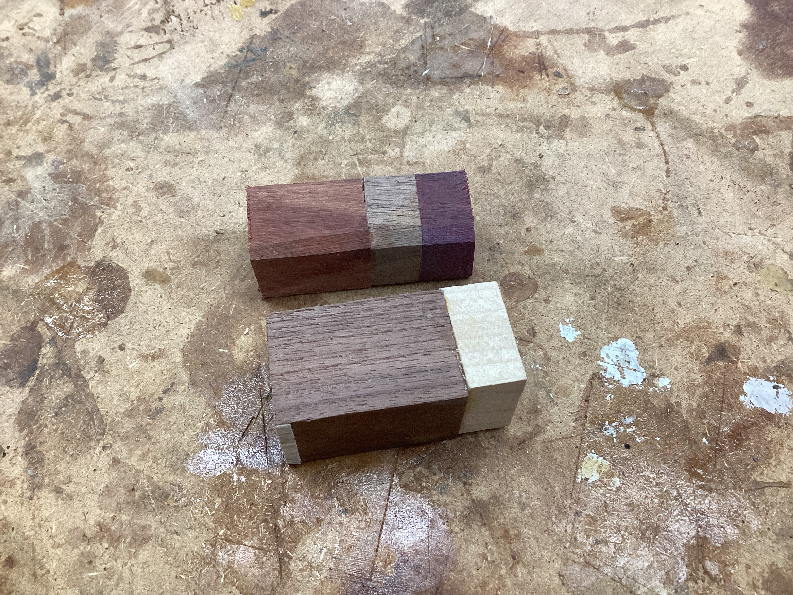
</center>

### 08/28/25

Seeing that the individual wood blocks were adhered together, I drilled a hole through both of my wood columns using the wood lathe with a drill bit extension. Then, I sanded the brass tubes using a low-grit sandpaper, applied super glue externally, and inserted them into the wood holes. To ensure that the tubes were flush with the wood, I tapped both columns on the table.


<center>
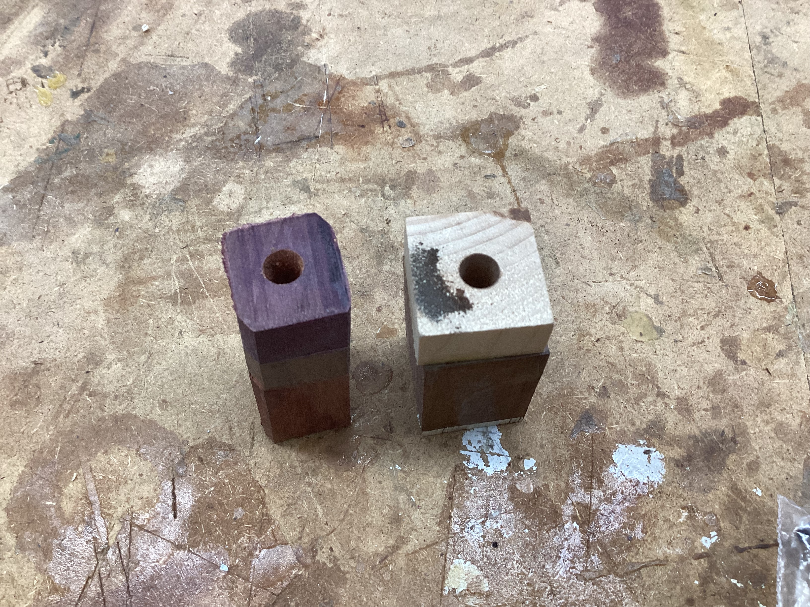
</center>

### 09/03/25

Today, I turned my two wood pieces that make up my pen on the lathe. I sanded down the corners of the two pieces beforehand, which would allow me to smoothly trim the wood's original square shape to its final cylindrical shape. Installing the two columns into the lathe, I started by using the rectangular tool, angling it downwards to take off more material. At first, the wood would stop whenever the tool made contact with it; however, this issue was resolved when I further tightened the lathe. Once I had trimmed off around 3/4 of the wood, I switched the circular tool to make precise changes, such as shaping the ends of the wood. Then, I began polishing the wood, using rough sandpaper (~120), before slowly moving up to ~320, ~600, ~1000, and eventually ~2000. 

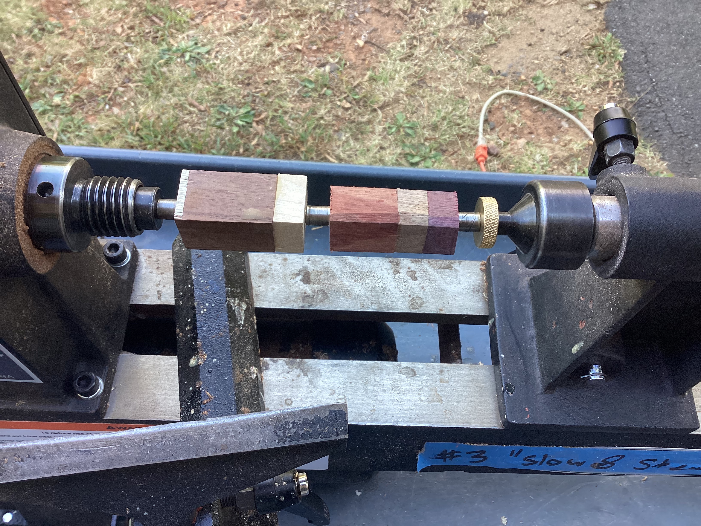 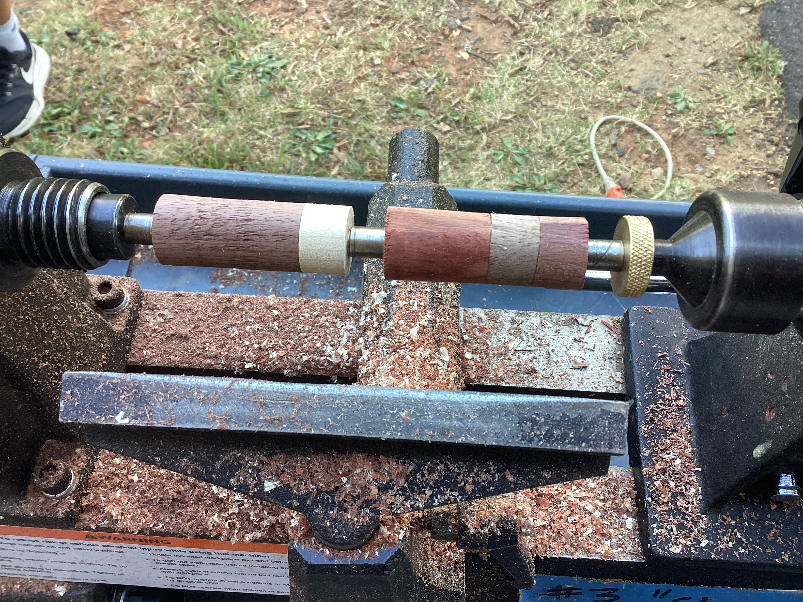 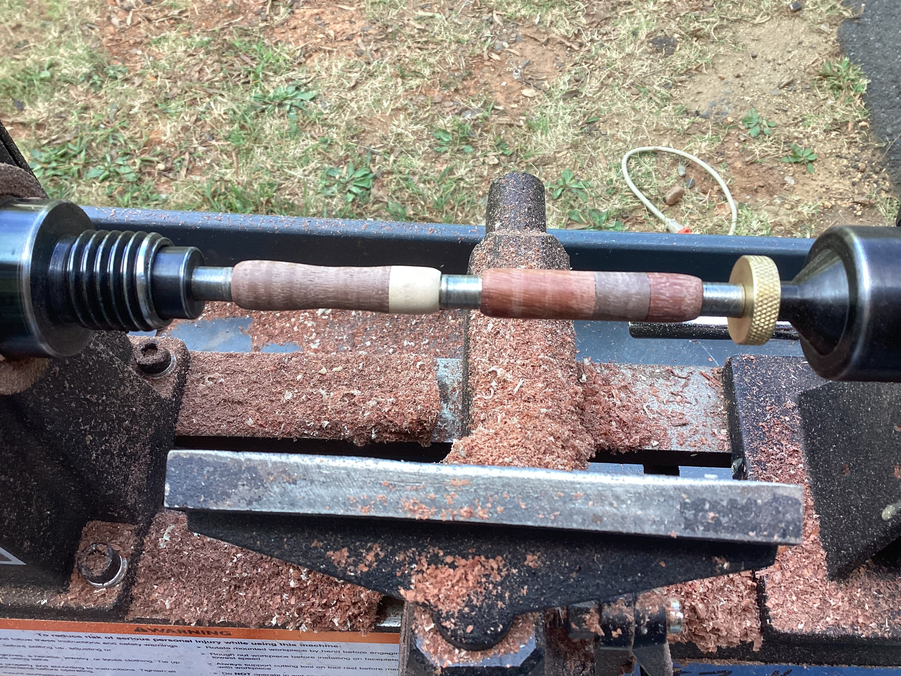


I used a paper towel and applied wood finisher to both of the components. After taking off both pieces off of the lathe, I noticed that one of the brass tubes was a bit longer than the wood, but this ended up not being a big issue during the assembly process.


<center>
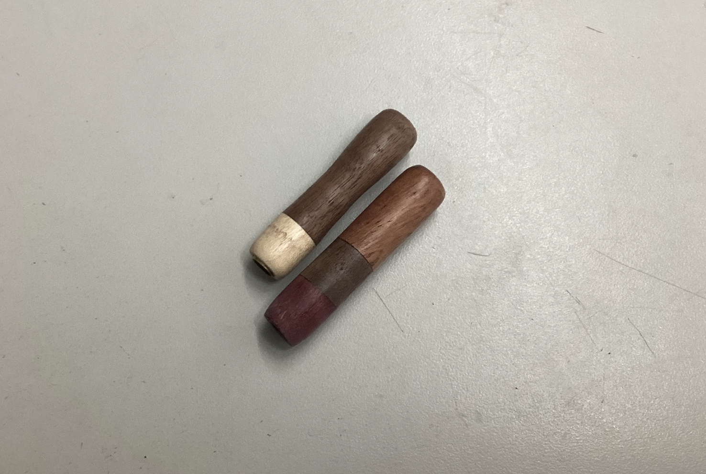
</center>

### 09/04/25

Today, I assembled my pen with the push press. This was a rather quick process, as I simply needed to organize the individual pieces into the correct order and manually press them together. Once all parts were assembled, the pen could easily open with a twist!

<center>
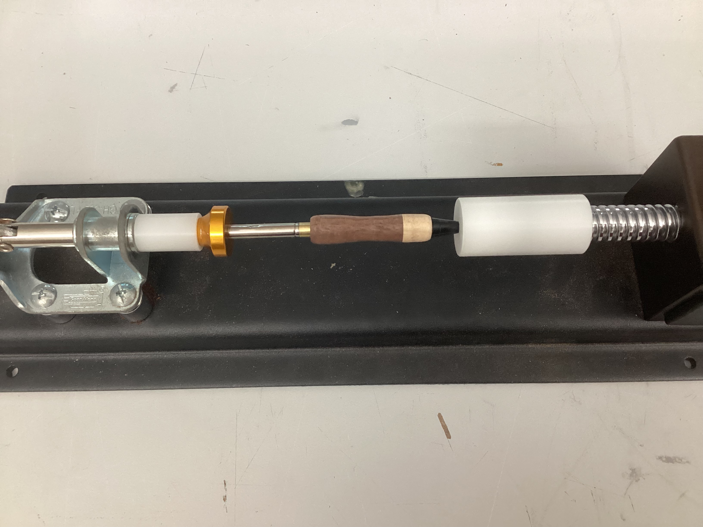
</center>

Here is the final pen assembled and ready to use:

<center>
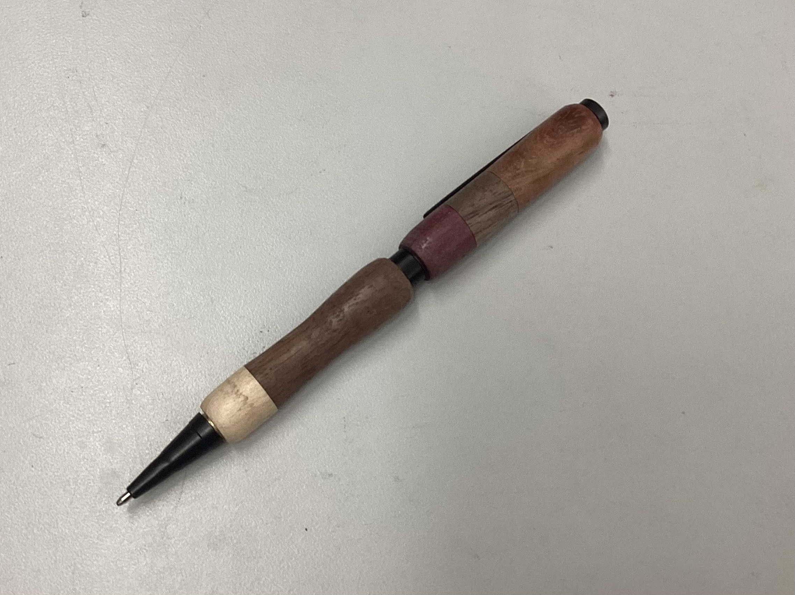
</center>

For the remainder of class, I drafted an updated email to Rhythmlink asking about this year's assignment. Additionally, I began tinkering in Adobe Illustrator, learning how to adjust document dimensions, draw vector shapes, and add text. I laser cut 6"x4" rectangle with a cut-out circle and my name engraved in the center. I thought Adobe Illustrator was pretty intuitive to use, but I definitely need to practice more!


### 09/05/25-09/09/25

During these classes, I brainstormed potential final project ideas, in the case that Rhythmlink didn't have an assignment for me. I looked into using an array of gas sensors to detect the presence of volatile organic compounds in exhaled breath, as a way to diagnose early-stage lung cancer.

### 09/10/25-09/19/25

Rhythmlink responded with a new assignment for me! („• ᴗ •„)

 On September 10, we began our introduction to Github, learning about version control, pushes/pulls, and different use cases. We watched a video tutorial, before creating our own repositories through Github desktop and making changes via Visual Studio Code. At this point, I had already created my main documentation repository, so I created a new repository for Rhythmlink. I also wrote up a short README.md with the action items for this year's assignment, as well as a high-level plan with a proof-of-concept. I shared both of these repositories with Mr. Dubick as a collaborator. I also began sketching out some designs for Rhythmlink. Since this year's project meshes functionality with wearability (i.e. how comfortable the product is), I mainly explored two elements of the project: a] sleeve material, and b] the type of temperature sensor. During this time, I stumbled upon this [Adafruit tutorial](https://learn.adafruit.com/wearable-temperature-monitor/overview), which embedded an MCP9808 high-precision temperature sensor into wearable arm band. I thought this was a neat starting point; however, I soon realized that because the sensor itself was so small in size, the readings would be inconsistent if the user wore the sleeve differently between each use. Another option I found was Adafruit's [ultra-thin thermistor](https://www.adafruit.com/product/4890?srsltid=AfmBOorrWaWLpQRxIvUpXYDWa7W9t47vGihrr80alzbG9IhYHmo-TxhxpeA), which detects changes in resistance and correlates that to temperature shifts. As of now, I'm not sure which option will be better. In terms of sleeve material, I took inspiration from [blood pressure cuffs](https://www.amazon.com/Pressure-Compatible-8-7-12-6-Replacement-Connectors/dp/B0D1QGNG6Q?th=1), which consisted of an inner-layer of softer material (e.g. modal) and an outer-layer of durable nylon. I think it'd be really interesting to integrate kapton flex PCBs (containing the temperature sensor) into the fabric!


 ### 09/24/25

 Today, we learned about pull requests, which is an effective mechanism for merging branches (i.e. copies of a repository) when collaborating with others. Mr. Dubick introduced the basic workflow for pull requests, and we had the opportunity to test it out afterwards with a partner. I found this really helpful, since I didn't have a lot of experience with pull requests/branches in the past. In the remaining class time, I continued exploring options for the temperature sensor. After looking through some past research papers, I learned that [flexible temperature sensors](https://www.mdpi.com/1424-8220/18/5/1400) have been engineered in the past using biomaterial like reduced graphene-oxide. This option seems to operate in a similar fashion as a thermistor, but it also seems to produce more accurate results. Since this would be difficult to reproduce within the Fab Lab, I'm wondering if I can reach out to a local lab (e.g. UNCC) to make it.

 ### 09/25/25

Since today's class was 75 minutes, we had a soldering party. (˵ •̀ ᴗ •́ ˵ ) ✧  Mr. Dubick went through a quick tutorial reviewing soldering basics, including using solder flux to improve solder joints. We first practiced soldering 3 through-hole resistors vertically on a protoboard.

<center>
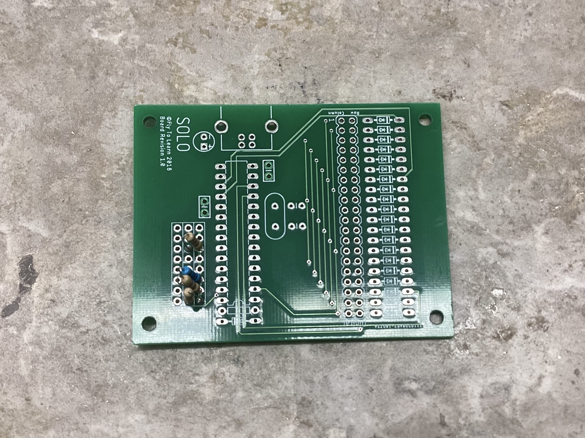
</center>


Once our soldering got approved, we began working on a soldering kit, which had a mix of through-hole and surface mount components. I hadn't surface-mount soldered since this past summer, so I used a multimeter on the continuity setting to make sure I didn't create any solder bridges. Overall, this was pretty fun and an awesome opportunity to review soldering fundeamentals. I also challenged myself to finish the entire kit within the period!

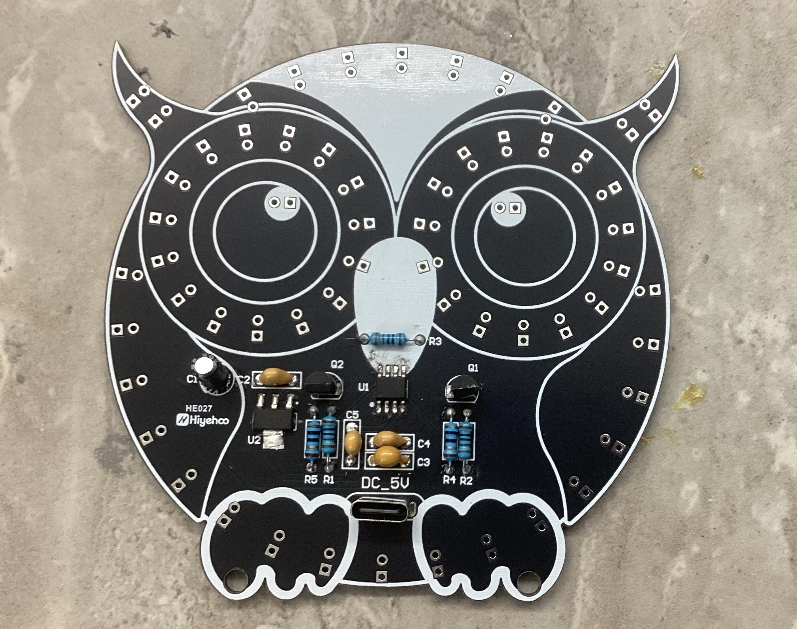 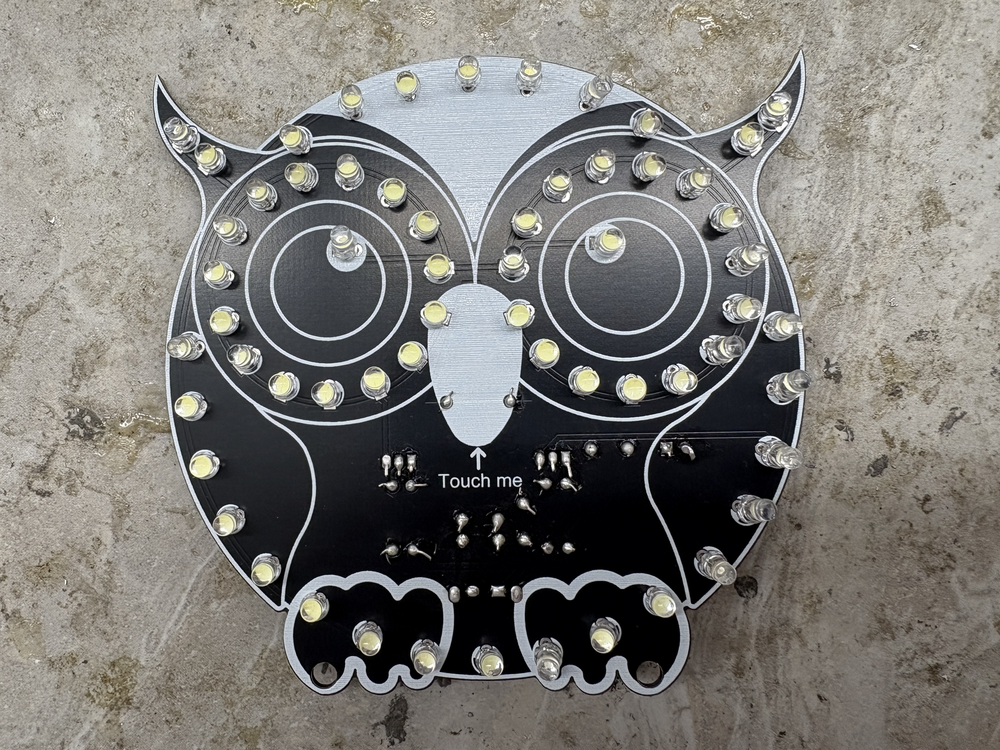

The last step of the kit was to install the M3 screws and standoffs, allowing the PCB to sit upright. 

<center>
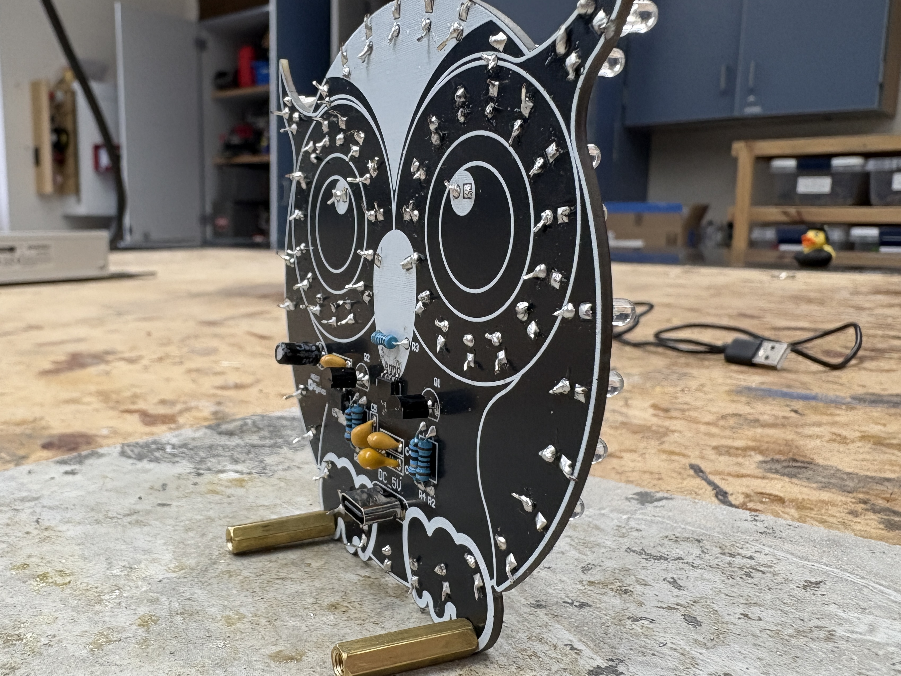
</center>

Here is a video of the final kit working:

<center>
<video width="500" height="300" controls>
  <source src="pcbowl.mp4" type="video/mp4">

</video>
</center>

Fortunately, I didn't experience any setbacks during this process (though it was very tedious to solder all of the LEDs).


### 09/30/25-10/1/25

I discussed with Mr. Dubick, and he suggested some alternative temperature sensors, including digital sensors, thermocouple, and thin-film RTD (PT1000). These solutions offer higher-precision measurements but are typically more expensive and harder to integrate into wearable technology. I looked into PT resistance temperature detectors (RTD), which reliably correlate the resistance of platinum with measured temperature. I read [online](https://www.dwyeromega.com/en-us/resources/rtd-pt100-vs-pt1000) that the PT100 is better suited for 3-4 wire configurations, and unwanted resistance from lead wires and connectors will have a larger distorting effect on overall resistance measurements. On the other hand, PT1000 has a much greater resistance, meaning that it's less vulnerable to resistance distortion.

### 10/06/25-10/07/25

Today, I wrote up the [Bill of Materials](https://angelinayyang.github.io/p/nerve-conduction-study-temperature-monitoring-sleeve/#bill-of-materials-bom) for this project. Afterwards, I communicated with Mr. Dubick and purchased two preliminary PT1000 RTDS.


### 10/09/25

Today, I designed a basic schematic/conceptualization of my design, which includes 1 ADG1408 8-1 multiplexer, 1 ADS1261 Analog-to-Digital converter, and the main MCU. You can access the text version of the schematic [here](https://angelinayyang.github.io/p/nerve-conduction-study-temperature-monitoring-sleeve/#proof-of-concept). I intend on using the MUX to select each leg of each RTD in the array, before sending the signal through the ADC.

### 10/10/25

Today's class was a 75-minute block, and I'm waiting on the RTDs to arrive, so I went through the formal rubric and completed the design specification considerations. You can access them [here](dsc.pdf). I also designed a [gantt chart](https://docs.google.com/spreadsheets/d/1M1naMrrbnOMg5gQO8-gfPohlKmZIxycnOxSoGX8i0pI/edit?usp=sharing) to monitor the progression of this project. So far, I'm on track with my timeline, and I look forward to begin prototyping once all of my components are delivered! Since I plan on using the 1.8" TFT LCD, I decided to spend the remainder of claess exploring the ST7735 and the Adafruit_GFX library. I wrote up a sample code that initiates the TFT and displays a simple text.

```
import board
import displayio
import fourwire
from adafruit_st7735r import ST7735R

spi = board.SPI()
tft_cs = board.D17
tft_dc = board.D22

displayio.release_displays()
display_bus = fourwire.FourWire(spi, command=tft_dc, chip_select=tft_cs, reset=board.D9)

display = ST7735R(display_bus, width=160, height=128, colstart=2, rowstart=1)

splash = displayio.Group()

color_bitmap = displayio.Bitmap(160, 128, 1)
color_palette = displayio.Palette(1)
color_palette[0] = 0x000000

bg_sprite = displayio.TileGrid(color_bitmap,
                               pixel_shader=color_palette,
                               x=0, y=0)
splash.append(bg_sprite)

text = "Current temperature: "
text_area = label.Label(terminalio.FONT, text=text, color=0xFFFFFF, x=30, y=64)
splash.append(text_area)

while True:
    pass
```

### 10/14/25

Today, Mr. Dubick went over the process of using Github Pages to develop our digital portfolio sites. Since I already set up a site, and I'm waiting for the RTDs to arrive, I worked on side project during class. On Youtube, I've been watching a lot of videos from the [Nerd Musician](https://www.youtube.com/@NerdMusician), and I similarly wanted to design a MIDI player and record some music my STEM maker portfolio. I designed a basic schematic of the main board, which uses an Arduino Nano board as the microcontroller:

<center>
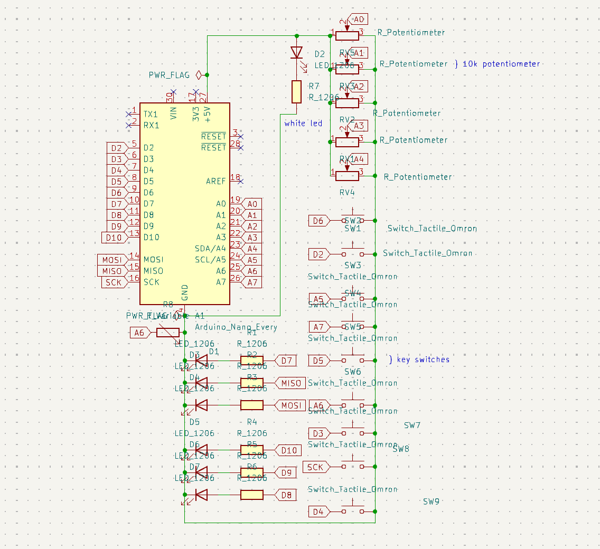
</center>

After assigning footprints, I arranged all of the components in the PCB layout editor. I then tried to route this board, but for some reason, Kicad kept crashing whenever I drew a trace. 

### 10/15/25

We had today off due to PSATs, so I continued working on MIDI PCB. I found that the KiCad crashing issue was related to an overloaded cache, so in terminal, I ran the following command:

```
rm -rf ~/Library/Caches/kicad

rm -rf ~/Library/Preferences/kicad

rm -rf ~/Library/Application Support/kicad
```

and this resolved the problem. In the PCB layout editor, I routed the MIDI PCB, using my standard constraints and .5mm width tracks. Some of the footprints, such as the [CherryMX key switch](https://github.com/sszczep/kicad-libraries), weren't previously available in KiCad, so I had to manually import them. Since all of the components are through-hole, I made use of both the front and back side.

<center>
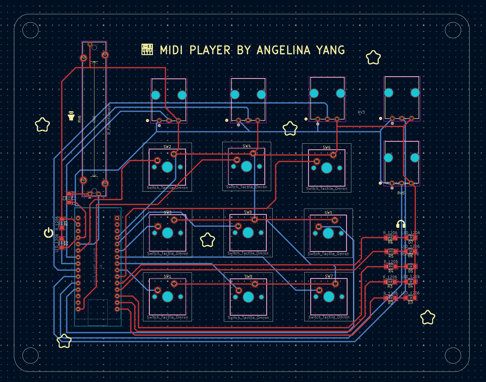
</center>

Here's the projected BOM for this project:

| Part Name | Cost | Quantity | Source |
| :---------: | :---------: | :-----: |:--------:|
| PT120 Linear 10kΩ Potentiometer | $1.42  | 5 | [Digikey](https://www.digikey.com/en/products/detail/tt-electronics-bi/P120PK-Y25BR10K/5957454)|
| White Micro Potentiometer Knob - 4 pack | $2.95 | 2 | [Adafruit](https://www.adafruit.com/product/5538) |
| Slide Potentiometer with Plastic Knob - 45mm Long - 10KΩ | $1.95 | 1 | [Adafruit](https://www.adafruit.com/product/4272) |
| 1206 SMD LEDs | $0.36 | 6 | [Digikey](https://www.digikey.com/en/products/detail/liteon/LTW-C230DS/3198820) |
| 1206 SMD 330Ω | $0.21 | 6 | [Digikey](https://www.digikey.com/en/products/detail/rohm-semiconductor/KTR18EZPF3303/1983725) |
| Arduino Nano Every Development board | $12.90 | 1 | [Arduino Store](https://store-usa.arduino.cc/products/nano-every?srsltid=AfmBOor4duAdkQ7W_REHfcpkdtGwOyXQd2NoSeVBtsPD7mocRG2U5cxd) |

### 10/16/25-10/17/25

Today, Mr. Dubick went over jekyll and how to use a provided template to create a Github site. I followed along, cloning the template into Github Desktop and modifying the markdown files included in the repo. For this template, the title requirements for each "post" are quite strict, requiring users to label each file with a formatted date. Even though I find this template pretty easy to use, I like the design flexibility of my current layout.

# 10/22/25 

During class, Mr. Budzichowski introduced me to the new CNC milling machines that lab recently bought. I had a KiCad project with a special graphic that I've been wanting to mill for a while, but with Bantam's abstracted software, I couldn't figure out how to isolate-mill certain parts of the board. The new software, however, is a lot more similar to Aspire, in the sense that you define individual toolpaths (e.g., contour) based on the different layers of the PCB (e.g., Fcu, edge cuts, etc.). Learning this software was relatively easy, and I enjoyed seeing the 5x5 z-axis touch-down and the automatic tool changer in action! The use of clamps, rather than nitto tape, was also notably convenient: after taking out the PCB, I noticed that I had set the edge cuts "ending depth" too small, so I simply realigned the FR1 with the corner of the bed and sent a new g-code with the modified edge cuts toolpath. Here's how it turned out:

<center>
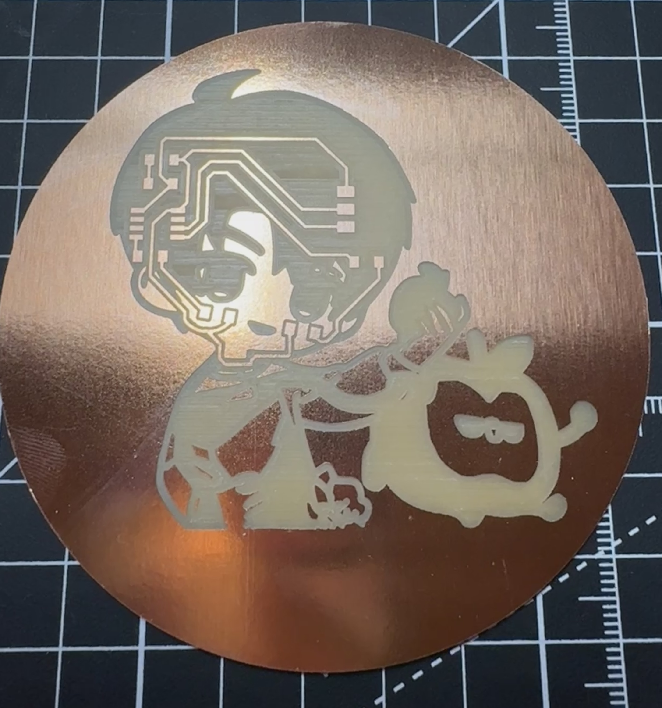
</center>

# 10/24/25

Good news: most of my components for my MIDI player arrived today! However, since JLC hasn't delivered my PCB, I can't get started on soldering just yet. During class, I watched a couple of a videos on op-amps, including this [one](https://www.youtube.com/watch?v=kqCV-HGJc6A). Although I didn't find it particularly helpful, I think I have a basic understanding of how op-amps work: it takes two inputs, consisting of a non-inverting and inverting input, and it amplifies their difference, outputting a large, controlled voltage. For the rest of class, I worked on my ADG1408 multiplexer board. It seems like the pin connections to the Raspberry Pi Pico are pretty intuitive, so I'm not too worried about designing the schematic in KiCad.

# 10/27/25

Today, Mr. Dubick formally went over the process of developing toolpaths in MakeraCAM and using the milling machines. I wrote a workflow based on the slideshow and his instructions.


# 10/28/25

Today, we began class by reviewing how to design the toolpaths for the PCB and generate the g-code. To do this, I first downloaded the gerber files from the FabLab google drive, including [Resistance1-Edge_cuts](Resistance1-Edge_Cuts.gbr) and [Resistance1-F_Cu](Resistance1-F_Cu.gbr), and imported them into the MakeraCAM software. I created three toolpaths total: 1 pocket toolpath with an end depth of .05mm (traces), 1 contour toolpath with an end depth of 1.7mm (edge cuts), and 1 drill file with an end depth of 1.7mm (holes). I previewed these toolpaths in the software, before exporting them as a .nc file. You can access this file [here](YangA_resistorgcode.nc). 

 On the Carvera software, I first checked the probe voltage. Initially, it said 3.3V, which is below the functional threshold; however, this was because a tool had already been selected and installed by the milling machine. Once I uninstalled the tool, the voltage went to 3.7V. Perfect! ദ്ദി ˉ͈꒳ˉ͈ )✧

 I imported the .nc file into the software and clicked "Config and run."

The milling machine first began with the .8mm corn flatend mill to remove the bulk of material on the PCB, before going back in with the engraving bit and creating the intricate traces. Something I found odd was that the engraving bit moved around the perimeter as well, but Mr. Budzichowski told me that this was naturally apart of the g-code. 

<center>
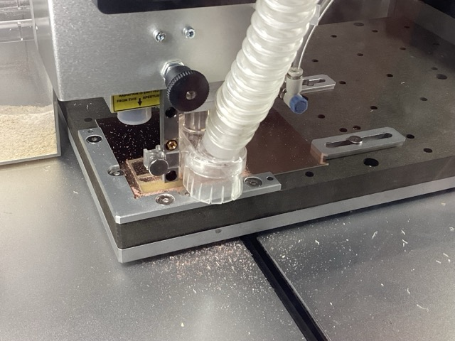
</center>

One problem I encountered: Dr. Taylor, in epic Dr. Taylor fashion, came in and accidentally turned off the power strip powering the milling machine. As a result, my edge cuts toolpath was cut short. (  •̀⤙•́  ) This was a easy fix, though. I isolated the contour toolpath on MakeraCAM and re-exported the .nc file, before selecting and running the new .nc file on the milling machine. 

Here is what the final PCB looked like:

<center>

</center>

Overall, through this project, I continued to familiarize myself with the new software, and I was able to review the fundamentals of toolpaths, feeds & speeds, inclusion of tabs, etc. Additionally, although the milling machine operates through a more "hands-off" approach, I prefer it over the old Bantam machines because there is less human error involved (especially with bits snapping and z-axis probing). 

In the future, to save time on my PCB mills, I may adjust the KiCad files to include "zones". Similar to be previous board (see 10/22/25), including these zones allows you to solely mill around the traces and keep the remainder of the copper in tact. 

# 10/29/25

Absent from school.

# 10/30/25 

Today, I wrapped up my documentation for the PCB milling (see "10/28/25"). I inserted the pictures and wrote up the "problems encountered" section.


# 11/3/25-11/4/25

During these two classes, I revised the basic schematic Kathryn and I made during our last Rhythmlink meeting. Here's the pipeline we finalized: 
excitation precision current source → RTD_COMMON (Emitter/collector node) → RTD → ADG1408 CHx → ADG1408 COM → ADS1220 AIN+ ; ADS1220 AIN− → pico for software processing. Here is what the schematic looks like in KiCad:


Additionally, I set up the interim virtual meeting with Rhythmlink for November 18th, and I've begun making the presentation on Google Slides. 

Some specific changes I made to the schematic:

- According to the ADS1220 [datasheet](https://www.ti.com/lit/ds/symlink/ads1220.pdf) from Texas Instruments (TI), they recommend including 47Ω resistors with all the digital input and output pins like CS, SCLK, DIN, DOUT/DRDY, and DRDY to make transitioning smoother.
 
- The emitter leg of the 2N9304 transistor is connected to resistor Rset, and the other end of the resistor is tied to ground. It's connected to ground because the current source needs a stable reference point (ground) to define the voltage across Rset.

Before I begin production on this board, Kathryn and I are planning on meeting and discussing the schematic design with Dr. Harris. Mr. Dubick reached out to him today, so I'm looking forward to hearing back!


# 11/6/25

Today, I decided to wrap up assembly for my MIDI controller. I first soldered 5 1k ohm resistors and a 94 nF capacitor to my PCB. These were the last two things I needed to solder before I began assembly. To put the controller together, I used 4 6m-long M5 screws

# 11/7/25

Kathryn and I had our conversation with Dr. Harris yesterday, and it was very helpful! He thought the general approach to our circuit was correct. However, he suggested adjusting the multiplexer connections to create a wheatstone bridge, a circuit that precisely measures an unknown electrical resistance by balancing two legs of a bridge circuit. 

<center>
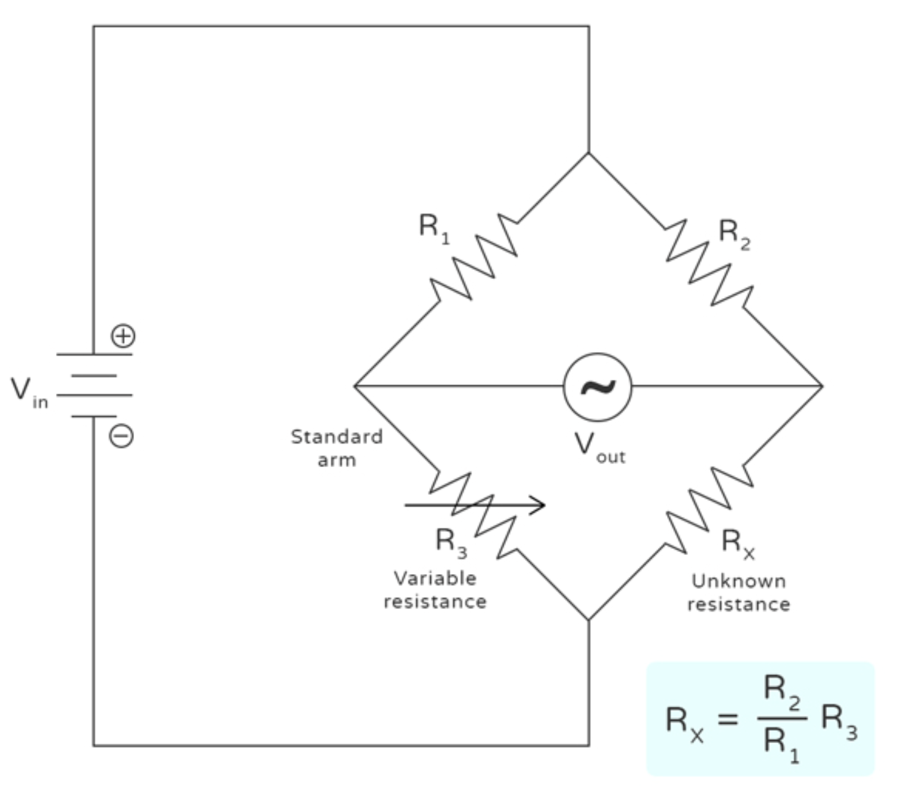
</center>


The variable resistance is referred to the strain gauge, which is basically variable resistor that measures 'mechanical strain' by changing its resistance as it is stretched or compressed. For the purposes of our design, the strain gauge is the common output of one lead of the RTD. He also suggested adding a resistor between the Rg pins on the INA333, as the ohmic value would determine how much the signal going in is amplified.

Additionally, I added 2 bypass capacitors (.1 uF and 10 uF) to the REF5025 to improve reference stability, per advised on page 3 of the [datasheet](https://www.ti.com/lit/ds/symlink/ref5025-ht.pdf?ts=1762532810665). Finally, I changed the REFP0 connection on the ADS1220 to be linked to the stable reference voltage Vout, rather than 3v3. Here's what the schematic looks like now:

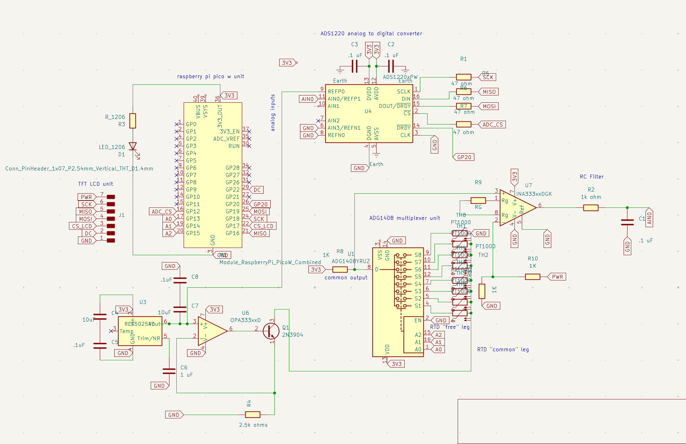


# 11/11/25

Today, I wrote up the basic test scripts for running the ST7735R TFT LCD and the ADS1220 analog-to-digital converter. For the TFT LCD, I referenced [this](https://docs.circuitpython.org/projects/st7735r/en/latest/examples.html#x160-tests) site and the [Github repository](https://github.com/adafruit/Adafruit_CircuitPython_ST7735R), which includes the documentation for circuitpython and using the adafruit library linked to this screen. All of the code I wrote up is located in the [project repository](https://github.com/angelinayyang/NCS-Temp-Monitoring-Sleeve). As for the adc code, because there isn't a specific ADS1220 library, I had to manually adress the SPI pins (MOSI, MISO, clock); I used ChatGPT to help me analyze the datasheet and refine the code accordingly. 

# 11/12/25

Today, Mr. Dubick went over the process of creating an STL of a mountain range through [this site](https://jthatch.com/Terrain2STL/). After dragging the red box over a mountain range, under "Model Details," I set the box width and height to .05º. Then, under "Water and Base Settings," I set the water drop and base height to the max value. I first clicked "Generate," before hitting "Download" to export the .STL file. Here is the [.STL file](Angelina's_mountain_range.stl).

<center>
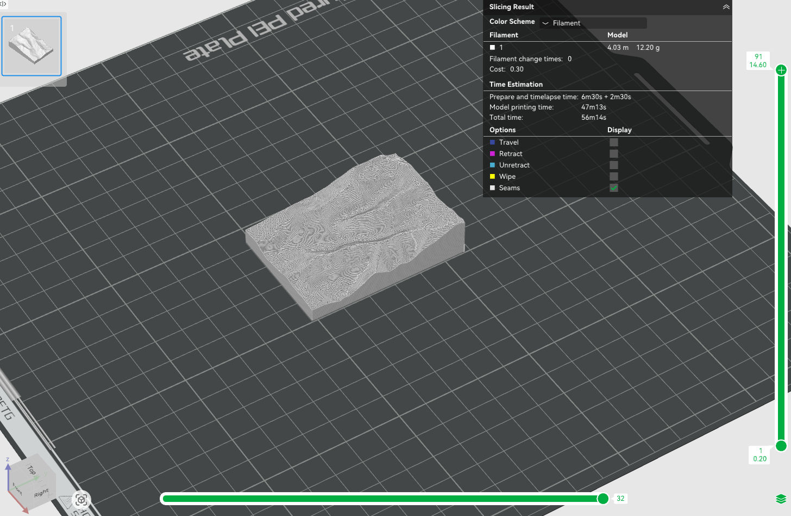
</center>

# 11/13/25

Today, I formally picked my mountain range, following the same process as yesterday. I decided to pick a mountainous region around the Himalayan region. Generating and downloading the model from the site, I imported the .STL file into Bambu Studio. I used the "scale" tool to adjust the x, y, and z dimensions to 2.5in, 3.5in, and 1.0in, respectively. Then, I sent the file to be printed. Here is the final and scaled [.STL file](Yang_A_B_Topo.stl). 

<center>
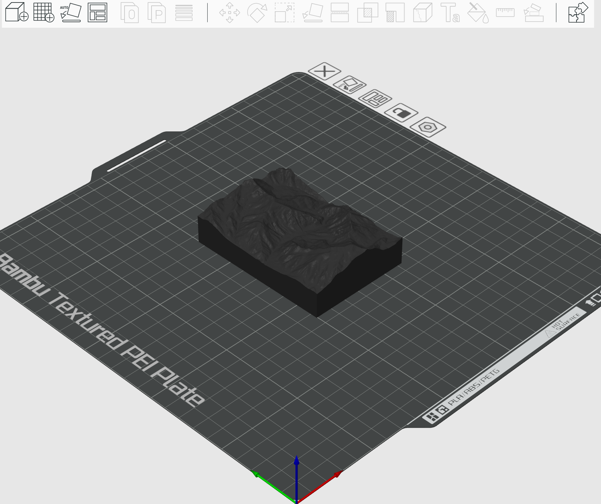
</center>

# 11/14/25

Today, I formalized my presentation for my Rhythmlink virtual check-in meeting on this Tuesday, including the up-to-date BOM and the heating design mechanism. You can find the presentation [here](https://docs.google.com/presentation/d/1PqOhVfdrmDky0n9mDZeVNytKNfMDkOpkWzbMBGjTZ28/edit?usp=sharing). I also worked on the code scaffolding. Based on Kathryn and I's multiplexer, adc, and lcd test scripts, I decided to design three main classes: MUX_Manager, ADC_Manager, and ST7735R_Manager. the MUX_Manager class rotates through each channel of the multiplexer, accessing each RTD per timestep. The ADC_Manager will take the output from the in-amp and the RC filter per RTD and translate the measured voltage via the `read_rtd_resistance()` method. All of the scaffolding can be accessed in the [README.md file](https://github.com/angelinayyang/NCS-Temp-Monitoring-Sleeve/blob/main/README.md).

# 11/17/25 

Mr. Dubick went over the Aspire workflow for designing our topography map toolpaths in class today. We followed [this workflow](https://docs.google.com/document/d/1tivBCj7krFAnMuTojKnl7sYzdXHBOTjOttF18pJgJQY/edit?usp=sharing), and we used a sample file that Dr. Taylor created. Afterwards, we designed our own topography gcodes with our own mountain ranges. Here is what my file in Aspire looked like with and without the toolpath:

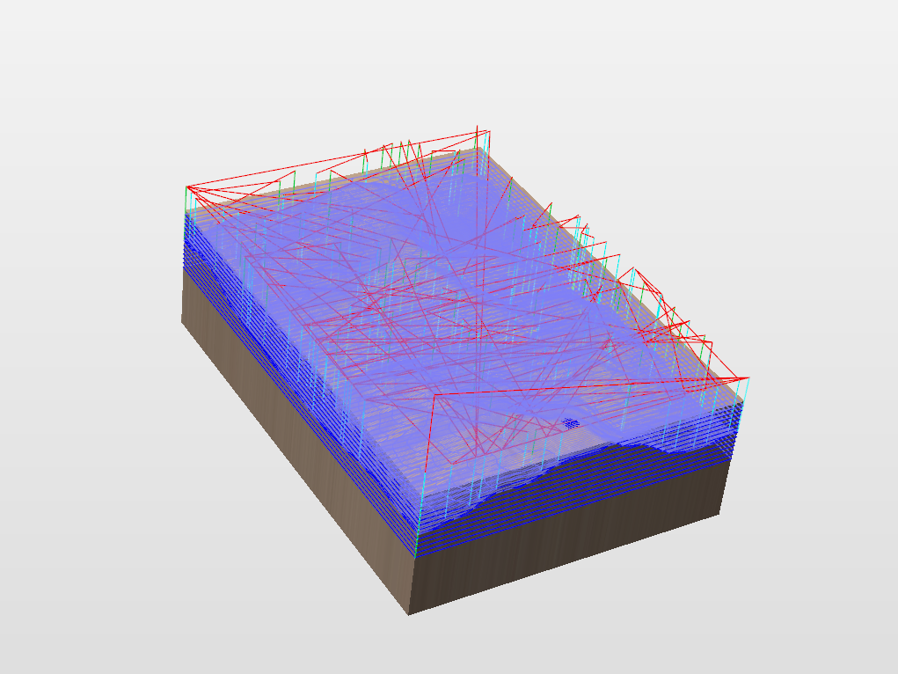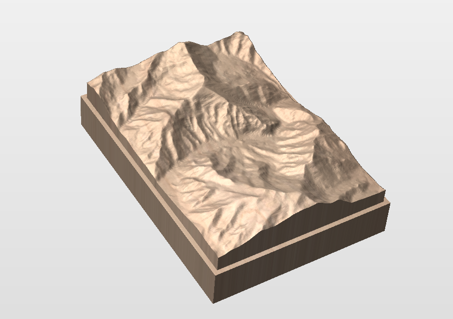


# 12/01/25

Today, Mr. Dubick taught the basics of electronics, using Tinkercad to illustrate how breadboards, LEDs, resistors, high/low signals, and microcontrollers worked.

Separately, I worked on designing the casing for the LCD screen in Fusion360. To adopt Rhythmlink's proposal to include a light indicator as to whether the temperature of a user's forearm is fit for NCS, I decided to switch from the 1.8" screen to the 2.8" screen. This screen still operates on SPI, but I believe I'll have to adjust the code I wrote previously.

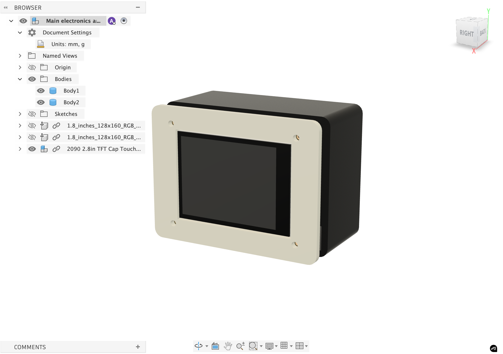

# 12/02/25

Since there are no company-manufactured breakouts that use the reference voltage (REF50250)/op-amp (OPA333), I isolated one part of the master schematic and routed a simple breakout. This is what it looked like:

 


# 12/03/25

In class today, Mr. Dubick introduced the concept of Pulse Width Modulation with the example of a fading LED. 

In terms of my Rhythmlink development, I milled out the board on the Carvera; however, the CNC machine unfortunately did not mill all of the gaps between the pads of the IC. Shucks.

# 12/04/25

I milled out the  op-amp and reference voltage board again today, and I worked on the software side, designing the `MUX_manager`, `LCD_manager`, and `ADC_manager` classes. I have yet to integrate everything into a `main.py`, but I intend on doing that over the weekend.

# 12/05/25

Today, I spent class soldering the op-amp and the reference voltage onto the board. Because the components are naturally tiny and traditional solder would result in bridges, I decided to do reflow soldering with a heat gun and solder paste. This worked pretty well, so I'm confident that I'll be able to reproduce it for the real thing.

<center>
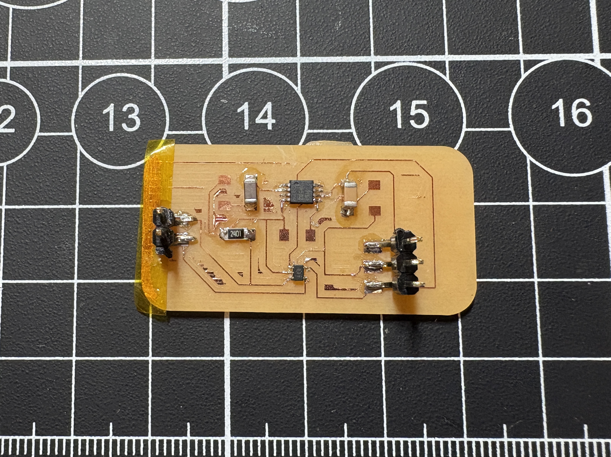
</center>


# 12/9/25

I designed another breakout board today based on the RC-filter and the inamp that proceeds the RTD in the proof-of-concept. Here is what it looks like:

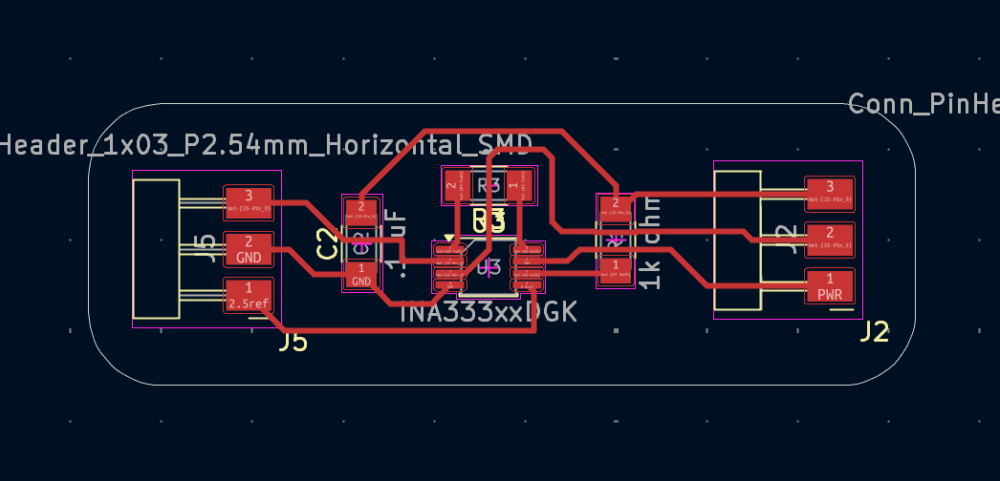

After school, I started the mill on the Carvera and was able to obtain a successful version on the second try!

# 12/10/25

During class, I soldered my new in-amp board. One of the main challenges I had was determining that what the Rg, or the gain resistance value would be. Because the lowest forearm temperature would correlate to a resistance value greater than 1,000 ohms (and therefore maintain a voltage of 1V), the amplified voltage coming out of the inamp would never swing below the reference. In cases like these, the [INA333 datasheet](https://www.ti.com/lit/ds/symlink/ina333.pdf?ts=1766039200822) suggests grounding the Ref pin and adjusting the resistance value to cover the appropriate range of the ADC input (in this case, 0V to 2.5). The equation for gain is defined as G = 1 + (100k)/Rg, and the pre-ampliifed voltage would range between 1V and 1.194V (equating to ~50ºC), so I decided to define the gain as 2 and Rg as 100k ohms.

# 12/11/12

During class today, I milled out my topography map. After checking the toolpaths one last time in my Aspire file, I uploaded my g-code to the Carvera software. In terms of milling the wood, the only major difference was the clamps we used to fix the block. The milling process was relatively straightforward, and I didn't experience any issues during this process. One change I would make, however, is adjusting the z-depth of the mill, as it came out looking shallower than I intended. Here is what it looked like:


<center>

</center>


# 12/15/25

Today, I wired up the connections for my proof-of-concept board. I'm not fully confident this will work, but I'm excited to try it out with the Pi. I also printed out the case for the electronics/Pi, and it fits pretty well.

# 12/16/25

Absent.

# 12/18/25

Today, I worked on my final project and topography map documentation.