Welcome to my daily journal! Here, you will find my day-to-day progress in advanced engineering! ヾ(・-・*)

## Semester 1

### 08/27/25

Today, I began the pen turning project. I selected four types of wood I wanted to incorporate into my wood pen, including cherry, purple, coffee, and light-beige colored wood. After marking off measurements on each piece according to the length of the brass tubes (2⅛”), I used the bandsaw to cut them. I applied glue between each piece and clamped them down, leaving them to dry for ~24 hours.


<center>

</center>

### 08/28/25

Seeing that the individual wood blocks were adhered together, I drilled a hole through both of my wood columns using the wood lathe with a drill bit extension. Then, I sanded the brass tubes using a low-grit sandpaper, applied super glue externally, and inserted them into the wood holes. To ensure that the tubes were flush with the wood, I tapped both columns on the table.


<center>

</center>

### 09/03/25

Today, I turned my two wood pieces that make up my pen on the lathe. I sanded down the corners of the two pieces beforehand, which would allow me to smoothly trim the wood's original square shape to its final cylindrical shape. Installing the two columns into the lathe, I started by using the rectangular tool, angling it downwards to take off more material. At first, the wood would stop whenever the tool made contact with it; however, this issue was resolved when I further tightened the lathe. Once I had trimmed off around 3/4 of the wood, I switched the circular tool to make precise changes, such as shaping the ends of the wood. Then, I began polishing the wood, using rough sandpaper (~120), before slowly moving up to ~320, ~600, ~1000, and eventually ~2000. 

  


I used a paper towel and applied wood finisher to both of the components. After taking off both pieces off of the lathe, I noticed that one of the brass tubes was a bit longer than the wood, but this ended up not being a big issue during the assembly process.


<center>

</center>

### 09/04/25

Today, I assembled my pen with the push press. This was a rather quick process, as I simply needed to organize the individual pieces into the correct order and manually press them together. Once all parts were assembled, the pen could easily open with a twist!

<center>

</center>

Here is the final pen assembled and ready to use:

<center>

</center>

For the remainder of class, I drafted an updated email to Rhythmlink asking about this year's assignment. Additionally, I began tinkering in Adobe Illustrator, learning how to adjust document dimensions, draw vector shapes, and add text. I laser cut 6"x4" rectangle with a cut-out circle and my name engraved in the center. I thought Adobe Illustrator was pretty intuitive to use, but I definitely need to practice more!


### 09/05/25-09/09/25

During these classes, I brainstormed potential final project ideas, in the case that Rhythmlink didn't have an assignment for me. I looked into using an array of gas sensors to detect the presence of volatile organic compounds in exhaled breath, as a way to diagnose early-stage lung cancer.

### 09/10/25-09/19/25

Rhythmlink responded with a new assignment for me! („• ᴗ •„)

 On September 10, we began our introduction to Github, learning about version control, pushes/pulls, and different use cases. We watched a video tutorial, before creating our own repositories through Github desktop and making changes via Visual Studio Code. At this point, I had already created my main documentation repository, so I created a new repository for Rhythmlink. I also wrote up a short README.md with the action items for this year's assignment, as well as a high-level plan with a proof-of-concept. I shared both of these repositories with Mr. Dubick as a collaborator. I also began sketching out some designs for Rhythmlink. Since this year's project meshes functionality with wearability (i.e. how comfortable the product is), I mainly explored two elements of the project: a] sleeve material, and b] the type of temperature sensor. During this time, I stumbled upon this [Adafruit tutorial](https://learn.adafruit.com/wearable-temperature-monitor/overview), which embedded an MCP9808 high-precision temperature sensor into wearable arm band. I thought this was a neat starting point; however, I soon realized that because the sensor itself was so small in size, the readings would be inconsistent if the user wore the sleeve differently between each use. Another option I found was Adafruit's [ultra-thin thermistor](https://www.adafruit.com/product/4890?srsltid=AfmBOorrWaWLpQRxIvUpXYDWa7W9t47vGihrr80alzbG9IhYHmo-TxhxpeA), which detects changes in resistance and correlates that to temperature shifts. As of now, I'm not sure which option will be better. In terms of sleeve material, I took inspiration from [blood pressure cuffs](https://www.amazon.com/Pressure-Compatible-8-7-12-6-Replacement-Connectors/dp/B0D1QGNG6Q?th=1), which consisted of an inner-layer of softer material (e.g. modal) and an outer-layer of durable nylon. I think it'd be really interesting to integrate kapton flex PCBs (containing the temperature sensor) into the fabric!


 ### 09/24/25

 Today, we learned about pull requests, which is an effective mechanism for merging branches (i.e. copies of a repository) when collaborating with others. Mr. Dubick introduced the basic workflow for pull requests, and we had the opportunity to test it out afterwards with a partner. I found this really helpful, since I didn't have a lot of experience with pull requests/branches in the past. In the remaining class time, I continued exploring options for the temperature sensor. After looking through some past research papers, I learned that [flexible temperature sensors](https://www.mdpi.com/1424-8220/18/5/1400) have been engineered in the past using biomaterial like reduced graphene-oxide. This option seems to operate in a similar fashion as a thermistor, but it also seems to produce more accurate results. Since this would be difficult to reproduce within the Fab Lab, I'm wondering if I can reach out to a local lab (e.g. UNCC) to make it.

 ### 09/25/25

Since today's class was 75 minutes, we had a soldering party. (˵ •̀ ᴗ •́ ˵ ) ✧  Mr. Dubick went through a quick tutorial reviewing soldering basics, including using solder flux to improve solder joints. We first practiced soldering 3 through-hole resistors vertically on a protoboard.

<center>

</center>


Once our soldering got approved, we began working on a soldering kit, which had a mix of through-hole and surface mount components. I hadn't surface-mount soldered since this past summer, so I used a multimeter on the continuity setting to make sure I didn't create any solder bridges. Overall, this was pretty fun and an awesome opportunity to review soldering fundeamentals. I also challenged myself to finish the entire kit within the period!

 

The last step of the kit was to install the M3 screws and standoffs, allowing the PCB to sit upright. 

<center>

</center>

Here is a video of the final kit working:

<center>
<video width="500" height="300" controls>
  <source src="pcbowl.mp4" type="video/mp4">

</video>
</center>

Fortunately, I didn't experience any setbacks during this process (though it was very tedious to solder all of the LEDs).


### 09/30/25-10/1/25

I discussed with Mr. Dubick, and he suggested some alternative temperature sensors, including digital sensors, thermocouple, and thin-film RTD (PT1000). These solutions offer higher-precision measurements but are typically more expensive and harder to integrate into wearable technology. I looked into PT resistance temperature detectors (RTD), which reliably correlate the resistance of platinum with measured temperature. I read [online](https://www.dwyeromega.com/en-us/resources/rtd-pt100-vs-pt1000) that the PT100 is better suited for 3-4 wire configurations, and unwanted resistance from lead wires and connectors will have a larger distorting effect on overall resistance measurements. On the other hand, PT1000 has a much greater resistance, meaning that it's less vulnerable to resistance distortion.

### 10/06/25-10/07/25

Today, I wrote up the [Bill of Materials](https://angelinayyang.github.io/p/nerve-conduction-study-temperature-monitoring-sleeve/#bill-of-materials-bom) for this project. Afterwards, I communicated with Mr. Dubick and purchased two preliminary PT1000 RTDS.


### 10/09/25

Today, I designed a basic schematic/conceptualization of my design, which includes 1 ADG1408 8-1 multiplexer, 1 ADS1261 Analog-to-Digital converter, and the main MCU. You can access the text version of the schematic [here](https://angelinayyang.github.io/p/nerve-conduction-study-temperature-monitoring-sleeve/#proof-of-concept). I intend on using the MUX to select each leg of each RTD in the array, before sending the signal through the ADC.

### 10/10/25

Today's class was a 75-minute block, and I'm waiting on the RTDs to arrive, so I went through the formal rubric and completed the design specification considerations. You can access them [here](dsc.pdf). I also designed a [gantt chart](https://docs.google.com/spreadsheets/d/1M1naMrrbnOMg5gQO8-gfPohlKmZIxycnOxSoGX8i0pI/edit?usp=sharing) to monitor the progression of this project. So far, I'm on track with my timeline, and I look forward to begin prototyping once all of my components are delivered! Since I plan on using the 1.8" TFT LCD, I decided to spend the remainder of claess exploring the ST7735 and the Adafruit_GFX library. I wrote up a sample code that initiates the TFT and displays a simple text.

```
import board
import displayio
import fourwire
from adafruit_st7735r import ST7735R

spi = board.SPI()
tft_cs = board.D17
tft_dc = board.D22

displayio.release_displays()
display_bus = fourwire.FourWire(spi, command=tft_dc, chip_select=tft_cs, reset=board.D9)

display = ST7735R(display_bus, width=160, height=128, colstart=2, rowstart=1)

splash = displayio.Group()

color_bitmap = displayio.Bitmap(160, 128, 1)
color_palette = displayio.Palette(1)
color_palette[0] = 0x000000

bg_sprite = displayio.TileGrid(color_bitmap,
                               pixel_shader=color_palette,
                               x=0, y=0)
splash.append(bg_sprite)

text = "Current temperature: "
text_area = label.Label(terminalio.FONT, text=text, color=0xFFFFFF, x=30, y=64)
splash.append(text_area)

while True:
    pass
```

### 10/14/25

Today, Mr. Dubick went over the process of using Github Pages to develop our digital portfolio sites. Since I already set up a site, and I'm waiting for the RTDs to arrive, I worked on side project during class. On Youtube, I've been watching a lot of videos from the [Nerd Musician](https://www.youtube.com/@NerdMusician), and I similarly wanted to design a MIDI player and record some music my STEM maker portfolio. I designed a basic schematic of the main board, which uses an Arduino Nano board as the microcontroller:

<center>

</center>

After assigning footprints, I arranged all of the components in the PCB layout editor. I then tried to route this board, but for some reason, Kicad kept crashing whenever I drew a trace. 

### 10/15/25

We had today off due to PSATs, so I continued working on MIDI PCB. I found that the KiCad crashing issue was related to an overloaded cache, so in terminal, I ran the following command:

```
rm -rf ~/Library/Caches/kicad

rm -rf ~/Library/Preferences/kicad

rm -rf ~/Library/Application Support/kicad
```

and this resolved the problem. In the PCB layout editor, I routed the MIDI PCB, using my standard constraints and .5mm width tracks. Some of the footprints, such as the [CherryMX key switch](https://github.com/sszczep/kicad-libraries), weren't previously available in KiCad, so I had to manually import them. Since all of the components are through-hole, I made use of both the front and back side.

<center>

</center>

Here's the projected BOM for this project:

| Part Name | Cost | Quantity | Source |
| :---------: | :---------: | :-----: |:--------:|
| PT120 Linear 10kΩ Potentiometer | $1.42  | 5 | [Digikey](https://www.digikey.com/en/products/detail/tt-electronics-bi/P120PK-Y25BR10K/5957454)|
| White Micro Potentiometer Knob - 4 pack | $2.95 | 2 | [Adafruit](https://www.adafruit.com/product/5538) |
| Slide Potentiometer with Plastic Knob - 45mm Long - 10KΩ | $1.95 | 1 | [Adafruit](https://www.adafruit.com/product/4272) |
| 1206 SMD LEDs | $0.36 | 6 | [Digikey](https://www.digikey.com/en/products/detail/liteon/LTW-C230DS/3198820) |
| 1206 SMD 330Ω | $0.21 | 6 | [Digikey](https://www.digikey.com/en/products/detail/rohm-semiconductor/KTR18EZPF3303/1983725) |
| Arduino Nano Every Development board | $12.90 | 1 | [Arduino Store](https://store-usa.arduino.cc/products/nano-every?srsltid=AfmBOor4duAdkQ7W_REHfcpkdtGwOyXQd2NoSeVBtsPD7mocRG2U5cxd) |

### 10/16/25-10/17/25

Today, Mr. Dubick went over jekyll and how to use a provided template to create a Github site. I followed along, cloning the template into Github Desktop and modifying the markdown files included in the repo. For this template, the title requirements for each "post" are quite strict, requiring users to label each file with a formatted date. Even though I find this template pretty easy to use, I like the design flexibility of my current layout.

# 10/22/25 

During class, Mr. Budzichowski introduced me to the new CNC milling machines that lab recently bought. I had a KiCad project with a special graphic that I've been wanting to mill for a while, but with Bantam's abstracted software, I couldn't figure out how to isolate-mill certain parts of the board. The new software, however, is a lot more similar to Aspire, in the sense that you define individual toolpaths (e.g., contour) based on the different layers of the PCB (e.g., Fcu, edge cuts, etc.). Learning this software was relatively easy, and I enjoyed seeing the 5x5 z-axis touch-down and the automatic tool changer in action! The use of clamps, rather than nitto tape, was also notably convenient: after taking out the PCB, I noticed that I had set the edge cuts "ending depth" too small, so I simply realigned the FR1 with the corner of the bed and sent a new g-code with the modified edge cuts toolpath. Here's how it turned out:

<center>

</center>

# 10/24/25

Good news: most of my components for my MIDI player arrived today! However, since JLC hasn't delivered my PCB, I can't get started on soldering just yet. During class, I watched a couple of a videos on op-amps, including this [one](https://www.youtube.com/watch?v=kqCV-HGJc6A). Although I didn't find it particularly helpful, I think I have a basic understanding of how op-amps work: it takes two inputs, consisting of a non-inverting and inverting input, and it amplifies their difference, outputting a large, controlled voltage. For the rest of class, I worked on my ADG1408 multiplexer board. It seems like the pin connections to the Raspberry Pi Pico are pretty intuitive, so I'm not too worried about designing the schematic in KiCad.

# 10/27/25

Today, Mr. Dubick formally went over the process of developing toolpaths in MakeraCAM and using the milling machines. I wrote a workflow based on the slideshow and his instructions.


# 10/28/25

Today, we began class by reviewing how to design the toolpaths for the PCB and generate the g-code. To do this, I first downloaded the gerber files from the FabLab google drive, including [Resistance1-Edge_cuts](Resistance1-Edge_Cuts.gbr) and [Resistance1-F_Cu](Resistance1-F_Cu.gbr), and imported them into the MakeraCAM software. I created three toolpaths total: 1 pocket toolpath with an end depth of .05mm (traces), 1 contour toolpath with an end depth of 1.7mm (edge cuts), and 1 drill file with an end depth of 1.7mm (holes). I previewed these toolpaths in the software, before exporting them as a .nc file. You can access this file [here](YangA_resistorgcode.nc). 

 On the Carvera software, I first checked the probe voltage. Initially, it said 3.3V, which is below the functional threshold; however, this was because a tool had already been selected and installed by the milling machine. Once I uninstalled the tool, the voltage went to 3.7V. Perfect! ദ്ദി ˉ͈꒳ˉ͈ )✧

 I imported the .nc file into the software and clicked "Config and run."

The milling machine first began with the .8mm corn flatend mill to remove the bulk of material on the PCB, before going back in with the engraving bit and creating the intricate traces. Something I found odd was that the engraving bit moved around the perimeter as well, but Mr. Budzichowski told me that this was naturally apart of the g-code. 

<center>

</center>

One problem I encountered: Dr. Taylor, in epic Dr. Taylor fashion, came in and accidentally turned off the power strip powering the milling machine. As a result, my edge cuts toolpath was cut short. (  •̀⤙•́  ) This was a easy fix, though. I isolated the contour toolpath on MakeraCAM and re-exported the .nc file, before selecting and running the new .nc file on the milling machine. 

Here is what the final PCB looked like:

<center>

</center>

Overall, through this project, I continued to familiarize myself with the new software, and I was able to review the fundamentals of toolpaths, feeds & speeds, inclusion of tabs, etc. Additionally, although the milling machine operates through a more "hands-off" approach, I prefer it over the old Bantam machines because there is less human error involved (especially with bits snapping and z-axis probing). 

In the future, to save time on my PCB mills, I may adjust the KiCad files to include "zones". Similar to be previous board (see 10/22/25), including these zones allows you to solely mill around the traces and keep the remainder of the copper in tact. 

# 10/29/25

Absent from school.

# 10/30/25 

Today, I wrapped up my documentation for the PCB milling (see "10/28/25"). I inserted the pictures and wrote up the "problems encountered" section.


# 11/3/25-11/4/25

During these two classes, I revised the basic schematic Kathryn and I made during our last Rhythmlink meeting. Here's the pipeline we finalized: 
excitation precision current source → RTD_COMMON (Emitter/collector node) → RTD → ADG1408 CHx → ADG1408 COM → ADS1220 AIN+ ; ADS1220 AIN− → pico for software processing. Here is what the schematic looks like in KiCad:


Additionally, I set up the interim virtual meeting with Rhythmlink for November 18th, and I've begun making the presentation on Google Slides. 

Some specific changes I made to the schematic:

- According to the ADS1220 [datasheet](https://www.ti.com/lit/ds/symlink/ads1220.pdf) from Texas Instruments (TI), they recommend including 47Ω resistors with all the digital input and output pins like CS, SCLK, DIN, DOUT/DRDY, and DRDY to make transitioning smoother.
 
- The emitter leg of the 2N9304 transistor is connected to resistor Rset, and the other end of the resistor is tied to ground. It's connected to ground because the current source needs a stable reference point (ground) to define the voltage across Rset.

Before I begin production on this board, Kathryn and I are planning on meeting and discussing the schematic design with Dr. Harris. Mr. Dubick reached out to him today, so I'm looking forward to hearing back!


# 11/6/25

Today, I decided to wrap up assembly for my MIDI controller. I first soldered 5 1k ohm resistors and a 94 nF capacitor to my PCB. These were the last two things I needed to solder before I began assembly. To put the controller together, I used 4 6m-long M5 screws

# 11/7/25

Kathryn and I had our conversation with Dr. Harris yesterday, and it was very helpful! He thought the general approach to our circuit was correct. However, he suggested adjusting the multiplexer connections to create a wheatstone bridge, a circuit that precisely measures an unknown electrical resistance by balancing two legs of a bridge circuit. 

<center>

</center>


The variable resistance is referred to the strain gauge, which is basically variable resistor that measures 'mechanical strain' by changing its resistance as it is stretched or compressed. For the purposes of our design, the strain gauge is the common output of one lead of the RTD. He also suggested adding a resistor between the Rg pins on the INA333, as the ohmic value would determine how much the signal going in is amplified.

Additionally, I added 2 bypass capacitors (.1 uF and 10 uF) to the REF5025 to improve reference stability, per advised on page 3 of the [datasheet](https://www.ti.com/lit/ds/symlink/ref5025-ht.pdf?ts=1762532810665). Finally, I changed the REFP0 connection on the ADS1220 to be linked to the stable reference voltage Vout, rather than 3v3. Here's what the schematic looks like now:


# 11/11/25

Today, I wrote up the basic test scripts for running the ST7735R TFT LCD and the ADS1220 analog-to-digital converter. For the TFT LCD, I referenced [this](https://docs.circuitpython.org/projects/st7735r/en/latest/examples.html#x160-tests) site and the [Github repository](https://github.com/adafruit/Adafruit_CircuitPython_ST7735R), which includes the documentation for circuitpython and using the adafruit library linked to this screen. All of the code I wrote up is located in the [project repository](https://github.com/angelinayyang/NCS-Temp-Monitoring-Sleeve). As for the adc code, because there isn't a specific ADS1220 library, I had to manually adress the SPI pins (MOSI, MISO, clock); I used ChatGPT to help me analyze the datasheet and refine the code accordingly. 

# 11/12/25

Today, Mr. Dubick went over the process of creating an STL of a mountain range through [this site](https://jthatch.com/Terrain2STL/). After dragging the red box over a mountain range, under "Model Details," I set the box width and height to .05º. Then, under "Water and Base Settings," I set the water drop and base height to the max value. I first clicked "Generate," before hitting "Download" to export the .STL file. Here is the [.STL file](Angelina's_mountain_range.stl).

<center>

</center>

# 11/13/25

Today, I formally picked my mountain range, following the same process as yesterday. I decided to pick a mountainous region around the Himalayan region. Generating and downloading the model from the site, I imported the .STL file into Bambu Studio. I used the "scale" tool to adjust the x, y, and z dimensions to 2.5in, 3.5in, and 1.0in, respectively. Then, I sent the file to be printed. Here is the final and scaled [.STL file](Yang_A_B_Topo.stl). 

<center>

</center>

# 11/14/25

Today, I formalized my presentation for my Rhythmlink virtual check-in meeting on this Tuesday, including the up-to-date BOM and the heating design mechanism. You can find the presentation [here](https://docs.google.com/presentation/d/1PqOhVfdrmDky0n9mDZeVNytKNfMDkOpkWzbMBGjTZ28/edit?usp=sharing). I also worked on the code scaffolding. Based on Kathryn and I's multiplexer, adc, and lcd test scripts, I decided to design three main classes: MUX_Manager, ADC_Manager, and ST7735R_Manager. the MUX_Manager class rotates through each channel of the multiplexer, accessing each RTD per timestep. The ADC_Manager will take the output from the in-amp and the RC filter per RTD and translate the measured voltage via the `read_rtd_resistance()` method. All of the scaffolding can be accessed in the [README.md file](https://github.com/angelinayyang/NCS-Temp-Monitoring-Sleeve/blob/main/README.md).

# 11/17/25 

Mr. Dubick went over the Aspire workflow for designing our topography map toolpaths in class today. We followed [this workflow](https://docs.google.com/document/d/1tivBCj7krFAnMuTojKnl7sYzdXHBOTjOttF18pJgJQY/edit?usp=sharing), and we used a sample file that Dr. Taylor created. Afterwards, we designed our own topography gcodes with our own mountain ranges. Here is what my file in Aspire looked like with and without the toolpath:


# 12/01/25

Today, Mr. Dubick taught the basics of electronics, using Tinkercad to illustrate how breadboards, LEDs, resistors, high/low signals, and microcontrollers worked.

Separately, I worked on designing the casing for the LCD screen in Fusion360. To adopt Rhythmlink's proposal to include a light indicator as to whether the temperature of a user's forearm is fit for NCS, I decided to switch from the 1.8" screen to the 2.8" screen. This screen still operates on SPI, but I believe I'll have to adjust the code I wrote previously.


# 12/02/25

Since there are no company-manufactured breakouts that use the reference voltage (REF50250)/op-amp (OPA333), I isolated one part of the master schematic and routed a simple breakout. This is what it looked like:

 


# 12/03/25

In class today, Mr. Dubick introduced the concept of Pulse Width Modulation with the example of a fading LED. 

In terms of my Rhythmlink development, I milled out the board on the Carvera; however, the CNC machine unfortunately did not mill all of the gaps between the pads of the IC. Shucks.

# 12/04/25

I milled out the  op-amp and reference voltage board again today, and I worked on the software side, designing the `MUX_manager`, `LCD_manager`, and `ADC_manager` classes. I have yet to integrate everything into a `main.py`, but I intend on doing that over the weekend.

# 12/05/25

Today, I spent class soldering the op-amp and the reference voltage onto the board. Because the components are naturally tiny and traditional solder would result in bridges, I decided to do reflow soldering with a heat gun and solder paste. This worked pretty well, so I'm confident that I'll be able to reproduce it for the real thing.

<center>

</center>


# 12/9/25

I designed another breakout board today based on the RC-filter and the inamp that proceeds the RTD in the proof-of-concept. Here is what it looks like:


After school, I started the mill on the Carvera and was able to obtain a successful version on the second try!

# 12/10/25

During class, I soldered my new in-amp board. One of the main challenges I had was determining that what the Rg, or the gain resistance value would be. Because the lowest forearm temperature would correlate to a resistance value greater than 1,000 ohms (and therefore maintain a voltage of 1V), the amplified voltage coming out of the inamp would never swing below the reference. In cases like these, the [INA333 datasheet](https://www.ti.com/lit/ds/symlink/ina333.pdf?ts=1766039200822) suggests grounding the Ref pin and adjusting the resistance value to cover the appropriate range of the ADC input (in this case, 0V to 2.5). The equation for gain is defined as G = 1 + (100k)/Rg, and the pre-ampliifed voltage would range between 1V and 1.194V (equating to ~50ºC), so I decided to define the gain as 2 and Rg as 100k ohms.

# 12/11/12

During class today, I milled out my topography map. After checking the toolpaths one last time in my Aspire file, I uploaded my g-code to the Carvera software. In terms of milling the wood, the only major difference was the clamps we used to fix the block. The milling process was relatively straightforward, and I didn't experience any issues during this process. One change I would make, however, is adjusting the z-depth of the mill, as it came out looking shallower than I intended. Here is what it looked like:


<center>

</center>


# 12/15/25

Today, I wired up the connections for my proof-of-concept board. I'm not fully confident this will work, but I'm excited to try it out with the Pi. I also printed out the case for the electronics/Pi, and it fits pretty well. 

Here is what the connections look like finished:


<center>
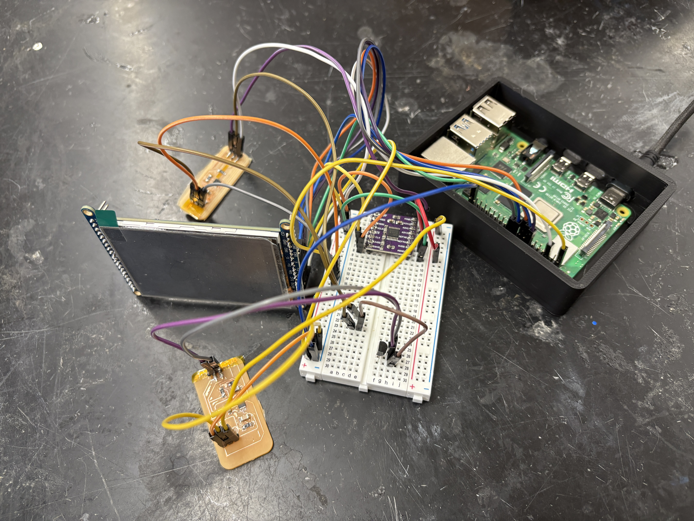
</center>

I tested the output of the REF5025 with a multimeter afterwards to see if the 2.5V reference voltage was properly produced:

<center>

</center>


# 12/16/25

Absent.

# 12/18/25

Today, I worked on my final project and topography map documentation.

# 12/24/25


Downloading [RaspberryPi Imager](https://www.raspberrypi.com/software/), I installed Rasberry Pi OS by writing to a 32GB microsd card. I used my home wifi to ssh into the Pi to confirm that it worked as intended. Then, in VSCode, using the Remote - SSH extension, opening a remote communication window with the Pi's IP address.

In the terminal I ran

```
python -m venv my_venv
```

And then

```
source my_venv/bin/activate
```

to open the virtual environment.

using `pip install`, I downloaded the following libraries:

```
pip install adafruit-blinka

pip install adafruit-circuitpython-rgb-display
```

I tried to upload the sample ILI9341 code I compiled to the LCD, but the screen remained white, unresponsive. After a bit of troubleshooting, I realized that I forgot to solder the IM2, IM3, and IM4 pads on the back of the screen, which enable the SPI communication. Once I did that, the screen was working as intended.


# 1/5/26:

Worked on documentation for semester 1.

# 1/6/26:

At the start of class, I was still a bit confused on the wiring of the RTD to the ADS1220; thus, I went through the ADS1220 datasheet again. It seems that the ADS1220 has a lot more features than I initially thought, including but not limited to IDAC (internal excitation current), differential AND single-ended measurements, internal reference voltage of 2.048V, and innate temperature sensing. Interesting! I ended up following the differential signal configuration, in which I bridged AIN0 and AIN1 with the RTD. I'm going to try programming it with the Pi after school.


# 1/7/26:

Worked on gantt chart and task analysis.

# 1/8/26:

After many attempts and fails to program the single RTD with the Raspberry Pi using our proposed approach of a manual and external excitation current, I re-configured the circuit from scratch: this time, I chose to experiment with the ADS1220 IDAC, so I removed the opa333/transistor module as well as the ina333/rc filter module. Kathryn and I tried to add the lab's wifi to the Pi, but we weren't able to successfully ssh into the Pi, so we wired the new configuration with an Arduino Uno. Theoretically, if this works, there might be the tradeoff of reduced flexibility (since we aren't in control of the ref voltage/excitation current), but on the bright side, I think that we can really simplify this design by using two multiplexers. Curious to see how this approach would work, I started developing a new schematic in Kicad:

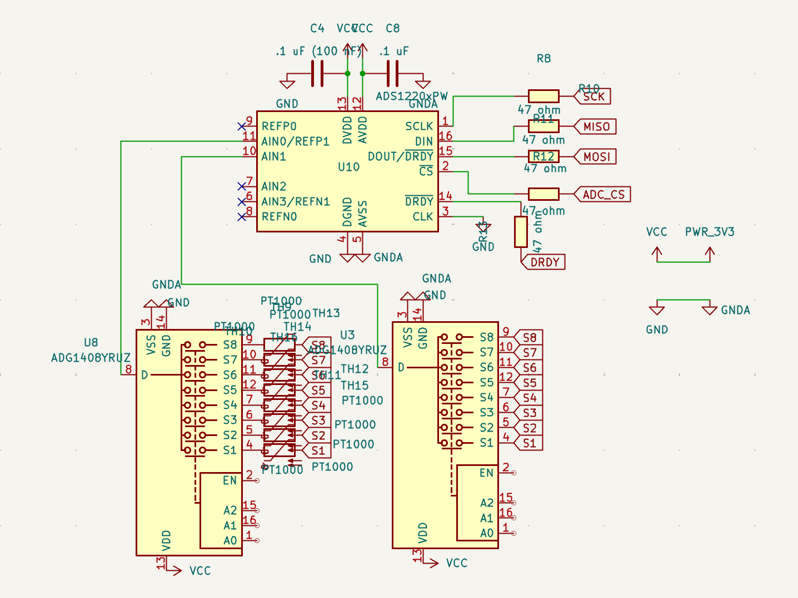

# 1/9/26

Today, I started routing the board in Kicad, and I was able to create a pretty decent layout:

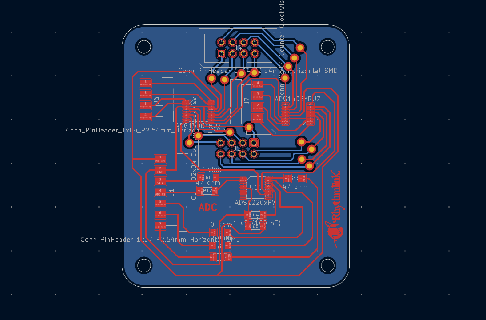


The only problem is that I'm not sure what size via to use. It seems like the lab only has 1.0mm inner diameter rivets, so I assume the size of the hole must be at least 1.0 mm in diameter. I'll verify this on Monday though.


# 1/12/26

[Voltera](https://docs.voltera.io/docs/v-one/learn-v-one/drill-attachment/working-with-rivets) had some documentation on rivet sizes, and they suggested making the drill hole size .1 mm larger than the outer diameter of the rivet. However, since this was my first time working with vias, Mr. Budzichowski recommended running a quick test with different sizes.

Thus I created a test file on KiCad, which features vias with hole diameters 1.0mm-1.5mm. Here's what it looked like:

<center>
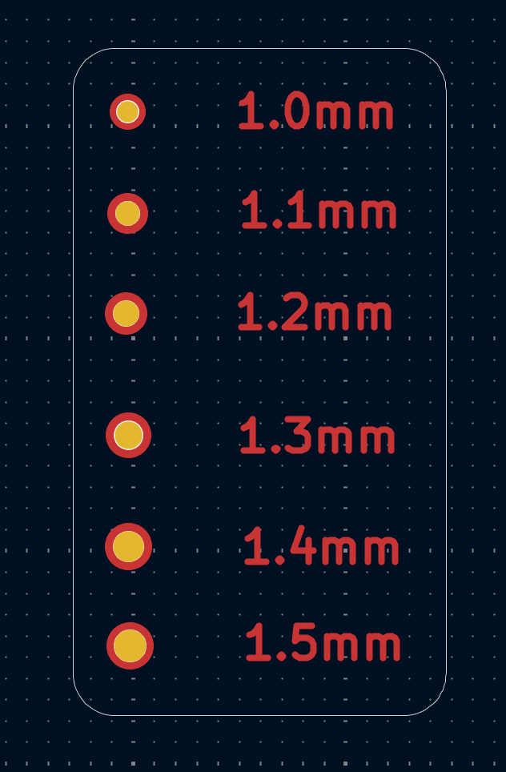
</center>

Upon milling this board, I tried to insert the 1mm ID rivets into each drill hole, and I found that the 1.5mm diameter indeed worked best! During this time, I also had the opportunity to practice installing rivets with the rivet press.

# 1/13/26

I tried milling out the double-sided board today. To do this, I imported the PCB gerbers into MakeraCAM, moved everything to the stock coordinate (6,6), and applied the *horizontal mirror* feature on the B.cu and edge-cuts layers. I then created the toolpaths as usual and sent the files to the Carvera. Since I've encountered issues with "uneven" milling in the past, I put a small piece of nitto on the other side of the FR-1. 

The first side milled quite nicely, but once I turned it around and sent the g-code for the backside, I noticed that it was unaligned with the front. ( • ᴖ • ｡)

Although it was frustrating to dedicate a lot of time to a board that ended up failing, I'm still glad I did, as I noticed that the 1.5 mm drill hole size did not accomodate the via as well on the double-sided FR-1 vs. the single-sided FR-1 that I did the via test on. Keeping this in mind, I changed the 1.5mm diameter to 1.6mm.


# 1/14/26

In preparation for the Rhythmlink presentation tomorrow, I wanted to finish up two tasks:

1. Successfully produce the double sided PCB
2. 3D print an updated electronics casing

First, to tackle the double sided PCB, Mr. Budzichowski and I ran a quick test to see if there was an inherent offset to the origin of the machine, and as we guessed, there was! That would explain the misalignment of the front/back-side mills. To solve this, we manually reset the origin by using the manual XYZ axis probe. We followed [this official tutorial](https://www.youtube.com/watch?time_continue=154&v=JMioN66AYvk&embeds_referring_euri=https%3A%2F%2Fwww.google.com%2F&source_ve_path=MjM4NTE) from the Makera youtube channel. Thankfully the process was pretty straight-forward:

1. Install the special probing bit into one of the tool-changing beds

2. In the Carvera control app, manually load the probing bit by selecting the appropraite tool-changing bed

3. Once the probing bit is selected, click "calibrate" under the tool menu

4. Remove the dust chute to prevent it from obstructing the tool

5. Install the stock material onto the spoil bed

6. In the Carvera control app, use the jog controls to manually position the bit roughly over the bottom left corner of the stock material

7. Plug the probing block into the side port of the machine

8. Sit the probing block on the stock material such that the L-shape lines up with the corners of the stock

9. Attach the magnetic extension of the probing block to the spindle

10. Adjust the position of the probing bit so that it is hovering above the "pocket" of the probing block

11. Click the "run and config" button

12. Under "set work origin," click "config"

13. Select "set by XYZ probe"

14. Press "OK"; the machine will begin its sequence, pressing the probing bit against the edge of the probing block pocket

Once I completed this sequence, I tried milling out the board again, and it worked!

While I was waiting for the board to mill, however, I decided to print the new electronics case, including the new middle compartment and the LCD-mounted top. With permission, I used the lime filament to print the Rhythmlink logo. Here is the case:


<center>
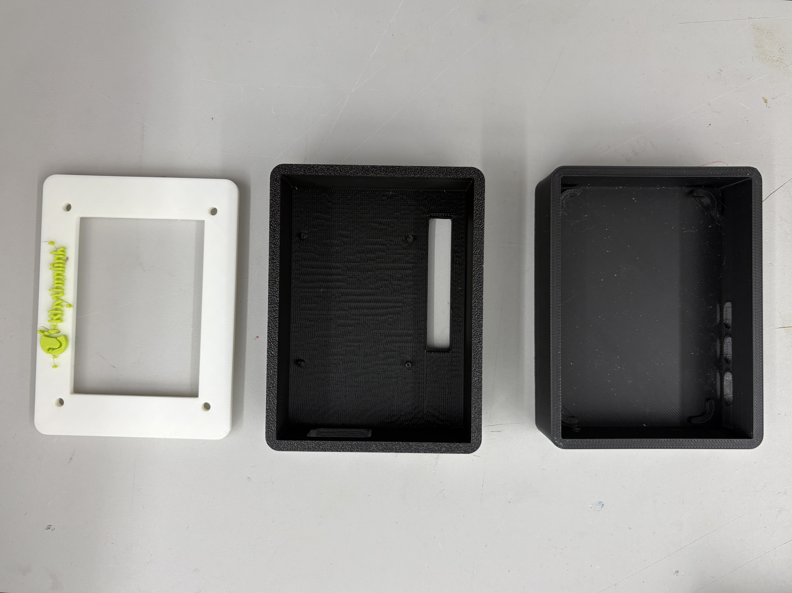
</center>

# 1/15/26

Rhythmlink presentation day.

# 1/21/26

During class, I used reflow soldering to solder the 2 ADG1408 chips and the 1 ADS1220 to the master board. Since I had some practice from assembling the breakout boards from before, this wasn't as difficult, and I was able to finish soldering everything within the period. Similar to before, I used Kapton tape to ensure that the pin headers weren't making unnecessary contact with some of the other traces. In the future, I'll make sure to account for this within the PCB layout design.


<center>
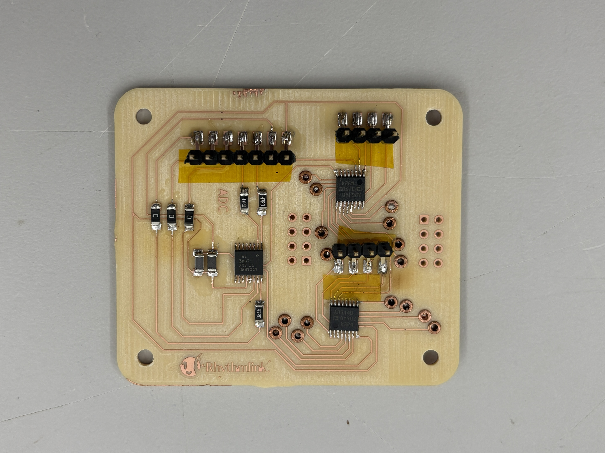
</center>

# 1/22/26

Today, I began constructing the individual flex nodes by soldering the RTDs to the circular flex PCBs. After soldering 8 of the these nodes, I applied a trace amount of super glue to keep the top of the RTD securely attached. Here is what it looked like assembled:

<center>
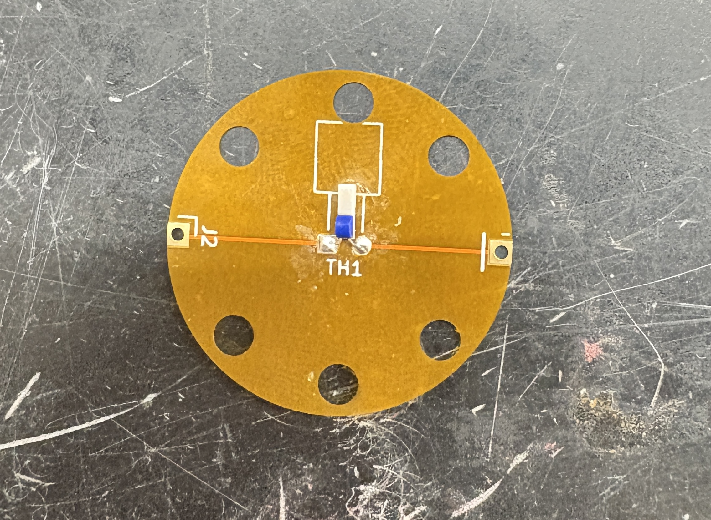
</center>

Here is the proposed layout on the sleeve:


<center>
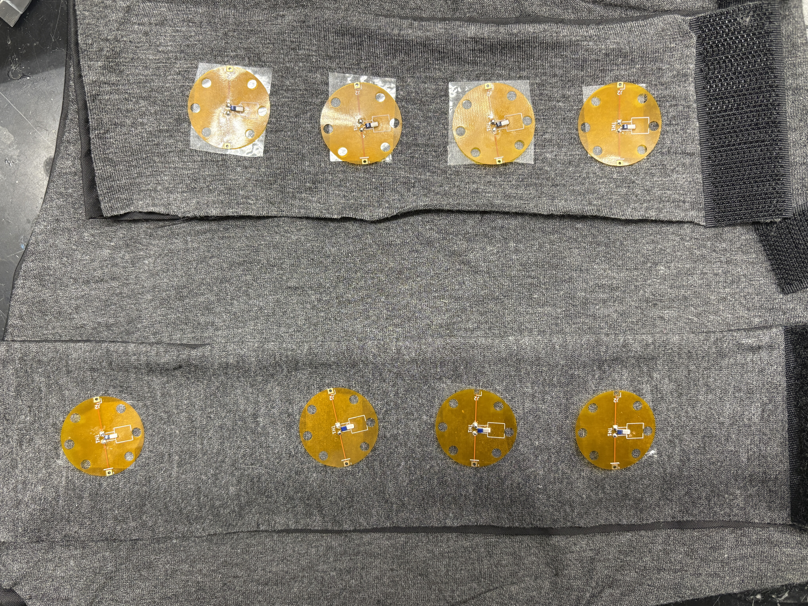
</center>

Since each one of these nodes is connected to the same channel of two multiplexers, I also designed this connector flex pcb:

<center>
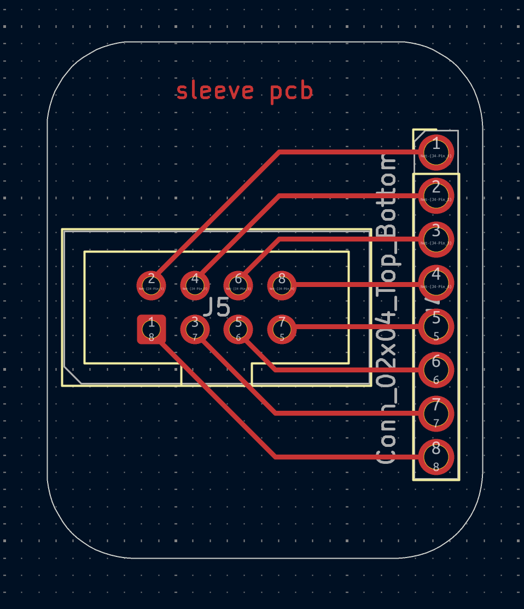
</center>


# 1/28/26

Today, I soldered the 2x4 male to the master board; one of the traces unfortunately ripped on the back side when I pushed its pins through, so I had to improvise and use a stray piece of wire to force the connection. Once I confirm the board is working as intended, I'll likely apply hot glue to the back since my solution is a bit flimsy. 


<center>
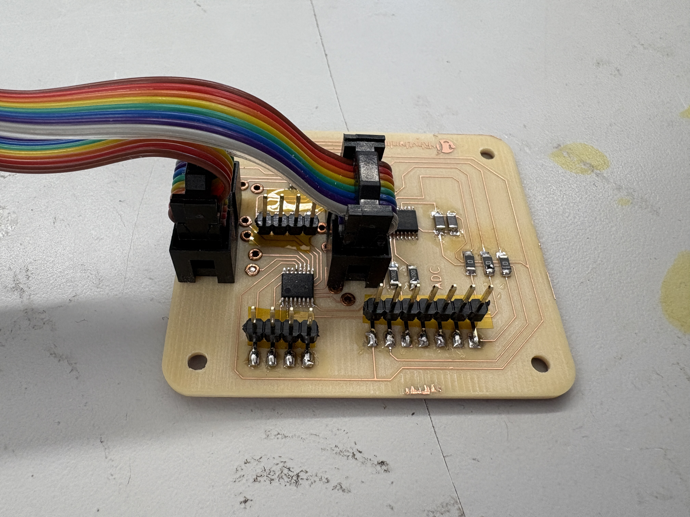
</center>

I wanted to try assembling the full electronics case afterwards, but I don't think there is enough free space in the middle compartment to fit the screen on top of the PCB. To solve this, I went back into Fusion360 and increased the wall length by around 10mm and re-printed it on the X1. 

For the remainder of class, I adjusted my ADC_manager class code, as it was still operating on the assumption that we would be using an external reference voltage, rather than the internal reference voltage of 2.048. I additionally made changes to define a specific excitation current based on the available IDAC values.

# 1/29/26

I began class by assembling the newly printed middle compartment of the electronics case with the PCB and the mounted LCD, and it fit perfectly! I think this will be one of the final iterations for the case, thankfully. 

Since Kathryn and I were experiencing some issues with remotely SSH-ing into the RPi, we decided to try a new approach, recommended by Collin: Pi Connect. To do this, I scrapped the headless setup and connected the Pi to a desktop, keyboard, and mouse. I then opened the terminal and, following the [online documentation](https://www.raspberrypi.com/documentation/services/connect.html), ran 

```
sudo apt install rpi-connect
```

followed by 

```
rpi-connect on
```

I signed in by clicking the "sign-in" icon in the top toolbar, before logging in with my Raspberry Pi ID. Then, opening the [devices page](https://connect.raspberrypi.com/devices) on my personal device, I could screen-share/remotely access the Pi as long as it was plugged into the monitor. This was pretty cool, but in the future, I'd like to still figure out a way to upload code directly through VS. Anyways, to test out my code, I pasted my `single_rtd_test.py` and `ADC_manager.py` scripts into Geany, downloaded all library packages (caldus, numpy, rpi-gpio, etc.), and clicked run. Unfortunately, despite confirming that the caldus library was actually downloaded and that SPI was on (done through `raspi-config`), the terminal kept saying that it couldn't find the caldus package. I'm not sure why this is the case, but for now, I decided to remove the resistance to temperature function in the code and simply display the measured voltage. 

On a side note, Kathryn has used regular thread to effectively attach the RTD flexible PCB nodes to the sleeve. 


# 2/4/26

After attempting to program the RPi over the weekend to no avail, I decided to continue trouble-shooting during class today. However, upon connecting my pi to the monitor and initiating Pi connect, I noticed that neighter the keyboard nor the mouse was working, and frustratingly, the monitor kept flickering on and off. Initially, I speculated that this was an issue related to the power supply, but after swapping out the power supply a couple of times (and also attempting to connect the Pi directly to my Mac), I realized that it might just be an issue with a faulty Pi. The Pi seems less reliable at the moment, and given the current time frame, I've made the decision to switch to using an Atmega328P.

Arduino IDE conveniently supports an ADS1220 library, meaning that switching over to this microcontroller should be a relatively streamlined process. Using ChatGPT, I converted my code from Python to C++, keeping the same settings of the ADC (IDAC, 1mA, differential voltage between AIN0 and AIN1). Here is the updated code:


```
#include "Protocentral_ADS1220.h"
#include <SPI.h>
#include <Adafruit_GFX.h>
#include <Adafruit_ILI9341.h>


// ==============================
// ADS1220 configuration
// ==============================
#define PGA 1
#define VREF 2.048
#define VFSR (VREF / PGA)
#define FSR (((long int)1 << 23) - 1)


// ==============================
// Pin definitions
// ==============================
#define ADS1220_CS_PIN    10
#define ADS1220_DRDY_PIN  2


#define TFT_CS   7
#define TFT_DC   9
#define TFT_RST  8


// ==============================
// SPI settings
// ==============================
SPISettings ads1220SPI(1000000, MSBFIRST, SPI_MODE1);
SPISettings tftSPI(8000000, MSBFIRST, SPI_MODE0);


// ==============================
// Objects
// ==============================
Adafruit_ILI9341 tft = Adafruit_ILI9341(TFT_CS, TFT_DC, TFT_RST);
Protocentral_ADS1220 pc_ads1220;


volatile bool drdyIntrFlag = false;
int32_t adc_data;


// ==============================
// DRDY interrupt
// ==============================
void drdyInterruptHndlr() {
 drdyIntrFlag = true;
}


void enableInterruptPin() {
 attachInterrupt(digitalPinToInterrupt(ADS1220_DRDY_PIN),
                 drdyInterruptHndlr, FALLING);
}


// ==============================
// Setup
// ==============================
void setup() {
 Serial.begin(115200);
 SPI.begin();


 // ---- TFT INIT ----
 SPI.beginTransaction(tftSPI);
 tft.begin();
 SPI.endTransaction();


 tft.setRotation(3);
 tft.fillScreen(ILI9341_WHITE);


 tft.setCursor(10, 20);
 tft.setTextColor(ILI9341_BLACK);
 tft.setTextSize(2);
 tft.print("Forearm Temp. Monitor");


 tft.drawLine(0, 40, 320, 40, ILI9341_BLACK);


 tft.setTextSize(2);
 tft.setTextColor(ILI9341_BLACK);
 tft.setCursor(10, 60);
 tft.print("Temperature in C:");


 tft.setCursor(10, 110);
 tft.print("Temperature in F:");


 tft.setCursor(10, 160);
 tft.print("NCS Status:");


 // ---- ADS1220 INIT ----
 pc_ads1220.begin(ADS1220_CS_PIN, ADS1220_DRDY_PIN);


 pc_ads1220.set_data_rate(DR_20SPS);
 pc_ads1220.set_pga_gain(PGA_GAIN_1);
 pc_ads1220.select_mux_channels(MUX_AIN0_AIN1);


 pc_ads1220.set_IDAC_Current(IDAC_1000);    // 1 mA excitation
 pc_ads1220.set_IDAC1_Route(IDAC1_AIN0);
 pc_ads1220.set_IDAC2_Route(IDAC_OFF);


 pc_ads1220.set_conv_mode_continuous();
 pc_ads1220.Start_Conv();


 enableInterruptPin();
}


// ==============================
// Main loop
// ==============================
void loop() {
 if (!drdyIntrFlag) return;
 drdyIntrFlag = false;


 // ---- SAFE SPI READ ----
 SPI.beginTransaction(ads1220SPI);
 adc_data = pc_ads1220.Read_Data_Samples();
 SPI.endTransaction();


 // ---- Voltage calculation ----
 float Vout_mV = (adc_data * VREF * 1000.0) / (FSR * PGA);


 // ---- Resistance (1mA excitation) ----
 float resistance = Vout_mV;   // mV == ohms


 // ---- PT1000 temperature ----
 float pt1000_temp_C = (resistance - 1000.0) / 3.85;


 float pt1000_temp_F = pt1000_temp_C * (9) / 5 +32;


 // ---- Serial output ----
 Serial.print("ADC: ");
 Serial.print(adc_data);
 Serial.print(" | Vout: ");
 Serial.print(Vout_mV, 6);
 Serial.print(" mV | R: ");
 Serial.print(resistance, 2);
 Serial.print(" ohm | T: ");
 Serial.print(pt1000_temp_C, 2);
 Serial.println(" C");


 // ---- TFT UPDATE ----
 SPI.beginTransaction(tftSPI);


 tft.fillRect(10, 85, 300, 20, ILI9341_WHITE);
 tft.setCursor(10, 85);
 tft.setTextColor(ILI9341_BLACK);
 tft.setTextSize(2);
 tft.print(pt1000_temp_C, 2);
 tft.print(" C");


 tft.fillRect(10, 135, 300, 20, ILI9341_WHITE);
 tft.setCursor(10, 135);
 tft.setTextColor(ILI9341_BLACK);
 tft.print(pt1000_temp_F, 2);
 tft.print("  F");


 tft.fillRect(10, 185, 300, 20, ILI9341_WHITE);
 //tft.setCursor(10, 185);
 if (pt1000_temp_C >= 31 && pt1000_temp_C <= 34) {
 tft.drawCircle(150,  165,  8, ILI9341_GREEN);
  tft.fillCircle(150, 165, 8, ILI9341_GREEN);
  tft.fillRect(1, 190, 300, 100, ILI9341_WHITE);
    tft.setCursor(10, 190);
   tft.setTextColor(ILI9341_GREEN);
   tft.print("PROCEED WITH ");
   tft.setCursor(10, 206);
   tft.print("NERVE CONDUCTION STUDY");
 }
 else {
   tft.drawCircle(150,  165,  8, ILI9341_RED);
   tft.fillCircle(150, 165, 8, ILI9341_RED);
   tft.fillRect(1, 190, 300, 100, ILI9341_WHITE);
    tft.setCursor(10, 190);
   tft.setTextColor(ILI9341_RED);
   tft.print("DO NOT PROCEED WITH NERVE CONDUCTION STUDY");
 }


 SPI.endTransaction();


 delay(300);
}


```


I tested this code with the LCD wired up, directly probing the RTDs, and I got suitable readings for the individual RTDs:

<center>
<video width="500" height="300" controls>
  <source src="temptest.mp4" type="video/mp4">
</center>

# 2/11/26

I looked into developing the sleeve heater today, and it seems like JLCPCB requires just a DXF file (nice!). In terms of the circuit, I'm using a Proportional Integral Derivative (PID) system, a feedback loop design that incorporates a current heating pad and a  sensor to regulate the temperature. The lab has a couple of SMD thermistors, and this part of the project doesn't seem to have to be super precise, so I'm likely going to use it.

Following an [online example](https://electronoobs.com/eng_arduino_tut24.php), I iniitally wanted to use the IRFZ44N Mosfet paired with the S8050 transistor, but I soon realized that this wouldn't be feasible in terms of compactness because the mosfet has a gate threshold voltage of 10V (they integrated a 12V power source). Thus, I chose to use the AO344A mosfet. Besides that, it seems that the only thing I need is a PWM pin from a microcontroller of choice. 

Here is the DXF file I intend on sending: [link to file](SleeveFInished-2.dxf).


# 2/18/26

I made modifications to the ADC/MUX board to account for the shared address pins on the MUX. I used more rivets and vias to connect A0, A1, and A2 to common pins. This layout is more favorable, since I'll ultimately have to use less jumper wires (yay for better system integration!). 


<center>
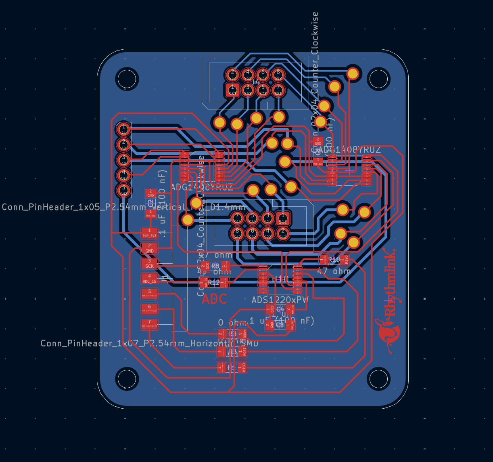
</center>


# 2/19/26-2/20/26

Today, I began milling out V2 of the ADC/MUX board. Unfortunately, because another class was using the milling machines and removed the bracket, I had to recallibrate the machine manually with the XYZ probe. In the past, I've experienced issues with the bit not fully penetrating through the copper (largely due to PCB not being uniformly attached to the spoil board), so I was especially anxious this time. I impulsively terminated the mill half-way through to check up on the board, and it seemed fine, but I wasn't sure how to begin the mill again without going repeating part of the g-code. To solve this, I searched up how to move to a specific line in the g-code and found this handy [Makera Wiki](https://wiki.makera.com/en/knowledge-sharing/knowledge-sharing/starting-from-middle-of-file). I simply had to start the g-code again, deactivating scan margin and all z-axis probing options, pause the job, and click the "MDI" button. In the command line, I typed `goto ____` and inserted the last line of the g-code I was on before I terminated the job. This seemed to work.

When I came back to check up on the job, the internal lights of the machine were off. I'm not sure why this happened, but when Mr. Budzichowski and I started the job again, the machine proceeded to ram its bit into the probing bit station. Later, I learned that this is because the machine reset sometime during the job and failed to recognize that it still had a bit installed. I'll have to mill on Monday.

# 2/23/26

I tried milling my board again today. I keep running into the issue of misalignment whenever I run the mill for the backside, and I'm not sure why. I tried manually recallibrating the XY origin with the probing block, but this doensn't seem effective. Partway through, I noticed that there was something slightly off with my MakeraCAM file: when I tried mirroring the B.Cu gerber files and mirrored it back, I noticed that it didn't align anymore. This was an especially frustrating discovery, since the difference is only 1-2 mm. At the same time, there is an arbitrary fail rate with the front side of the board too (the bit doesn't mill certain traces occasionally), which adds to the challenge of milling this board. 

While waiting for these boards (yes, plural. Many boards. (•́ ᴖ •̀)) to mill, I began designing the ATMEGA328P board in Kicad. Besides a couple of mandatory components (crystal, 22pF capacitors, reset pull-up resistor), the design was intuitive. 

Here is what my schematic looks like:


and the PCB layout:

<center>
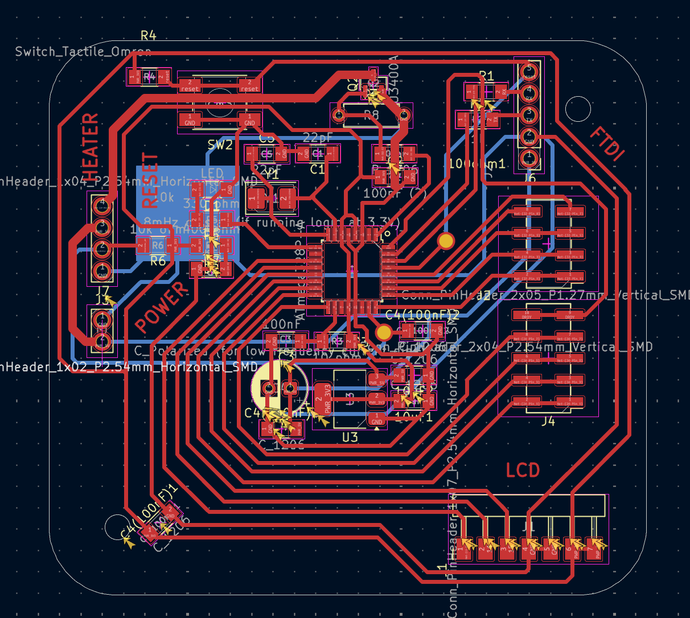
</center>


# 2/24/26

After my nth attempt at milling the ADC/MUX board, I was able to get a successful board! Through this experience, I have reached a conclusion and semi-fool proof way to mill double sided boards. Due to the L-shaped nature of the brackets (different from the Bantam's T-shaped brackets), human error also contributes significantly to misalignment of holes/traces. To solve this, it is important to callibrate the machine BEFORE both sides are milled.

I spent the rest of class soldering this board. Here's what it looked like:


<center>
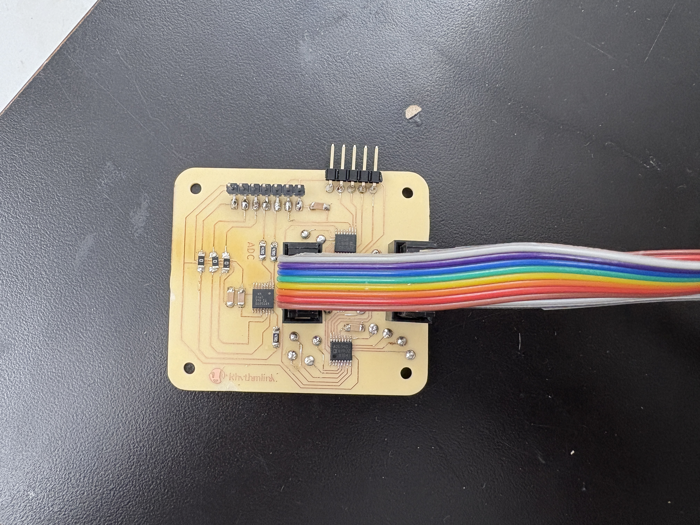
</center>

After school, I milled the atmega328pboard on the older Bantam machines, since those get the job done quicker compared to the Carveras. I promptly soldered all the components on the PCB afterwards, and here is the finished result:

<center>
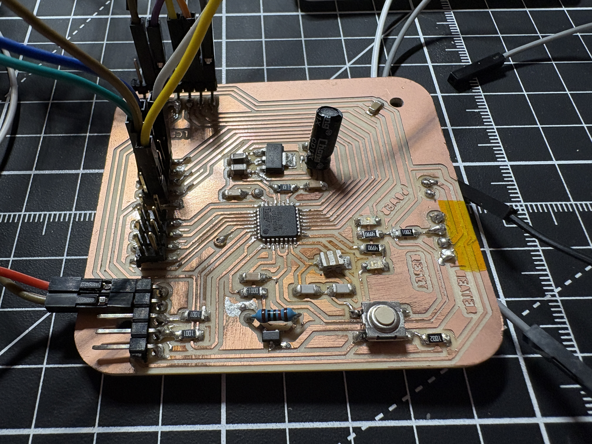
</center>

I checked for bridges and continuity errors on both boards, and as of right now, it seems that both should work fine.

At the end of class, I also started a new print of the electronics casing that supports the new Atmega328p board.

# 2/26/26

Today, I tried to program the ATMega328P board and get a basic blink code uploaded to it. After doing some research and reading through [this forum](https://www.thethingsnetwork.org/forum/t/how-to-program-an-atmega-328p-on-pcb/62102), I learned that, before programming the board through a USB-to-serial converter, I need to burn the bootloader first. To do this, I used another Arduino Uno and treated it as a programmer by connecting the ISP pins to my PCB (digital pin 10 to reset, 11 to MOSI, 12 to MISO, 13 to SCK, and power/ground pins). In ArduinoIDE, I opened `Examples` > `ArduinoISP` sketch and uploaded it with "Arduino Uno" as the board selected. This worked without any challenges. However, when I tried to burn the bootloader, I kept getting a  `avrdude stk500_recv(): programmer is not responding avrdude: stk500_getsync() attempt 1 of 10: not in sync: resp=0x00` error, which indicates that the computer is unable to communicate with my PCB. I checked my wiring a few times but couldn't find any major errors.

After school, Kathryn finished using conductive thread to connect the leads of each rtd to the connector flex pcb.

# 2/27/26-2/28/26

I talked to Mrs. Dhiman, and she said that a while back, when she tried to get the Atmega328p working during Fab Academy, there was a larger issue with the chips themselves. If this is the case, the chip might be the problem preventing me from burning the bootloader. I was curious if the same thing would happen if I tried to burn the bootloader from one Arduino Uno to another. Thus, I replicated the ISP pin connections, connecting the digital pins 11-13 between two Arduinos, and digital pin 10 of the "programmer" to the reset pin of the target board. Surprisingly, when I tried to burn the bootloader, this did work, and I was able to upload code to the target Arduino.

Seems like the chips are fine. I went back online to search for solutions and found from [this Arduino forum](https://forum.arduino.cc/t/why-the-capacitor-between-reset-and-gnd-for-arduino-as-isp/1313487) that a 10uF electrolytic capacitor might be required between the reset and ground pin of the programmer, so I added it to my programmer Arduino Uno and tried again with my PCB. No success. Frustrated, I decided to put this task to rest for today.

<center>
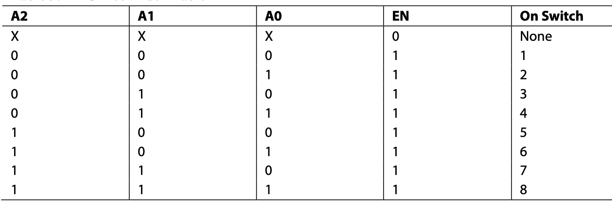
</center>

I spent the rest of my time at the lab today attaching a battery pack to a buck converter and installing it into the new 3D-printed case. This design was conveniently compact:

<center>
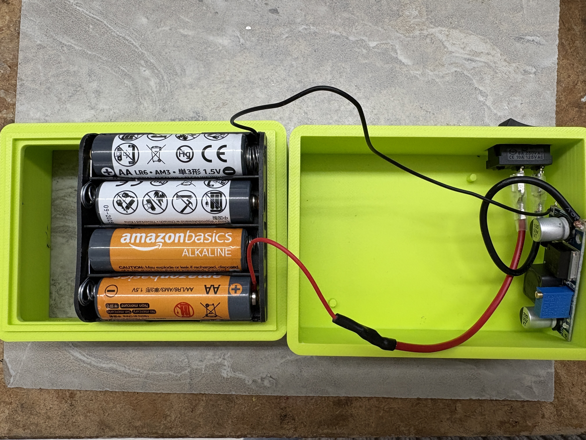
</center>

and here is the case fully assembled with the screen:

<center>

</center>

# 3/3/26

I was absent today, but I still had my hands on my multiplexer/adc board, so I tried to work with it at home. The multiplexer mechanics are pretty simple: the address lines A0-A2 are individually controlled by digital pins. The datasheet specifies how the combinations of HIGH/LOW conditions activate specific channels.

To verify the channels were actually changing, I connected one probe of a multimeter to the common ground and the other probe to A0-A2. I compared the jumps to 5V with the HIGH/LOW conditions from the table. Then, I plugged in the ribbon cables and used this code to rotate through all 8 channels and output the temperature of the RTD to the LCD:

```
#include "Protocentral_ADS1220.h"
#include <SPI.h>
#include <Adafruit_GFX.h>
#include <Adafruit_ILI9341.h>

// ==============================
// ADS1220 configuration
// ==============================
#define PGA 1
#define VREF 2.048
#define FSR (((long int)1 << 23) - 1)

// ==============================
// Pin definitions
// ==============================
#define ADS1220_CS_PIN    10
#define ADS1220_DRDY_PIN  2

#define TFT_CS   7
#define TFT_DC   9
#define TFT_RST  8

// ADG1408 pins
const int a0Pin = 15;
const int a1Pin = 16;
const int a2Pin = 17;
const int enPin1 = 18;
const int enPin2 = 19;

// ==============================
// SPI settings
// ==============================
SPISettings ads1220SPI(1000000, MSBFIRST, SPI_MODE1);
SPISettings tftSPI(8000000, MSBFIRST, SPI_MODE0);

// ==============================
// Objects
// ==============================
Adafruit_ILI9341 tft = Adafruit_ILI9341(TFT_CS, TFT_DC, TFT_RST);
Protocentral_ADS1220 pc_ads1220;

volatile bool drdyIntrFlag = false;
int32_t adc_data;

// ==============================
// DRDY interrupt
// ==============================
void drdyInterruptHndlr() {
  drdyIntrFlag = true;
}

void enableInterruptPin() {
  attachInterrupt(digitalPinToInterrupt(ADS1220_DRDY_PIN),
                  drdyInterruptHndlr, FALLING);
}

// ==============================
// Select channel on both MUXes
// ==============================
void selectChannelBothMUX(int channel) {

  digitalWrite(a0Pin, (channel & 1) ? HIGH : LOW);
  digitalWrite(a1Pin, (channel & 2) ? HIGH : LOW);
  digitalWrite(a2Pin, (channel & 4) ? HIGH : LOW);

  digitalWrite(enPin1, HIGH);
  digitalWrite(enPin2, HIGH);

  delay(60); // allow one conversion period (20SPS = 50ms)
}

// ==============================
// Setup
// ==============================
void setup() {

  Serial.begin(115200);
  SPI.begin();

  // ---- TFT INIT ----
  SPI.beginTransaction(tftSPI);
  tft.begin();
  SPI.endTransaction();

  tft.setRotation(3);
  tft.fillScreen(ILI9341_WHITE);
  tft.setTextSize(2);
  tft.setTextColor(ILI9341_BLACK);

  tft.setCursor(10, 10);
  tft.print("8-Channel PT1000 Monitor");
  tft.drawLine(0, 30, 320, 30, ILI9341_BLACK);

  // ---- ADS1220 INIT ----
  pc_ads1220.begin(ADS1220_CS_PIN, ADS1220_DRDY_PIN);
  pc_ads1220.set_data_rate(DR_20SPS);
  pc_ads1220.set_pga_gain(PGA_GAIN_1);
  pc_ads1220.select_mux_channels(MUX_AIN0_AIN1);

  pc_ads1220.set_IDAC_Current(IDAC_1000);   // 1 mA excitation
  pc_ads1220.set_IDAC1_Route(IDAC1_AIN0);
  pc_ads1220.set_IDAC2_Route(IDAC_OFF);

  pc_ads1220.set_conv_mode_continuous();
  pc_ads1220.Start_Conv();

  enableInterruptPin();

  // ---- MUX INIT ----
  pinMode(a0Pin, OUTPUT);
  pinMode(a1Pin, OUTPUT);
  pinMode(a2Pin, OUTPUT);
  pinMode(enPin1, OUTPUT);
  pinMode(enPin2, OUTPUT);

  digitalWrite(enPin1, LOW);
  digitalWrite(enPin2, LOW);
}

// ==============================
// Main loop
// ==============================
void loop() {

  for (int channel = 0; channel < 8; channel++) {

    selectChannelBothMUX(channel);

    // Wait for conversion ready
    while (!drdyIntrFlag);
    drdyIntrFlag = false;

    SPI.beginTransaction(ads1220SPI);
    adc_data = pc_ads1220.Read_Data_Samples();
    SPI.endTransaction();

    // ---- Voltage calculation ----
    float Vout_mV = (adc_data * VREF * 1000.0) / (FSR * PGA);

    // ---- Resistance (1mA excitation) ----
    float resistance = Vout_mV;   // 1mA → mV = ohms

    // ---- PT1000 temperature ----
    float tempC = (resistance - 1000.0) / 3.85;
    float tempF = tempC * 9.0 / 5.0 + 32.0;

    // ---- Serial Debug ----
    Serial.print("CH");
    Serial.print(channel);
    Serial.print(" | T: ");
    Serial.print(tempC, 2);
    Serial.println(" C");

    // ---- TFT Display ----
    SPI.beginTransaction(tftSPI);

    int yPos = 40 + channel * 25;

    tft.fillRect(10, yPos, 300, 20, ILI9341_WHITE);
    tft.setCursor(10, yPos);

    tft.print("CH");
    tft.print(channel);
    tft.print(": ");
    tft.print(tempC, 2);
    tft.print(" C  ");
    tft.print(tempF, 1);
    tft.print(" F");

    SPI.endTransaction();

    digitalWrite(enPin1, LOW);
    digitalWrite(enPin2, LOW);
  }

  delay(200);
}
```

and I noticed something odd. Even though I verified each channel's RTDs was individually worknig with high accuracy (.5ºC error), when I introduced the multiplexer, the results were indicating either no connection or severely high (incorrect) temperature readings. 

<center>
<video width="500" height="300" controls>
  <source src="badmultiplex.mp4" type="video/mp4">
</center>

Curious about what caused this, I changed back to the simpler, non-multiplexer configuration and compared the readings when I directly probed the RTDs vs. using the ribbon cable connectors.

<center>
<video width="500" height="300" controls>
  <source src="stable.mp4" type="video/mp4">


</center>
<center>
  <video width="500" height="300" controls>
  <source src="unstable.mp4" type="video/mp4">
  </center>

This brought me to my final conclusion that this design may not sustain in the long-term due to unstable connections between the RTDs and the microcontroller/main PCB. The inconsistency in the stitching, constant fabric flexing, and hybrid interface between the flex PCBs and the spandex compromises much of the data quality, leading to inaccurate readings. Although I'm able to occassionally obtain accurate readings through this type of connection, it's not reliably recreated.

# 3/4/26

I took on the challenge again of burning the bootloader to clean up this prototype in preparation for presentations. At some point, I was wondering if the problem had to do with the board I had selected on Arduino IDE, so I tried finding a native Atmega328P board option. To do this, I found the [MiniCore](https://github.com/MCUdude/Minicore) library, and pasted `https://mcudude.github.io/MiniCore/package_MCUdude_MiniCore_index.json` in the Additional Boards Manager URLs. In terms of the clock settings, I selected external 16mHz. When I tried to burn the bootloader again, I got the same communication error. At this point, I wasn't really sure what to do, so I went online and read through some forums again. This is when I found [this forum](https://forum.arduino.cc/t/solved-trouble-burning-bootloader-to-atmega328p-au/676462/9), which suggested touching the jumper from pin 10 of the programmer to the reset pin of the Atmega328p directly. I was initially skeptical of this solution because I had checked continuity between my header pin and the reset pin, but I tried it anyways, and it worked! It seems that, at least for programming via Arduino as ISP, making this jump is necessary. 

I uploaded the basic graphicstest to the PCB after connecting its SPI pins to the LCD. Here's a video of it working:

<center>
<video width="500" height="300" controls>
  <source src="graphicstest.mp4" type="video/mp4">
  </center>

Here is an updated workflow on programming the Atmega328P:

1. Find a standard Arduino Uno to serve as the programmer

2. Create all ISP connections (Arduino Uno digital pins 11-13) between the Arduino Uno and the target board

3. Insert a male-to-male jumper wire into digital pin 10

4. Insert a 10uF electrolytic capacitor between Ground and Reset on the Arduino Uno programmer, with the positive leg inserted into Reset

5. Under `Examples`, run the `ArduinoISP` sketch, selecting `Arduino Uno` as the board

6. Once that sketch has uploaded, manually jump the jumper wire in the Arduino's digital pin 10 to the Atmega328P's reset pin

7. Under `Tools`, ensure that `Arduino as ISP` is selected as the programmer

8. Click `Burn Bootloader` and verify that the bootloader has successfully been burnt

9. When uploading code, continue manually jumping digital pin 10 to the reset pin, and use the `Upload using Programmer` option


# 3/5/26

Presentation day.

