---
title: PCB Milling Workflows 
description: Using MakeraCAM to develop PCB Boards
image:
date: 2025-08-25

categories:
    
tags: 
    - daily journal
    
weight: 1      # You can add weight to some posts to override the default sorting (date descending)

---

## Introduction and Scope

[Subtractive manufacturing](https://www.makerverse.com/resources/insights-and-trends/subtractive-manufacturing/) is a process where material is removed from a larger block of stock to create a final part, using techniques like cutting, drilling, and milling. This article will cover the fundamentals and everything you need to get started for producing your own printed circuit boards through the following softwares:

 

## CNC Router Terminology

* **Flute**: Cutting edge of a metal bit for removing stock material. Most common types of flutes include a **straight flute** and **spiral flute**  

    * **Straight Flute**

    * **Spiral Flute**

* **Chip load**: Thickness of a machined chip as cut by a specific tool type 
* **Spindle speed**:  Number of revolutions made by the endmill in a unit of time (RPM) 

## Feeds and Speeds

**Feeds and speeds** are the two key variables that control a cutting tool's movement and rotation when shaping material through CNC machining:  

* **Speed** is the rotational speed of the tool, measured in revolutions per minute (RPM).
* **Feed** refers to how fast the tool moves through the material, measured in units per minute (like inches per minute or millimeters per minute). There are two types of feeds:

     * **Standard Feed Rate**: The speed at which the tool moves across the material. 
        
     * **Plunge Rate**: The speed at which the tool moves down into the material, often set lower than the standard feed rate to reduce stress. 

There isn't one *universal* way to determine speeds and feeds because they often depend on the material, tool, spindle speed, and desired cut quality. However, having the wrong speed/feed can introduce a variety of problems, including but not limited to tool breakage and stock damage.

## MakeraCAM Workflows

**Key notes:**
* .8mm Corn flat-end bit is used to remove the bulk of the material
* The .2mm*30ºEngraving(Metal) engraving bit will be used to cut out the copper traces
* The Makera Milling machine affixes the FR4 using clamps, rather than adhesive, so tabs are necessary to keep the PCB in place.
* 2D contour is used for edge cuts 
* 2D pocket is used for copper traces
* 2D drilling is used for drill holes  

**PCB Toolpath Workflow on MakeraCAM**

1. Open **MakeraCAM** on your desktop.
2. Select the “3-AXIS” option on the welcome screen.
3. Edit the “Stock” settings in the top right corner

   3a. For Material, select “PCB”

   3b.For Length(X), adjust the value to 150mm

   3c. For Width(Y), adjust the value to 100mm

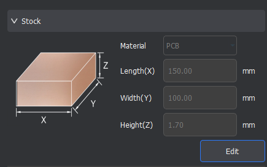

4. For Height(Z), adjust the value to 1.7mm (thickness of FR4)
5. In the top toolbar, click the icon titled “import PCB” and individually insert all Gerber files into the workspace.

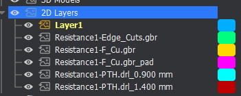

6. The imported gerbers will likely populate outside of the workspace, so select all 2D layers, hover over the “Adjust object” and “Transform” drop-down menu and select the  “Move” tool
7. When layers are dotted, that indicates that they are selected; when layers are solid, that indicates that they are unselected

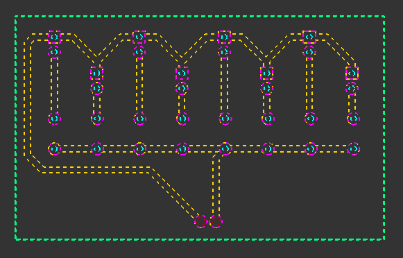 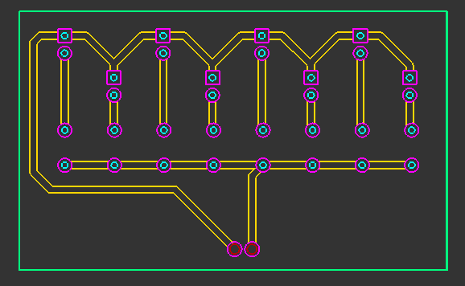

8. Select the bottom left corner as the anchor point
9. Set both the X and Y location values to 6 mm, which positions the file in the bottom right corner of the workspace

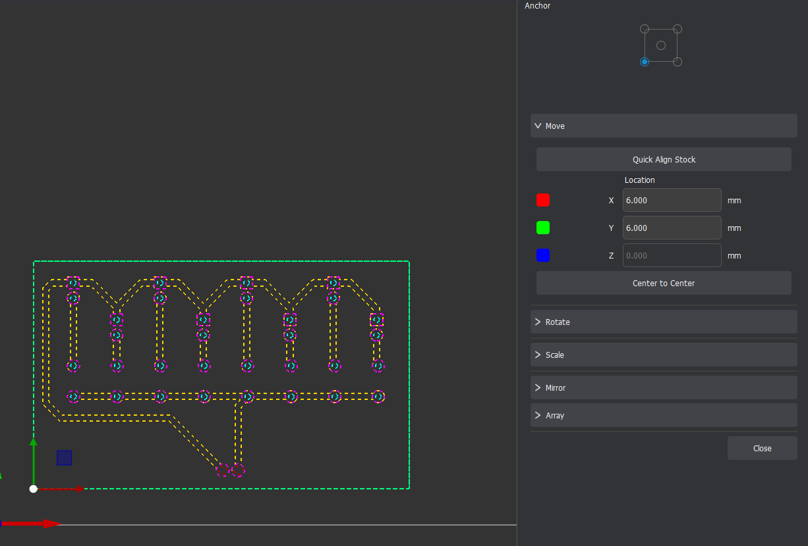

10. Keeping all layers selected, hold the shift key and deselect the outer edge of the Edge_cuts
11. Toggle the visibility such that only the “F_Cu” and the “Edge_cuts” layer are visible 
12. In the top toolbar, hover over the “2D Path” drop-down menu and select the “2D Pocket” option
13. In the dialogue box, adjust the “End Depth” value to .05mm
14. Under “Tools,” click the “Add Tool” button, select “.8mm Corn tool” and click “Choose”

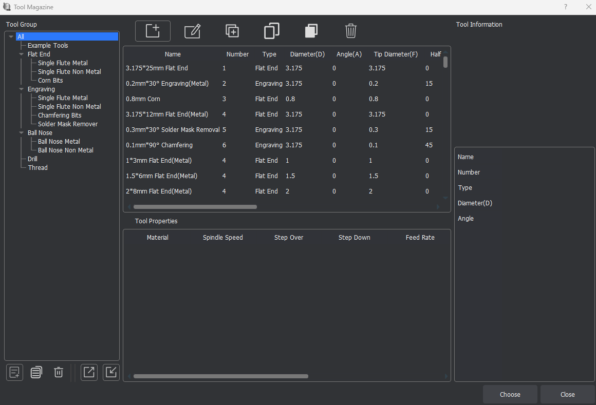

15. Click “Add Tool” again, select the “.2mm*30ºEngraving(Metal),“ and click “Choose”
16. Ensure that the material selected is “PCB”
17. Click “Calculate”; you should see a “2D Pocket” toolpath fall under the Path dropdown in the hierarchy
18. If you have drill files, untoggle the visibility for all “F_Cu” and “Edge_cuts” layers and toggle visibility for all drill files 
19. In the top toolbar, hover over the “2D Path” drop-down menu and select the “2D Drilling” option
20. In the dialogue box, adjust the “Drill Tip End Depth” value to 1.7mm
21. Under “Tools,” click the “Add Tool” button, select “.8mm Corn tool” and click “Choose”
22. Click “Calculate”; you should see a “2D Drilling” toolpath fall under the Path dropdown in the hierarchy
23. To design a toolpath for the edge cuts, untoggle the visibility for all drill files and toggle visibility for solely the “Edge_cuts” layer
24. Select the inner outline of the “Edge_cuts” layer
25. In the top toolbar, hover over the “2D Path” drop-down menu and select the “2D Contour” option (synonymous with a “Pocket” cut)
26. In the dialogue box, adjust the “End Depth” value to 1.7mm
27. Under “Tools,” click the “Add Tool” button, select “.8mm Corn tool” and click “Choose”
28. Under “Strategy,” select “Outside”

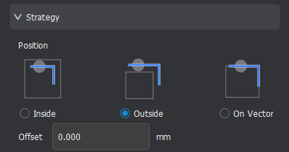

29. Under “Tabs,” select “Custom,” and click “Add”
30. Add appropriate tabs around the selected “Edge_cuts” layer (typically, 3 will be sufficient)

    30a. Tip: Ensure that these tabs are staggered and not directly across from one another

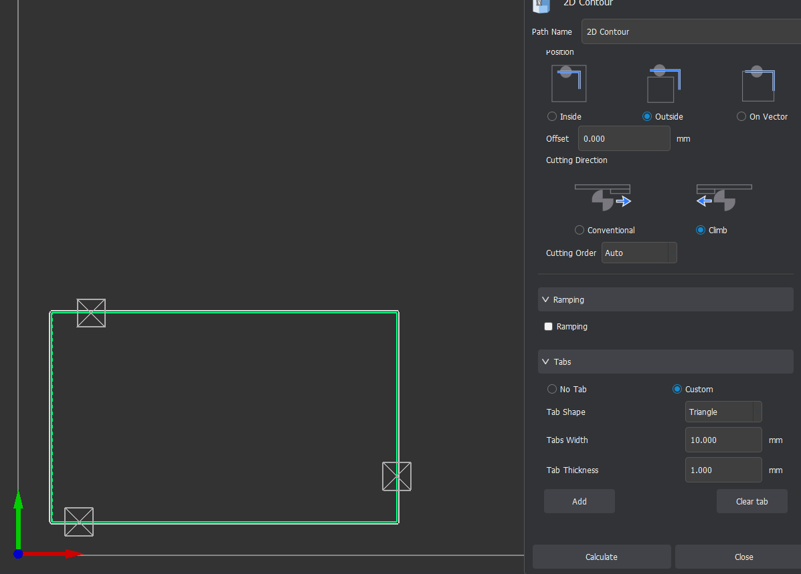

31. Click “Calculate”; you should see a “2D Contour” toolpath fall under the Path dropdown in the hierarchy

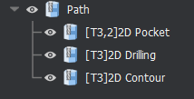

32. In the top toolbar, click the icon “Preview Toolpaths,” and select all toolpaths in the pop-up dialogue box
33. Click “Preview” and press the play button to view a simulation of the toolpaths 

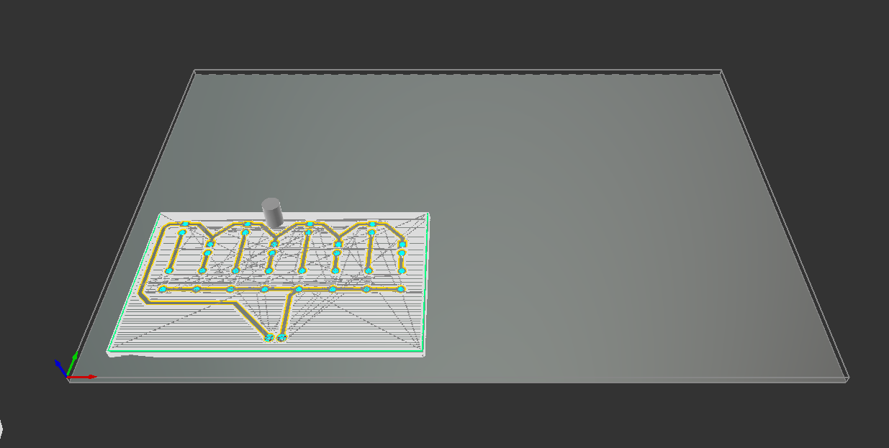

34. In the top toolbar, click the “Export” button, ensure all toolpaths are selected, and click “Export”
Rename the .nc file to your last name, your first initial, and your project name, followed by “gcode”

**PCB Milling on Carvera**
1. Open the Carvera Controller software on the desktop
2. In the top toolbar, click on the button with the status “N/A disconnected”
3. Select the appropriate COM port to connect the Carvera to the computer (if the COM port is already connected, leave it as is)
4. In the menu in the top right corner, click “Switch to display manual control interface” followed by the “Home” button 
5. Under “Tool Status and Control,” ensure that the probe is charged to at least 3.6V (this ensures the machine operates in the z-axis as intended)
6. In the bottom left corner, open the G-code from your files 
7. Before starting the mill, open the menu in the top right corner and click the “Switch to display file preview interface” to preview the toolpaths 
8. Click “Config and run,” and ensure that both the “auto vacuum” and “auto leveling” options are on.
9. Once all settings are verified, click “Run”

## Producing a PCB on the Carvera

To do this, I first downloaded the gerber files from the FabLab google drive, including [Resistance1-Edge_cuts](Resistance1-Edge_Cuts.gbr) and [Resistance1-F_Cu](Resistance1-F_Cu.gbr), and imported them into the MakeraCAM software. I created three toolpaths total: 1 pocket toolpath with an end depth of .05mm (traces), 1 contour toolpath with an end depth of 1.7mm (edge cuts), and 1 drill file with an end depth of 1.7mm (holes). I previewed these toolpaths in the software, before exporting them as a .nc file. You can access this file [here](YangA_resistorgcode.nc). 

 On the Carvera software, I first checked the probe voltage. Initially, it said 3.3V, which is below the functional threshold; however, this was because a tool had already been selected and installed by the milling machine. Once I uninstalled the tool, the voltage went to 3.7V. Perfect! ദ്ദി ˉ͈꒳ˉ͈ )✧

 I imported the .nc file into the software and clicked "Config and run."

The milling machine first began with the .8mm corn flatend mill to remove the bulk of material on the PCB, before going back in with the engraving bit and creating the intricate traces. Something I found odd was that the engraving bit moved around the perimeter as well, but Mr. Budzichowski told me that this was naturally apart of the g-code. 

One problem I encountered: Dr. Taylor, in epic Dr. Taylor fashion, came in and accidentally turned off the power strip powering the milling machine. As a result, my edge cuts toolpath was cut short. (  •̀⤙•́  ) This was a easy fix, though. I isolated the contour toolpath on MakeraCAM and re-exported the .nc file, before selecting and running the new .nc file on the milling machine. 

Here is what the final PCB looked like:

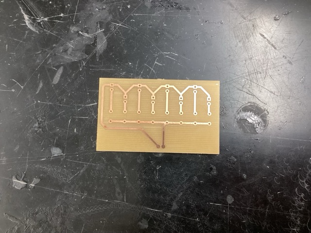

Overall, through this project, I continued to familiarize myself with the new software, and I was able to review the fundamentals of toolpaths, feeds & speeds, inclusion of tabs, etc. Additionally, although the milling machine operates through a more "hands-off" approach, I prefer it over the old Bantam machines because there is less human error involved (especially with bits snapping and z-axis probing). 

In the future, to save time on my PCB mills, I may adjust the KiCad files to include "zones". Similar to be previous board (see 10/22/25), including these zones allows you to solely mill around the traces and keep the remainder of the copper in tact. 