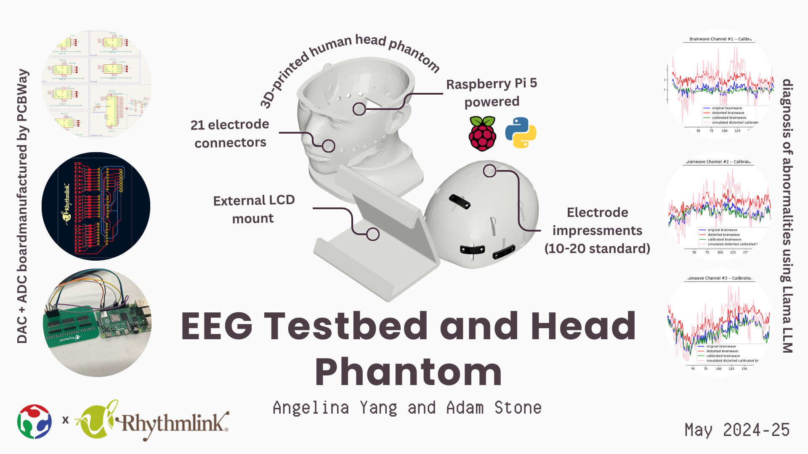

## Summary Slide

## Purpose 

Simulated testing environments are widely used in both medical and non-medical/consumer markets to assist in product development and testing. Access to repeatable and reproducible testing apparatus that can mimic real world outputs can reduce time and errors during the development stages and provide a more cost-effective method of initial verification than performing the same tests in-vivo. 
Neurological monitoring devices provide a great example of the potential benefits of a simulated test environment. An electroencephalogram (EEG) is a procedure in which multiple small, conductive electrodes are placed on a subject’s scalp in order to record the subject’s brain activity in the form of electric potentials. Currently a typical clinical EEG uses 21 electrodes placed on the patient’s scalp in pre-determined locations based on the international 10-20 system. Each location must be prepped to ensure low contact impedance between the electrode and the patient’s skin; prep usually includes a mild abrasion with exfoliating gel as well as the application of a highly conductive paste. Once the electrodes are applied to the patient’s scalp, an impedance check will be performed to ensure each electrode location is below 10kΩ, and preferably below 5kΩ. 

Upon a successful impedance measurement, an EEG montage will be set up in the clinical software to determine what data to record. An observed EEG signal is the potential difference between two electrode locations, and the montage determines which electrode pairs will be compared. For example, the signal of an electrode at site C3 may be subtracted from the signal of an electrode at site F3 for a montage of F3-C3. This difference is what will be displayed on the screen as the “signal” and is monitored at a particular frequency based on hardware and software characteristics. 

Variables that may affect the signals displayed during an EEG include but are not limited to, electrode-to-skin impedance, impedance mismatching, patient movement or muscle artifacts, electrode or leadwire movement, environmental conditions and artifacts, etc. Inconsistencies during EEG setup such as accuracy of electrode placement, amount of conductive paste applied, and abrasion techniques may affect the successfulness of signal capture as well. In addition to these clinical variables, in a product development scenario, subject variability also plays an important role in producing reliable and repeatable test results.
Given the time, complexity, and amount of variables that may affect the outcome of an EEG, it’s easy to see how a repeatable and reproducible test method for producing and capturing EEG data could help streamline product development.

## Bill of Materials (BOM)

| Component    | Quantity | Source | Cost Per Unit |
| :-----------: | :-----------: | :------------: | :-------------: |
| MCP3008-I/P MCP3008 8-Channel 10-Bit A/D Converters (pack of 4) | 1 |	[Amazon](https://www.amazon.com/Juried-Engineering-MCP3008-I-Converters-Breadboard-Friendly/dp/B08HH1YB46)  | $3.12 |
| Raspberry Pi 5 | 1 | [Amazon](https://a.co/d/cDMw8fp) | $93.91 |
| Conductive Silicone Polymer 140cmX140cm | 2 | *Rhythmlink* | N/A |
| 5inch Resistive Touch Screen LCD (800x480) | 1 | [Waveshare](https://www.waveshare.com/5inch-HDMI-LCD-B.htm) | $52.99 |
| TCA9548APWR I2C Multiplexer | 1 | [Digikey](https://www.digikey.com/en/products/detail/texas-instruments/TCA9548APWR/3615458) | $6.95 | 
|MCP4728 SMD Digital-to-Analog Converter | 6 | [Digikey](https://www.digikey.com/en/products/detail/microchip-technology/MCP47CVB08-20E-ST/14565703) | $2.50 | 
| 10kΩ Resistor SMD | 24 | [Digikey](https://www.digikey.com/en/products/detail/yageo/RC0603FR-1310KL/12756437?gclsrc=aw.ds&&utm_adgroup=Yageo&utm_source=google&utm_medium=cpc&utm_campaign=PMax%2520Shopping_Supplier_Yageo&utm_term=&utm_content=Yageo&utm_id=go_cmp-17816160916_adg-_ad-__dev-c_ext-_prd-12756437_sig-Cj0KCQjwkZm_BhDrARIsAAEbX1GcpxlbON39Y_XcKtH9hMcIOqrQUDgvZBVQ528ILB-zckAXLBPtfwIaAqxdEALw_wcB&gad_source=1&gclid=Cj0KCQjwkZm_BhDrARIsAAEbX1GcpxlbON39Y_XcKtH9hMcIOqrQUDgvZBVQ528ILB-zckAXLBPtfwIaAqxdEALw_wcB&gclsrc=aw.ds) | $0.10 |
| Head Pin to Touch Proof Electrode Adapter | 21 | [OpenBCI](https://shop.openbci.com/products/touch-proof-electrode-cable-adapter) | $2.99 |
| Conductive Scalp Material (e.g. silicone) | 1 | *Rhythmlink* | N/A |

## Determining Electrode Number Mapping
Below is the workflow for determining the above number mapping from scratch if the inner wiring of the analog output PCB board to the outputs has been done:

1. Turn on the Raspberry Pi and connect a display. 
2. Connect the Raspberry Pi to a local WiFi network and check the IP address.
3. On another computer, SSH into the Raspberry Pi.

    3a. Username: “rhythmlink” 

    3b. Password: “Rhythmlink1”

4. Run “cd /home/rhythmlink/RHY_NEW/FINAL_SCRIPTS”
5. Run “bash _00_ELECTRODE_MAP_FINAL.bash”
6. One at a time, a 3.3V signal will be output from each electrode, and the terminal output will indicate the electrode number from which it is outputting. Use a multimeter to find this electrode and record the corresponding name in the 10-20 system.

## Matrix Calibration

Below is the workflow for configuring the Matrix Calibration if the scalp material is changed from the conductive silicone polymer:

1. Turn on the Raspberry Pi and connect a display. 
2. Connect the Raspberry Pi to a local WiFi network and check the IP address.
3. On another computer, SSH into the Raspberry Pi.

    3a. Username: “rhythmlink” 

    3b. Password: “Rhythmlink1”

4. Run “cd /home/rhythmlink/RHY_NEW/FINAL_SCRIPTS”
5. Ensure that a function set of 21 electrodes is set up with the head phantom.
6. Run “bash _01_CALIBRATE_FINAL.bash”

## AI Training

Below is the workflow for re-training the AI:

1. Turn on the Raspberry Pi and connect a display. 
2. Connect the Raspberry Pi to a local WiFi network and check the IP address.
3. On another computer, SSH into the Raspberry Pi.

    3a. Username: “rhythmlink” 

    3b. Password: “Rhythmlink1”

4. Run “cd /home/rhythmlink/RHY_NEW/FINAL_SCRIPTS”
5. Ensure that a functional set of 21 electrodes is set up with the head phantom.
6. Run “_02_TRAIN_FINAL.bash”.

    6a.  When prompted for a label name, give a name that you will remember corresponds to functional electrodes, such as “success”, “working”, or “functional.”

    6b.  When prompted for electrode numbers, give the electrode numbers corresponding to the electrodes that you have just attached, comma-separated with no spaces. For example, if you have just attached a full set of 21 electrodes, write “0,1,2,3,4,5,6,7,8,9,10,11,12,13,14,15,16,17,18,19,20”.
7. Repeat steps 5-6, switching out the electrodes for different types of defective electrodes, giving each a descriptive label name that you will remember and the electrode numbers that correspond to the electrodes where you have attached the defective ones.
When prompted for a label name, now that you have finished collecting all the data, you can type “no” and the model training will run.

## Quality Assurance Testing of New Electrodes

Below is the workflow for using the trained AI model to predict any defects in a new set of 21 electrodes:

1. Turn on the Raspberry Pi and connect a display. 
2. Connect the Raspberry Pi to a local WiFi network and check the IP address.
3. On another computer, SSH into the Raspberry Pi.
    
    3a. Username: “rhythmlink” 

    3b. Password: “Rhythmlink1”
4. Run “cd /home/rhythmlink/RHY_NEW/FINAL_SCRIPTS”
5. Ensure that a functional set of 21 electrodes is set up with the head phantom.
6. Run “_03_RUN_FINAL.bash”.
7. When prompted for electrode numbers, give the electrode numbers corresponding to the electrodes that you have just attached, comma-separated with no spaces. For example, if you have just attached a full set of 21 electrodes, write “0,1,2,3,4,5,6,7,8,9,10,11,12,13,14,15,16,17,18,19,20”.
8. When the application window has opened, click the button on the touchscreen to run the test and see the results! Note that it may take several minutes for the LLM natural language summary to populate.

## Final Prototype Development

### Head Phantom

>  The CAD for the prototype consisted of modeling a head phantom, touch screen display case, and two circuit boards using Fusion 360 and KiCAD. 

To ensure precision and ease of production, we decided to 3D print the head phantom, a deviation from traditional approaches of injection molding[^1]. This allowed for precise touch-proof electrode adapters to produce from the head phantom, as well as sturdy electronics casing for a Raspberry Pi, circuit boards, and electrodes, and wiring in the lumen of the head phantom.

In addition to “lollipop” shaped slits tangent to the head at points aligning with the 10-20 Standard, for electrodes that are not clamped down, we used a string that loops through the inner webbed electrodes on different sides of the head to hold them tightly in place.

The head phantom was made in a shape as close to a real human head as possible to ensure a realistic simulated testing environment that would detect potential issues or defects with electrodes during the quality assurance process.
You can access the Fusion 360 model [here](https://a360.co/4cvf0zE).

[^1]: [Audette, William E., et. al.](https://www.researchgate.net/publication/339697951_Design_and_Demonstration_of_a_Head_Phantom_for_Testing_of_Electroencephalography_EEG_Equipment)

