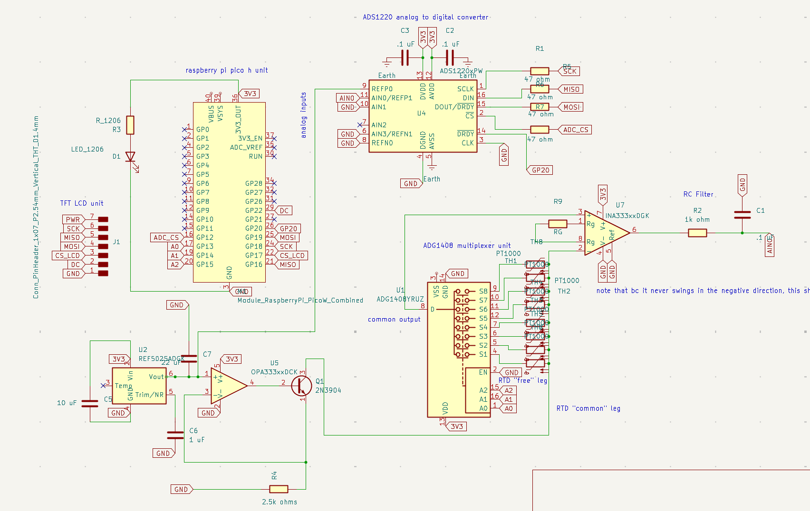
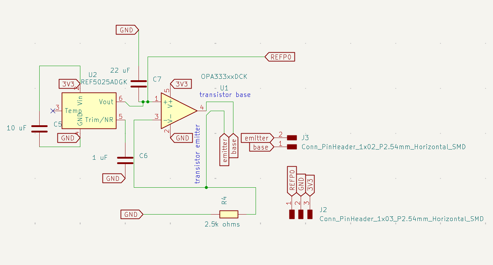
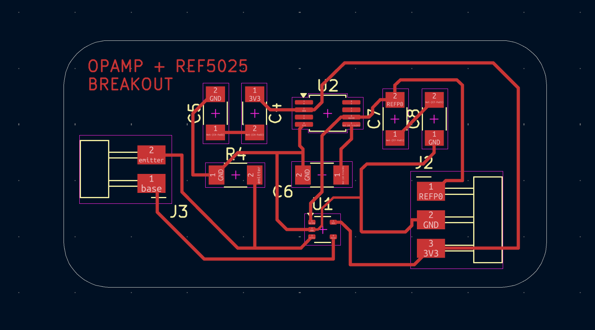
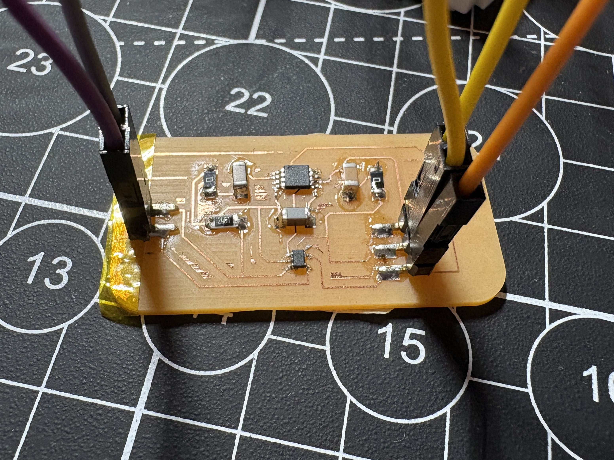
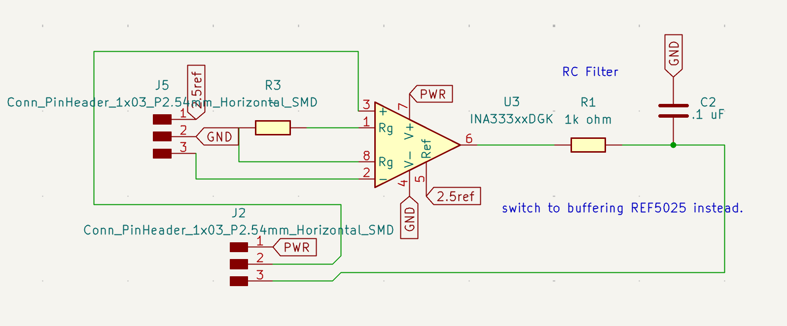
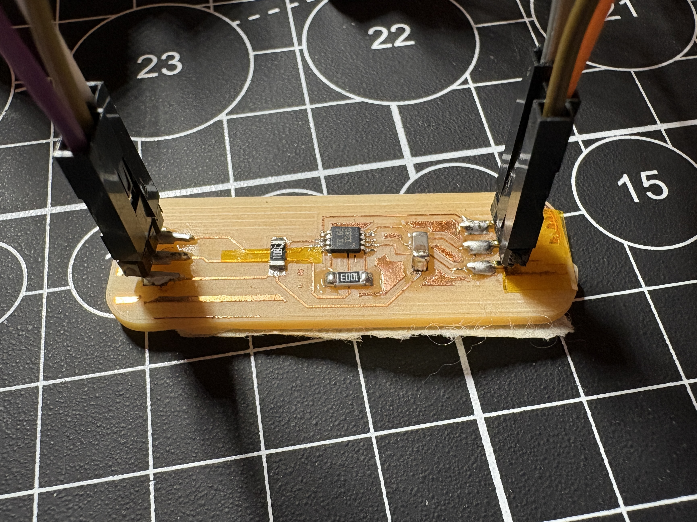
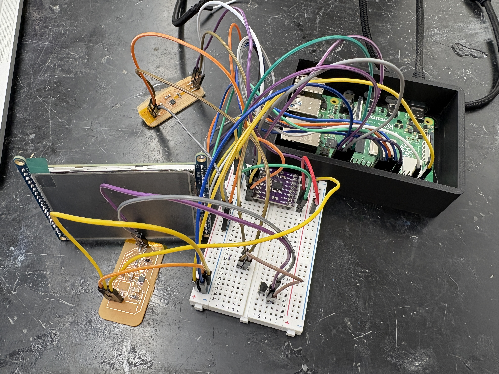
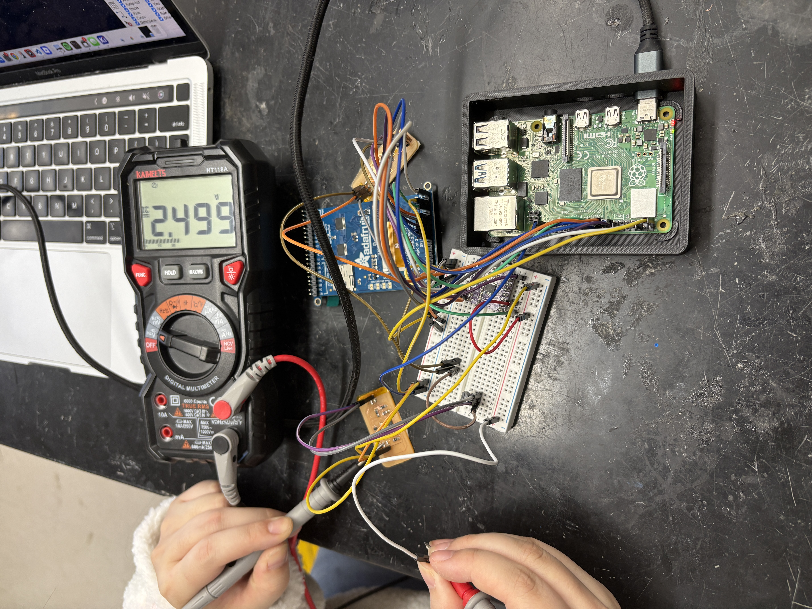
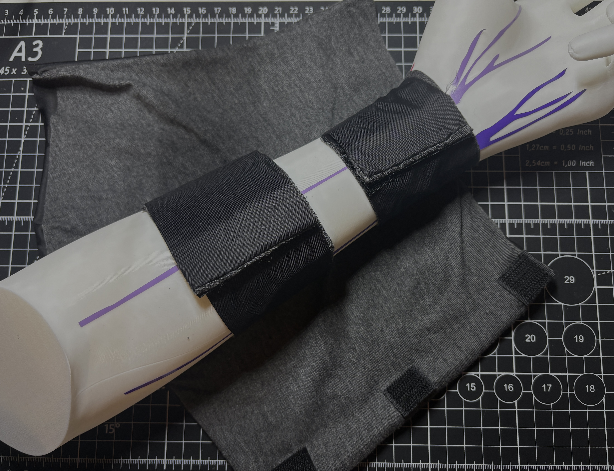

## Purpose


Widely used within the medical field, electrodiagnostic tests are a non-invasive mechanism that utilize stimulated electrical signals to assess the functionality of nerves and muscles. Nerve Conduction Study (NCS) is a low-risk example of an electrodiagnostic test that measures the speed at which an electrical impulse travels through an individual nerve. Used to diagnose conditions such as Carpal Tunnel Syndrome (CTS), Guillain-Barre syndrome, and neuopathy/nerve damage, NCS is paramount in the assessment of the peripheral nervous system. Currently, in a NCS, several electrode patches are placed on the skin to stimulate the nerve conduction. One electrode (cathode) acts as an active simulator, inducing a mild electrical impulse that depolarizes and excites the underlying nerve fibers. A second electrode (anode), the inactive simulator, provides a return path for the electrical signal and reduces stimulus artifact. A third electrode then records the resulting electrical activity; the speed of the signal is determined by measuring the distance between electrodes and the corresponding time it takes for impulses to travel between each. 

Temperature is a major physiological factor that may affect the signals displayed during an NCS. The speed at which nerve fibers conduct electrical impulses decreases by 1.5-2.5 m/s for every 1ºC drop in temperature, thereby creating discrepancies in fundamental nerve conduction values such as amplitude, distal latency, conduction velocity, and duration in both motor and sensory studies. Crucially, these discrepancies across a patient population can ultimately skew test results and produce potential misdiagnoses (i.e. false-positives, false-negatives). Therefore, maintaining a skin surface temperature between 32ºC and 34ºC ensures the standardization and holistic accuracy of the study. Current methods for thermal stimulation include but are not limited to, immersing a limb within warm water, using a heating pad, or using a hot water towel; however, these approaches do not necessarily provide feedback on the actual temperature of the area being studied. Thus, a localized solution that includes real-time monitoring and recording of temperature data can help to improve the accuracy of nerve conduction studies. Furthermore, customized sleeves that include visual aids to the technologist and even active warming could provide an even more streamlined and accurate process for nerve conduction study, ultimately providing a better outcome for the patient.

## Phase I Project Action Items

* Conduct research to become familiar with common issues and current solutions regarding low body and limb temperature during nerve conduction studies.
* Propose design for custom forearm sleeve that actively monitors, displays, and records skin temperature.
* Fabricate proposed design.
* Create a design proposal for an active temperature control sleeve with an integrated heating mechanism. Fabrication of a prototype is not required, but is encouraged if within the capabilities of Charlotte Latin and within the project timeline.


## Bill of Materials (BOM)


| Component    | Quantity | Source | Cost Per Unit | Available in Lab? | 
| :-----------: | :-----------: | :------------: | :-------------: | :-------------: | 
| PT1000 thin-film RTD | 8 | [Digikey](https://www.digikey.com/en/products/detail/te-connectivity-measurement-specialties/NB-PTCO-153/5272167) | $6.65 | No | 
| 2.8" TFT LCD - ILI9341 | 1 | [Adafruit](https://www.adafruit.com/product/1770?srsltid=AfmBOoqoj3elneHPFLwtWOMmx21mZA04d9PxkCAEO36Iyasb3Dnv8Ubq) | $29.95 | Yes | 
| Raspberry Pi 4 Model B | 1 | [Adafruit](https://www.adafruit.com/product/4292?src=raspberrypi) | $49.50 | Yes | 
| ADG1408 8-1 Multiplexer | 1 | [Digikey](https://www.digikey.com/en/products/detail/analog-devices-inc/ADG1408YRUZ-REEL/1210200) | $10.79 | No |
| ADS1220 24-bit Analog-to-Digital converter | 1 | [Mouser Electronics](https://www.mouser.com/ProductDetail/Texas-Instruments/ADS1220IPW?qs=5GI1giJCN%252BKzuruuF2dUlQ%3D%3D) | $10.37 | No |
| OPA333 Operational Amplifier | 1 | [Digikey](https://www.digikey.com/en/products/detail/texas-instruments/OPA333AIDCKR/1004601) | $1.88 | No |
| INA333 Instrumentation Amplifier | 1 | [Digikey](https://www.digikey.com/en/products/detail/texas-instruments/INA333AIDGKR/1886116) | $4.54 | No |
| REF5025 Voltage Reference IC | 1 | [Digikey](https://www.digikey.com/en/products/detail/texas-instruments/REF5025AIDGKR/2232440) | $3.54 | No |
| Silicone Thermal Pad | 1 | [Amazon](https://a.co/d/aHpsNRI) | $7.94 | No |
| Velcro Roll | 1 | [Amazon](https://a.co/d/cPnOWCi) | $9.99 | No |
| Nylon (per yard) | 1 | [Amazon](https://a.co/d/9OwZLaa) | $6.89 | No |
| Spandex (per yard) | 1 | [Amazon](https://a.co/d/hNvpx1m) | $10.99 | No |

## Tools Used

* Embroidery/sewing machine

* Bambu 3D-printer

* Carvera desktop milling machine (access the workflow [here](https://angelinayyang.github.io/p/pcb-milling-workflows/))

    * .2mm*30ºEngraving(Metal) engraving bit

    * .8mm Corn flat-end bit
        

* Soldering iron

* Vinyl cutter


## Projected Timeline

As of the November 18th internal check-in, here is our projected timeline:


## System Architecture

Here is the [design specification considerations](dsc.pdf) for this project.

A precision voltage reference (REF5025) and OPA333 op-amp form a low-side current sink (1mA) using the 2N3904 transistor. This resultant current is sunk through whichever RTD is selected by the ADG1408 (8-1 MUX), which serves as a low-current leakage switch. The INA333 then amplifies the small differential voltage across the RTD (V_top − V_bottom), before RC smooths/anti-aliases the INA output. The ADS1220 (24-bit analog to digital converter) digitizes the result for the Raspberry Pi to effectively process via Python. 

Here is a sketch of the proposed design:


## Final Prototype Development 

### Proof of Concept

Phase 1 goals:

* Fabricate the first iteration of a wrappable sleeve with mapped positions of RTDs

* Develop modular components of master circuit to verify that a singular RTD works as intended


### Electronics

A wheatstone bridge configuration (voltage divider) is the conventional method of measuring RTD resistance, but this approach offers little to no flexibility with operating multiple RTDs. Thus, I instead opted to multiplex RTDs. 



Looking ahead in software development, I felt like a Raspberry Pi Pico W didn't offer enough computing power; moreover, I wasn't used to using a full CircuitPython hierarchy. Thus, Kathryn and I made the decision to migrate over to a Raspberry Pi 4.

For an electonics proof-of-concept, we tried measuring the temperature of a single RTD through the RPi and displaying it to the LCD.

Unfortunately, there are virtually no manufactured breakouts of the op-amp and in-amp we chose to use, so we resorted to designing and milling our own breakout boards, which we could assembled modularly and easily troubleshoot:

**Op-Amp Circuit (Excitation current) Breakout**

Here is the [op-amp gcode file](opamp_breakout_gcode120125.nc).

  

**In-Amp Circuit and RC Filter Breakout**

Here is the [in-amp gcode file](newinampgcode.nc).

  


Here is the configuration fully wired:

<center>

</center>


 Before programming the RPi, I confirmed that the 2.5V and 1mA excitation current were firmly established:

 <center>
 
 </center>

Here is the sample single RTD script I compiled, using the ADC_manager class:

```python
"""This is a sampling test with a single RTD, using the newly revised ADC_manager_PI4 class"""

import time
from ADC_manager_PI4 import adc_Manager

def main():
    adc = adc_Manager(
        excitation_current=0.001,  
        reference_voltage=2.5,      
        gain=1,
        data_rate=20 
    )
    adc.initialize()
    n = 0

    while True:

        print("\n CYCLE: ", n)
        voltage = adc.read_voltage()      
        resistance = adc.read_rtd_resistance(voltage)   
        tempcelsius = adc.convert_rtd_resistance_to_temp(resistance)
        print("Measured Temperature: {:.2f} °C".format(tempcelsius))
        if tempcelsius >= 32.0 and tempcelsius <= 35:
            print("ALERT: Temperature is within safe range! {:.2f} °C".format(tempcelsius))
        else:
            print("ALERT: Temperature within the critical range! {:.2f} °C".format(tempcelsius))


        print("\nCYCLE", n, "COMPLETE")
        time.sleep(1)
        n+=1


if __name__ == "__main__":
    main()

```


### Software


**The software is a work in progress.**


The software hierarchy consists of three classes: 1) ADC_Manager, 2) MUX_Manager, and 3) LCD_Manager. 

**1)  ADC_Manager**: The ADC_Manager class handles the conversion of RTD voltage to RTD resistance to temperature through the **caldus** python library. Here is the most up-to-date version:

```python

import time
import spidev
import caldus # facilitates conversion from resistance to temp.

class adc_Manager:
    RESET = 0x06
    START = 0x08
    STOP  = 0x0A
    RDATA = 0x10
    WREG  = 0x40

    def __init__(
        self,
        spi_bus=0,
        spi_device=1,
        spi_speed=500000,

        excitation_current=0.001,   
        reference_voltage=2.048, # INTERNAL ref of ads1220; verify      
        ina_gain=2,                
        ads_gain=1,             
        data_rate=20               
    ):
        self.excitation_current = excitation_current
        self.reference_voltage = reference_voltage
        self.ina_gain = ina_gain
        self.ads_gain = ads_gain


        self.spi = spidev.SpiDev()
        self.spi.open(spi_bus, spi_device)
        self.spi.max_speed_hz = spi_speed
        self.spi.mode = 0b01  

        self._initialize_ads1220(data_rate)

    def _initialize_ads1220(self, data_rate):
        print("Resetting ADS1220...")
        self.spi.xfer2([self.RESET])
        time.sleep(0.05)

        # REG0:
        # AINP = AIN0, AINN = AIN1 (default) --> about this, I hooked up AIN1 to GND to create that differential
        # Gain = 1
        reg0 = 0b00000000 # first config register

 
        dr_map = {
            20:  0b010,
            45:  0b011,
            90:  0b100,
            175: 0b101,
        }
        if data_rate not in dr_map:
            raise ValueError("Unsupported data rate")

        reg1 = dr_map[data_rate] << 5

        reg2 = 0b10000000  # Enable internal 2.048V reference

        reg3 = 0b00000000


        self.spi.xfer2([
            self.WREG | 0x00,
            0x03,
            reg0,
            reg1,
            reg2,
            reg3
        ])
        time.sleep(0.05)
        self.spi.xfer2([self.START])
        time.sleep(1 / data_rate)
        print("ADS1220 Initialized.")


    def _read_raw(self):
        raw = self.spi.xfer2([self.RDATA, 0x00, 0x00, 0x00])[1:]

        raw_val = (raw[0] << 16) | (raw[1] << 8) | raw[2]

        if raw_val & 0x800000:
            raw_val -= 1 << 24

        return raw_val

    def read_voltage(self):
        raw = self._read_raw()
        voltage = (raw / (2**23)) * self.reference_voltage # ref voltage * full scale
        return voltage
    

    def read_rtd_resistance(self):
        voltage = self.read_voltage()
        voltage_rtd = voltage / self.ina_gain
        resistance = voltage_rtd / self.excitation_current
        return resistance


    def convert_rtd_resistance_to_temp(self):
        resistance = self.read_rtd_resistance()
        return caldus.resistance2temperature(resistance)


```


### Sleeve Design

For the sleeve, Kathryn suggested lining the RTDs along two "belts" on the inner side of the sleeve. As an early prototype, we stitched together nylon and spandex, securing the sleeve on a 3D-printed forearm with velcro. 


<center>

</center>

**Sleeve assembly demonstration:** To put on the sleeve, users first fasten the two belts, before gently wrapping the external sleeve around their arm. 


<center>
<video width="500" height="300" controls>
  <source src="sleeve-assembly.mp4" type="video/mp4">

