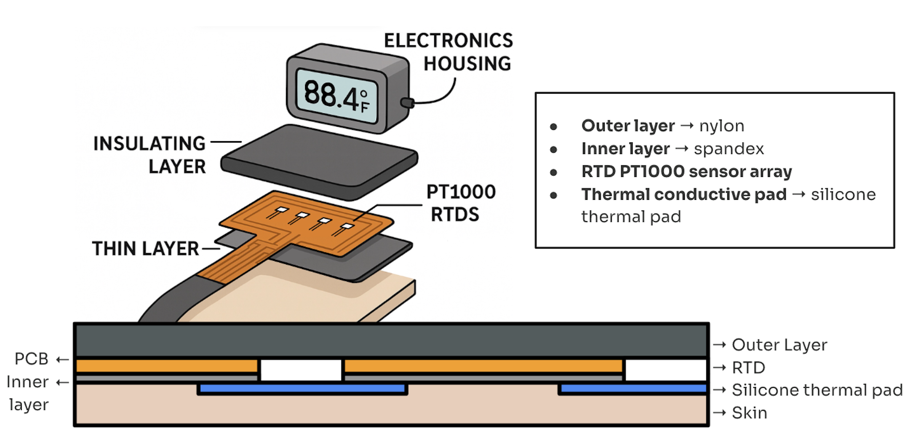

## Purpose

Widely used within the medical field, electrodiagnostic tests are a non-invasive mechanism that utilize stimulated electrical signals to assess the functionality of nerves and muscles. Nerve Conduction Study (NCS) is a low-risk example of an electrodiagnostic test that measures the speed at which an electrical impulse travels through an individual nerve. Used to diagnose conditions such as Carpal Tunnel Syndrome (CTS), Guillain-Barre syndrome, and neuopathy/nerve damage, NCS is paramount in the assessment of the peripheral nervous system. Currently, in a NCS, several electrode patches are placed on the skin to stimulate the nerve conduction. One electrode (cathode) acts as an active simulator, inducing a mild electrical impulse that depolarizes and excites the underlying nerve fibers. A second electrode (anode), the inactive simulator, provides a return path for the electrical signal and reduces stimulus artifact. A third electrode then records the resulting electrical activity; the speed of the signal is determined by measuring the distance between electrodes and the corresponding time it takes for impulses to travel between each. 

Temperature is a major physiological factor that may affect the signals displayed during an NCS. The speed at which nerve fibers conduct electrical impulses decreases by 1.5-2.5 m/s for every 1ºC drop in temperature, thereby creating discrepancies in fundamental nerve conduction values such as amplitude, distal latency, conduction velocity, and duration in both motor and sensory studies. Crucially, these discrepancies across a patient population can ultimately skew test results and produce potential misdiagnoses (i.e. false-positives, false-negatives). Therefore, maintaining a skin surface temperature between 32ºC and 34ºC ensures the standardization and holistic accuracy of the study. Current methods for thermal stimulation include but are not limited to, immersing a limb within warm water, using a heating pad, or using a hot water towel; however, these approaches do not necessarily provide feedback on the actual temperature of the area being studied. Thus, a localized solution that includes real-time monitoring and recording of temperature data can help to improve the accuracy of nerve conduction studies. Furthermore, customized sleeves that include visual aids to the technologist and even active warming could provide an even more streamlined and accurate process for nerve conduction study, ultimately providing a better outcome for the patient.

## Phase I Project Action Items

* Conduct research to become familiar with common issues and current solutions regarding low body and limb temperature during nerve conduction studies.
* Propose design for custom forearm sleeve that actively monitors, displays, and records skin temperature.
* Fabricate proposed design.
* Create a design proposal for an active temperature control sleeve with an integrated heating mechanism. Fabrication of a prototype is not required, but is encouraged if within the capabilities of Charlotte Latin and within the project timeline.

## Bill of Materials (BOM)

| Component    | Quantity | Source | Cost Per Unit | Available in Lab? | 
| :-----------: | :-----------: | :------------: | :-------------: | :-------------: | 
| PT1000 thin-film RTD | 8 | [Digikey](https://www.digikey.com/en/products/detail/te-connectivity-measurement-specialties/NB-PTCO-153/5272167) | $6.65 | No | 
| 2.8" TFT LCD - ILI9341 | 1 | [Adafruit](https://www.adafruit.com/product/1770?srsltid=AfmBOoqoj3elneHPFLwtWOMmx21mZA04d9PxkCAEO36Iyasb3Dnv8Ubq) | $29.95 | Yes | 
| Raspberry Pi 4 Model B | 1 | [Adafruit](https://www.adafruit.com/product/4292?src=raspberrypi) | $49.50 | Yes | 
| ADG1408 8-1 Multiplexer | 1 | [Digikey](https://www.digikey.com/en/products/detail/analog-devices-inc/ADG1408YRUZ-REEL/1210200) | $10.79 | No |
| ADS1220 24-bit Analog-to-Digital converter | 1 | [Mouser Electronics](https://www.mouser.com/ProductDetail/Texas-Instruments/ADS1220IPW?qs=5GI1giJCN%252BKzuruuF2dUlQ%3D%3D) | $10.37 | No |
| OPA333 Operational Amplifier | 1 | [Digikey](https://www.digikey.com/en/products/detail/texas-instruments/OPA333AIDCKR/1004601) | $1.88 | No |
| INA333 Instrumentation Amplifier | 1 | [Digikey](https://www.digikey.com/en/products/detail/texas-instruments/INA333AIDGKR/1886116) | $4.54 | No |
| REF5025 Voltage Reference IC | 1 | [Digikey](https://www.digikey.com/en/products/detail/texas-instruments/REF5025AIDGKR/2232440) | $3.54 | No |
| Silicone Thermal Pad | 1 | [Amazon](https://a.co/d/aHpsNRI) | $7.94 | No |
| Velcro Roll | 1 | [Amazon](https://a.co/d/cPnOWCi) | $9.99 | No |
| Nylon (per yard) | 1 | [Amazon](https://a.co/d/9OwZLaa) | $6.89 | No |
| Spandex (per yard) | 1 | [Amazon](https://a.co/d/hNvpx1m) | $10.99 | No |

## Projected Timeline

As of the November 18th internal check-in, here is our projected timeline:

## System Architecture

Here is the [design specification considerations](dsc.pdf) for this project.

A precision voltage reference (REF5025) and OPA333 op-amp form a low-side current sink (1mA) using the 2N3904 transistor. This resultant current is sunk through whichever RTD is selected by the ADG1408 (8-1 MUX). The INA333 then measures the small differential voltage across the RTD (V_top − V_bottom), before RC smooths/anti-aliases the INA output, and the ADS1220 (24-bit analog to digital converter) digitizes the result for the Raspberry Pi to effectively process via Python. 

Here is a sketch of the proposed design:

# Proof of Concept

Our proof of concept involved the 