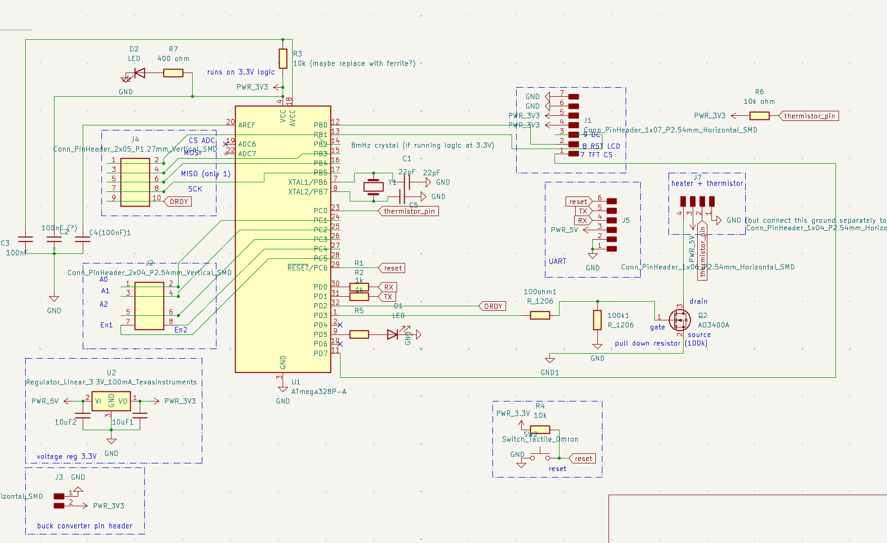
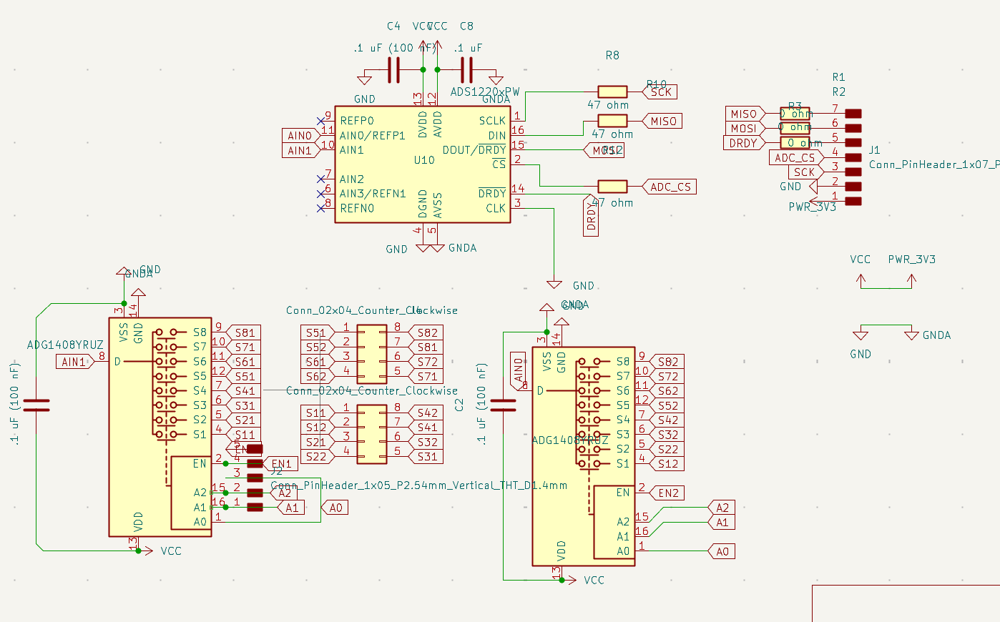
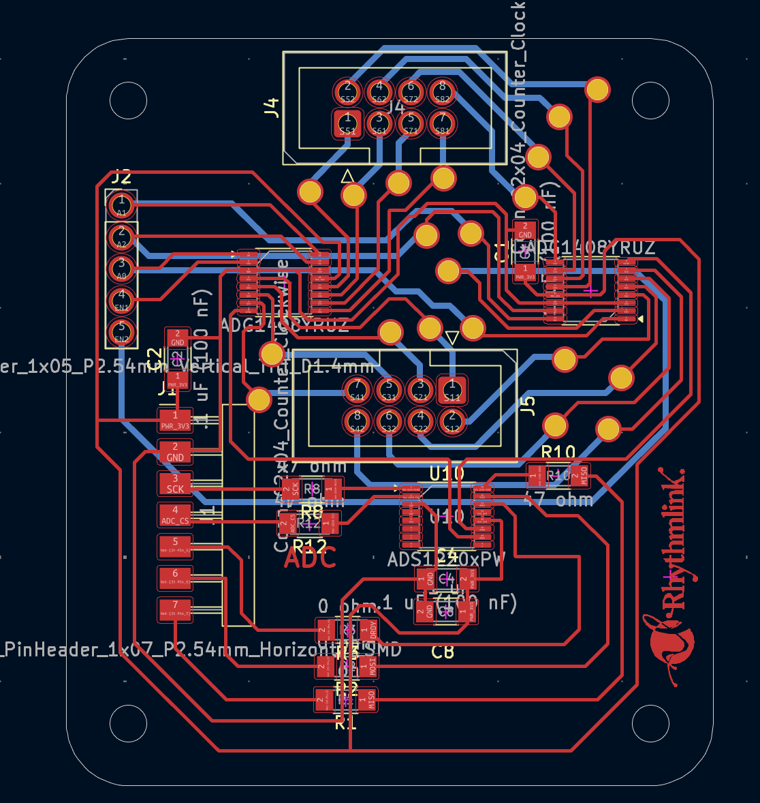
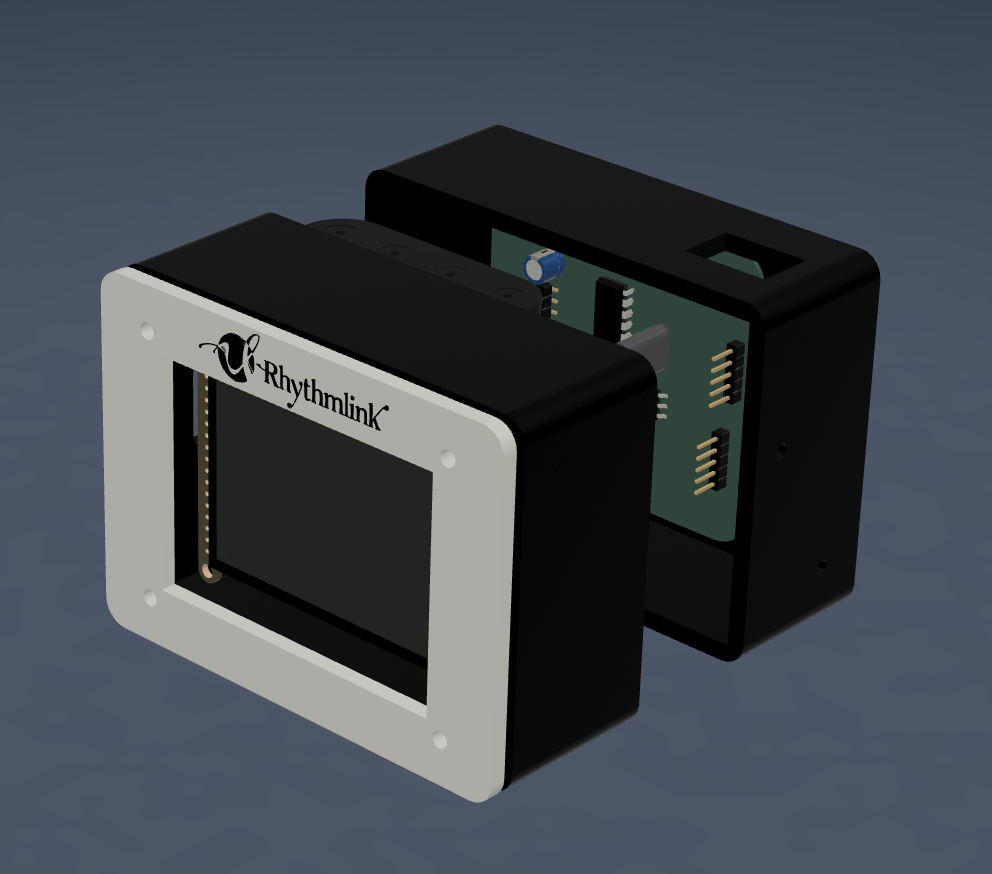
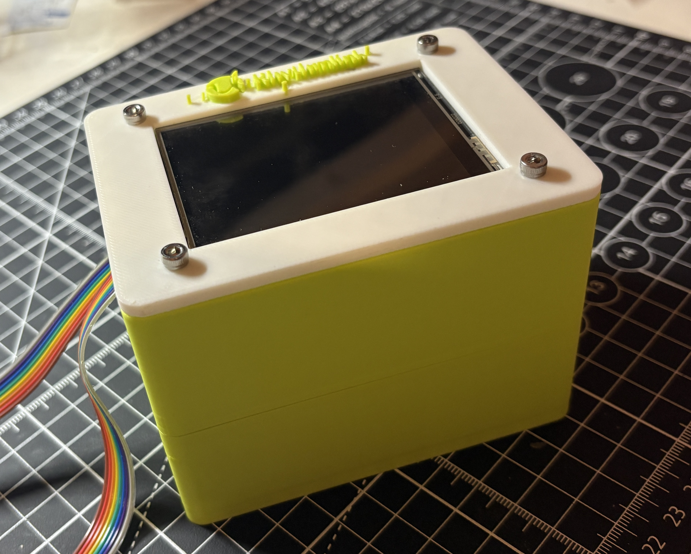
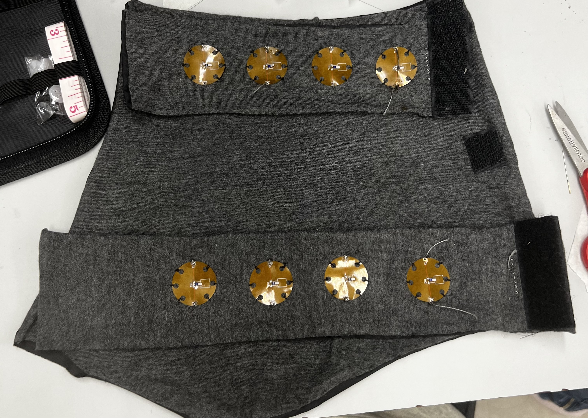
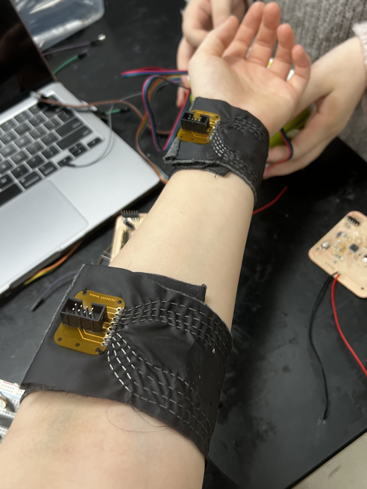
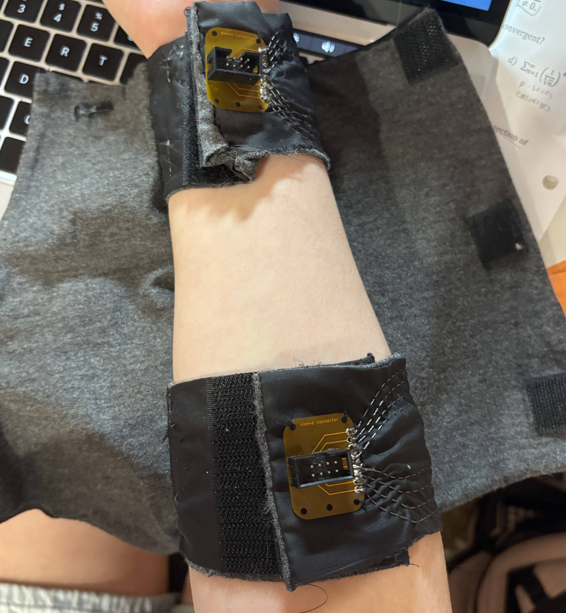

## Purpose


Widely used within the medical field, electrodiagnostic tests are a non-invasive mechanism that utilize stimulated electrical signals to assess the functionality of nerves and muscles. Nerve Conduction Study (NCS) is a low-risk example of an electrodiagnostic test that measures the speed at which an electrical impulse travels through an individual nerve. Used to diagnose conditions such as Carpal Tunnel Syndrome (CTS), Guillain-Barre syndrome, and neuopathy/nerve damage, NCS is paramount in the assessment of the peripheral nervous system. Currently, in a NCS, several electrode patches are placed on the skin to stimulate the nerve conduction. One electrode (cathode) acts as an active simulator, inducing a mild electrical impulse that depolarizes and excites the underlying nerve fibers. A second electrode (anode), the inactive simulator, provides a return path for the electrical signal and reduces stimulus artifact. A third electrode then records the resulting electrical activity; the speed of the signal is determined by measuring the distance between electrodes and the corresponding time it takes for impulses to travel between each. 

Temperature is a major physiological factor that may affect the signals displayed during an NCS. The speed at which nerve fibers conduct electrical impulses decreases by 1.5-2.5 m/s for every 1ºC drop in temperature, thereby creating discrepancies in fundamental nerve conduction values such as amplitude, distal latency, conduction velocity, and duration in both motor and sensory studies. Crucially, these discrepancies across a patient population can ultimately skew test results and produce potential misdiagnoses (i.e. false-positives, false-negatives). Therefore, maintaining a skin surface temperature between 32ºC and 34ºC ensures the standardization and holistic accuracy of the study. Current methods for thermal stimulation include but are not limited to, immersing a limb within warm water, using a heating pad, or using a hot water towel; however, these approaches do not necessarily provide feedback on the actual temperature of the area being studied. Thus, a localized solution that includes real-time monitoring and recording of temperature data can help to improve the accuracy of nerve conduction studies. Furthermore, customized sleeves that include visual aids to the technologist and even active warming could provide an even more streamlined and accurate process for nerve conduction study, ultimately providing a better outcome for the patient.

## Phase I Project Action Items

* Conduct research to become familiar with common issues and current solutions regarding low body and limb temperature during nerve conduction studies.
* Propose design for custom forearm sleeve that actively monitors, displays, and records skin temperature.
* Fabricate proposed design.
* Create a design proposal for an active temperature control sleeve with an integrated heating mechanism. Fabrication of a prototype is not required, but is encouraged if within the capabilities of Charlotte Latin and within the project timeline.


## Bill of Materials (BOM)


| Component    | Quantity | Source | Cost Per Unit | Available in Lab? | 
| :-----------: | :-----------: | :------------: | :-------------: | :-------------: | 
| PT1000 thin-film RTD | 8 | [Digikey](https://www.digikey.com/en/products/detail/te-connectivity-measurement-specialties/NB-PTCO-153/5272167) | $6.65 | No | 
| 2.8" TFT LCD - ILI9341 | 1 | [Adafruit](https://www.adafruit.com/product/1770?srsltid=AfmBOoqoj3elneHPFLwtWOMmx21mZA04d9PxkCAEO36Iyasb3Dnv8Ubq) | $29.95 | Yes | 
| Atmega328P | 1 | [Digikey](https://www.digikey.com/en/products/detail/microchip-technology/ATMEGA328P-AU/1832260) | $2.66 | Yes | 
| ADG1408 8-1 Multiplexer | 2 | [Digikey](https://www.digikey.com/en/products/detail/analog-devices-inc/ADG1408YRUZ-REEL/1210200) | $10.79 | No |
| ADS1220 24-bit Analog-to-Digital converter | 1 | [Mouser Electronics](https://www.mouser.com/ProductDetail/Texas-Instruments/ADS1220IPW?qs=5GI1giJCN%252BKzuruuF2dUlQ%3D%3D) | $10.37 | No |
| Velcro Roll | 1 | [Amazon](https://a.co/d/cPnOWCi) | $9.99 | No |
| Nylon (per yard) | 1 | [Amazon](https://a.co/d/9OwZLaa) | $6.89 | No |
| Spandex (per yard) | 1 | [Amazon](https://a.co/d/hNvpx1m) | $10.99 | No |
| Stainless steel 3-ply conductive thread | 1 | [Adafruit](https://www.adafruit.com/product/641?srsltid=AfmBOoo_pX8QFl4U2NHfP9YsvfXDJCob42BzKsp_SNZwFILEogQaqdh0) | $9.95 | No | 

## Tools Used

* Bambu 3D-printer

* Carvera desktop milling machine (access the workflow [here](https://angelinayyang.github.io/p/pcb-milling-workflows/))

    * .2mm*30ºEngraving(Metal) engraving bit

    * .8mm Corn flat-end bit

* Bantam Milling Machine

    * 1/64" milling bit

    * 1/32" milling bit

    * .005" engraving bit
        

* Soldering iron

* Vinyl cutter


## Projected Timeline


Here is the link to the [Gantt chart](https://docs.google.com/spreadsheets/d/1M1naMrrbnOMg5gQO8-gfPohlKmZIxycnOxSoGX8i0pI/edit?usp=sharing) for an individual task breakdown. Although I was disappointed with my findings for the March 5th deadline, I'm glad to have found a redirection and seek to implement a new design in preparation for the final class and Rhythmlink deadline. For day-to-day documentation, refer to my [daily journal](https://angelinayyang.github.io/p/advanced-topics-in-engineering-documentation/).


## System Architecture Version 1

Here is the [design specification considerations](dsc.pdf) for this project.

Dual ADG1408 multiplexers (8-1 MUX) switch the respective leads of 8 PT1000 platinum RTDs, before the differential voltage is measured and converted by the ADS1220 (24-bit analog to digital converter). Indvidual PT1000 RTDs are integrated into the sleeve via flex PCB and sewing, creating a hybrid approach; the RTDs are connected to the microcontroller through 3-ply conductive thread. 

Here is a sketch of the proposed design:


## Final Prototype Development 

### Proof of Concept

The proof of concept involved the measurement of a single RTD through an ADS1220 analog-to-digital converter breakout board and having it output results and NCS status to an ILI9341 TFT LCD. Using the Protocentral.h library supported by Arduino IDE, we were able to get accurate temperature readings within an error range of .5ºC:


<center>
<video width="500" height="300" controls>
  <source src="temptest.mp4" type="video/mp4">
  </center>


Below contains the code:

```
#include "Protocentral_ADS1220.h"
#include <SPI.h>
#include <Adafruit_GFX.h>
#include <Adafruit_ILI9341.h>


// ==============================
// ADS1220 configuration
// ==============================
#define PGA 1
#define VREF 2.048
#define VFSR (VREF / PGA)
#define FSR (((long int)1 << 23) - 1)


// ==============================
// Pin definitions
// ==============================
#define ADS1220_CS_PIN    10
#define ADS1220_DRDY_PIN  2


#define TFT_CS   7
#define TFT_DC   9
#define TFT_RST  8


// ==============================
// SPI settings
// ==============================
SPISettings ads1220SPI(1000000, MSBFIRST, SPI_MODE1);
SPISettings tftSPI(8000000, MSBFIRST, SPI_MODE0);


// ==============================
// Objects
// ==============================
Adafruit_ILI9341 tft = Adafruit_ILI9341(TFT_CS, TFT_DC, TFT_RST);
Protocentral_ADS1220 pc_ads1220;


volatile bool drdyIntrFlag = false;
int32_t adc_data;


// ==============================
// DRDY interrupt
// ==============================
void drdyInterruptHndlr() {
 drdyIntrFlag = true;
}


void enableInterruptPin() {
 attachInterrupt(digitalPinToInterrupt(ADS1220_DRDY_PIN),
                 drdyInterruptHndlr, FALLING);
}


// ==============================
// Setup
// ==============================
void setup() {
 Serial.begin(115200);
 SPI.begin();


 // ---- TFT INIT ----
 SPI.beginTransaction(tftSPI);
 tft.begin();
 SPI.endTransaction();


 tft.setRotation(3);
 tft.fillScreen(ILI9341_WHITE);


 tft.setCursor(10, 20);
 tft.setTextColor(ILI9341_BLACK);
 tft.setTextSize(2);
 tft.print("Forearm Temp. Monitor");


 tft.drawLine(0, 40, 320, 40, ILI9341_BLACK);


 tft.setTextSize(2);
 tft.setTextColor(ILI9341_BLACK);
 tft.setCursor(10, 60);
 tft.print("Temperature in C:");


 tft.setCursor(10, 110);
 tft.print("Temperature in F:");


 tft.setCursor(10, 160);
 tft.print("NCS Status:");


 // ---- ADS1220 INIT ----
 pc_ads1220.begin(ADS1220_CS_PIN, ADS1220_DRDY_PIN);


 pc_ads1220.set_data_rate(DR_20SPS);
 pc_ads1220.set_pga_gain(PGA_GAIN_1);
 pc_ads1220.select_mux_channels(MUX_AIN0_AIN1);


 pc_ads1220.set_IDAC_Current(IDAC_1000);    // 1 mA excitation
 pc_ads1220.set_IDAC1_Route(IDAC1_AIN0);
 pc_ads1220.set_IDAC2_Route(IDAC_OFF);


 pc_ads1220.set_conv_mode_continuous();
 pc_ads1220.Start_Conv();


 enableInterruptPin();
}


// ==============================
// Main loop
// ==============================
void loop() {
 if (!drdyIntrFlag) return;
 drdyIntrFlag = false;


 // ---- SAFE SPI READ ----
 SPI.beginTransaction(ads1220SPI);
 adc_data = pc_ads1220.Read_Data_Samples();
 SPI.endTransaction();


 // ---- Voltage calculation ----
 float Vout_mV = (adc_data * VREF * 1000.0) / (FSR * PGA);


 // ---- Resistance (1mA excitation) ----
 float resistance = Vout_mV;   // mV == ohms


 // ---- PT1000 temperature ----
 float pt1000_temp_C = (resistance - 1000.0) / 3.85;


 float pt1000_temp_F = pt1000_temp_C * (9) / 5 +32;


 // ---- Serial output ----
 Serial.print("ADC: ");
 Serial.print(adc_data);
 Serial.print(" | Vout: ");
 Serial.print(Vout_mV, 6);
 Serial.print(" mV | R: ");
 Serial.print(resistance, 2);
 Serial.print(" ohm | T: ");
 Serial.print(pt1000_temp_C, 2);
 Serial.println(" C");


 // ---- TFT UPDATE ----
 SPI.beginTransaction(tftSPI);


 tft.fillRect(10, 85, 300, 20, ILI9341_WHITE);
 tft.setCursor(10, 85);
 tft.setTextColor(ILI9341_BLACK);
 tft.setTextSize(2);
 tft.print(pt1000_temp_C, 2);
 tft.print(" C");


 tft.fillRect(10, 135, 300, 20, ILI9341_WHITE);
 tft.setCursor(10, 135);
 tft.setTextColor(ILI9341_BLACK);
 tft.print(pt1000_temp_F, 2);
 tft.print("  F");


 tft.fillRect(10, 185, 300, 20, ILI9341_WHITE);
 //tft.setCursor(10, 185);
 if (pt1000_temp_C >= 31 && pt1000_temp_C <= 34) {
 tft.drawCircle(150,  165,  8, ILI9341_GREEN);
  tft.fillCircle(150, 165, 8, ILI9341_GREEN);
  tft.fillRect(1, 190, 300, 100, ILI9341_WHITE);
    tft.setCursor(10, 190);
   tft.setTextColor(ILI9341_GREEN);
   tft.print("PROCEED WITH ");
   tft.setCursor(10, 206);
   tft.print("NERVE CONDUCTION STUDY");
 }
 else {
   tft.drawCircle(150,  165,  8, ILI9341_RED);
   tft.fillCircle(150, 165, 8, ILI9341_RED);
   tft.fillRect(1, 190, 300, 100, ILI9341_WHITE);
    tft.setCursor(10, 190);
   tft.setTextColor(ILI9341_RED);
   tft.print("DO NOT PROCEED WITH NERVE CONDUCTION STUDY");
 }


 SPI.endTransaction();


 delay(300);
}


```

### Electronics

The project in its first major iteration features two boards: 1] an analog-to-digital converter and multiplexer board and a 2] ATMEGA328P-AU master board. 

The Atmega328p board supports two SPI devices, USB-to-serial programming, and connections to the ADG1408 address/EN pins. This board was designed in Kicad and milled on the Bantam milling machine. Here are the [gerber files](atmegagerber.zip). Here are the [kicad files](atmegakicad.zip).

Here is the schematic in Kicad:

<center>

</center>

Here is the fully-routed board in the PCB layout editor:

<center>

</center>


Here is the assembled PCB:

<center>

</center>

The ATmega328P board can easily be programmed via Arduino as ISP through the following steps:

1. Find a standard Arduino Uno to serve as the programmer

2. Create all ISP connections (Arduino Uno digital pins 11-13) between the Arduino Uno and the target board

3. Insert a male-to-male jumper wire into digital pin 10

4. Insert a 10uF electrolytic capacitor between Ground and Reset on the Arduino Uno programmer, with the positive leg inserted into Reset

5. Under `Examples`, run the `ArduinoISP` sketch, selecting `Arduino Uno` as the board

6. Once that sketch has uploaded, manually jump the jumper wire in the Arduino's digital pin 10 to the Atmega328P's reset pin

7. Under `Tools`, ensure that `Arduino as ISP` is selected as the programmer

8. Click `Burn Bootloader` and verify that the bootloader has successfully been burnt

9. When uploading code, continue manually jumping digital pin 10 to the reset pin, and use the `Upload using Programmer` option

The ADC-MUX board features a dual ADG1408 setup that shares address lines and maintains unique enable pins. The RTDs are connected by lead to the multiplexer inputs, and both multiplexers simultaneously switch channels, cycling through all 8 RTDs. 

Here is the schematic in Kicad:


<center>

</center>

Here is the fully-routed board in the PCB layout editor:

<center>

</center>

Here is the assembled PCB:

<center>

</center>


### Case Design

The electronics casing features a set of modular, three-tiered compartment boxes, with a screen mounted on top. Here is the [Fusion360 design file](electronicscase.f3z). Here is the [.STL file](electronicscase.stl).

Here is the case rendered in Fusion360:


<center>

</center>


Here is the case, fully assembled:


<center>

</center>


### Sleeve Design

For the sleeve, Kathryn suggested lining the RTDs along two "belts" on the inner side of the sleeve. As an early prototype, we stitched together nylon and spandex, securing the sleeve on a 3D-printed forearm with velcro. 


<center>

</center>

**Sleeve assembly demonstration:** To put on the sleeve, users first fasten the two belts, before gently wrapping the external sleeve around their arm. 


<center>
<video width="500" height="300" controls>
  <source src="sleeve-assembly.mp4" type="video/mp4">

</center>
To install the RTDs onto the fabric, we employed a hybrid approach of sewing flexible PCBs containing the RTD onto the fabric, before using conductive thread as a bridge between the sensors and the main PCB. 

<center>

</center>

Here is the modeling of the belt-sleeve design without the backing:

<center>

</center>

Here is the modeling of the belt-sleeve design with the backing:


<center>

</center>


### Testing and Findings

To formally test the completed sleeve with the MUX and ADC PCB, I ran the following script that cycles through all 8 channels and reports the measured temperatures:

```
#include "Protocentral_ADS1220.h"
#include <SPI.h>
#include <Adafruit_GFX.h>
#include <Adafruit_ILI9341.h>

// ==============================
// ADS1220 configuration
// ==============================
#define PGA 1
#define VREF 2.048
#define FSR (((long int)1 << 23) - 1)

// ==============================
// Pin definitions
// ==============================
#define ADS1220_CS_PIN    10
#define ADS1220_DRDY_PIN  2

#define TFT_CS   7
#define TFT_DC   9
#define TFT_RST  8

// ADG1408 pins
const int a0Pin = 15;
const int a1Pin = 16;
const int a2Pin = 17;
const int enPin1 = 18;
const int enPin2 = 19;

// ==============================
// SPI settings
// ==============================
SPISettings ads1220SPI(1000000, MSBFIRST, SPI_MODE1);
SPISettings tftSPI(8000000, MSBFIRST, SPI_MODE0);

// ==============================
// Objects
// ==============================
Adafruit_ILI9341 tft = Adafruit_ILI9341(TFT_CS, TFT_DC, TFT_RST);
Protocentral_ADS1220 pc_ads1220;

volatile bool drdyIntrFlag = false;
int32_t adc_data;

// ==============================
// DRDY interrupt
// ==============================
void drdyInterruptHndlr() {
  drdyIntrFlag = true;
}

void enableInterruptPin() {
  attachInterrupt(digitalPinToInterrupt(ADS1220_DRDY_PIN),
                  drdyInterruptHndlr, FALLING);
}

// ==============================
// Select channel on both MUXes
// ==============================
void selectChannelBothMUX(int channel) {

  digitalWrite(a0Pin, (channel & 1) ? HIGH : LOW);
  digitalWrite(a1Pin, (channel & 2) ? HIGH : LOW);
  digitalWrite(a2Pin, (channel & 4) ? HIGH : LOW);

  digitalWrite(enPin1, HIGH);
  digitalWrite(enPin2, HIGH);

  delay(60); // allow one conversion period (20SPS = 50ms)
}

// ==============================
// Setup
// ==============================
void setup() {

  Serial.begin(115200);
  SPI.begin();

  // ---- TFT INIT ----
  SPI.beginTransaction(tftSPI);
  tft.begin();
  SPI.endTransaction();

  tft.setRotation(3);
  tft.fillScreen(ILI9341_WHITE);
  tft.setTextSize(2);
  tft.setTextColor(ILI9341_BLACK);

  tft.setCursor(10, 10);
  tft.print("8-Channel PT1000 Monitor");
  tft.drawLine(0, 30, 320, 30, ILI9341_BLACK);

  // ---- ADS1220 INIT ----
  pc_ads1220.begin(ADS1220_CS_PIN, ADS1220_DRDY_PIN);
  pc_ads1220.set_data_rate(DR_20SPS);
  pc_ads1220.set_pga_gain(PGA_GAIN_1);
  pc_ads1220.select_mux_channels(MUX_AIN0_AIN1);

  pc_ads1220.set_IDAC_Current(IDAC_1000);   // 1 mA excitation
  pc_ads1220.set_IDAC1_Route(IDAC1_AIN0);
  pc_ads1220.set_IDAC2_Route(IDAC_OFF);

  pc_ads1220.set_conv_mode_continuous();
  pc_ads1220.Start_Conv();

  enableInterruptPin();

  // ---- MUX INIT ----
  pinMode(a0Pin, OUTPUT);
  pinMode(a1Pin, OUTPUT);
  pinMode(a2Pin, OUTPUT);
  pinMode(enPin1, OUTPUT);
  pinMode(enPin2, OUTPUT);

  digitalWrite(enPin1, LOW);
  digitalWrite(enPin2, LOW);
}

// ==============================
// Main loop
// ==============================
void loop() {

  for (int channel = 0; channel < 8; channel++) {

    selectChannelBothMUX(channel);

    // Wait for conversion ready
    while (!drdyIntrFlag);
    drdyIntrFlag = false;

    SPI.beginTransaction(ads1220SPI);
    adc_data = pc_ads1220.Read_Data_Samples();
    SPI.endTransaction();

    // ---- Voltage calculation ----
    float Vout_mV = (adc_data * VREF * 1000.0) / (FSR * PGA);

    // ---- Resistance (1mA excitation) ----
    float resistance = Vout_mV;   // 1mA → mV = ohms

    // ---- PT1000 temperature ----
    float tempC = (resistance - 1000.0) / 3.85;
    float tempF = tempC * 9.0 / 5.0 + 32.0;

    // ---- Serial Debug ----
    Serial.print("CH");
    Serial.print(channel);
    Serial.print(" | T: ");
    Serial.print(tempC, 2);
    Serial.println(" C");

    // ---- TFT Display ----
    SPI.beginTransaction(tftSPI);

    int yPos = 40 + channel * 25;

    tft.fillRect(10, yPos, 300, 20, ILI9341_WHITE);
    tft.setCursor(10, yPos);

    tft.print("CH");
    tft.print(channel);
    tft.print(": ");
    tft.print(tempC, 2);
    tft.print(" C  ");
    tft.print(tempF, 1);
    tft.print(" F");

    SPI.endTransaction();

    digitalWrite(enPin1, LOW);
    digitalWrite(enPin2, LOW);
  }

  delay(200);
}

```

but the results preented were drastically different than the initial proof of concept, even when accounting for the minimal lead resistance error. Although at times, this design yields highly accurate results, it can change unpredictably.

This brought me to my final conclusion that this design may not sustain in the long-term due to unstable connections between the RTDs and the microcontroller/main PCB. The inconsistency in the stitching, constant fabric flexing, and hybrid interface between the flex PCBs and the spandex compromises much of the data quality, leading to inaccurate readings. Although I’m able to occassionally obtain accurate readings through this type of connection, it’s not reliably recreated. 

Here is a more thorough comparison of the inaccuracy occasionally caused by the poor conductive thread connection:

**Stable, accurate readings when RTDs are directly probed**:

<center>
<video width="500" height="300" controls>
  <source src="stable.mp4" type="video/mp4">

</center>

**Unstable, inaccurate readings when sleeve is flexed in certain ways**:

<center>
  <video width="500" height="300" controls>
  <source src="unstable.mp4" type="video/mp4">
  </center>


# Reflection

So far in this project, I've not only learned how to burn the bootloader and program an Atmega328P-AU chip through an Arduino as ISP configuration, but I've explored and encountered multiple obstacles with integrating technology into textiles. Through my first major attempt at developing a sleeve, I effectively experimented with conductive thread as the primary bridge between 8 flex PCBs containing a resistance-based temperature sensor, and my main, rigid PCB. Although I have been able to consistently confirm the success of the individual RTDs on the flex PCBs, the results of the fully multiplexed RTDs have been mixed--a large reason being the inconsistency of the conductive thread. Although my timeline is a bit crunched, I'd like to explore the opportunity of developing a smart 'patch' (versus a formal sleeve) and offering Rhythmlink an array of temperature-sensing options moving forward. This approach will prioritize function over form and will rely on flexible PCBs and direct traces, rather than conductive thread. 

In terms of production, one of the new skills I've learned is reliably developing double-sided PCBs on the new Carvera milling machines, as well as soldering microelectronics. For milling double-sided PCBs, I've found that callibrating the machine before milling each side and applying nitto tape underneath the board solves two major error points with production: 1] trace misalignment between the front and back layer, and 2] PCB "flexing," causing z-axis probing issues. Concerning soldering, I've renewed my interest in solder paste and have become proficient with using the reflow station to mount small components.

As the leader of the Rhythmlink internship opportunity, I've learned a lot more about project management and finding a schedule that fits both individuals within the partnership. I'm constantly working on communication and ensuring that results are adequately delivered by everyone.