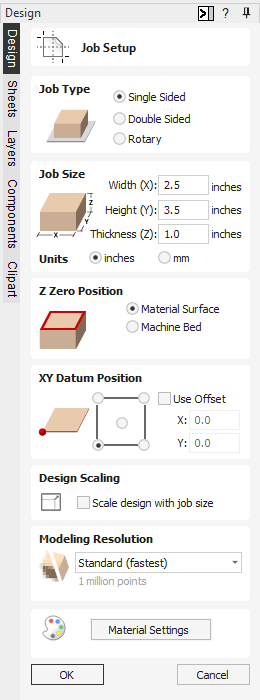
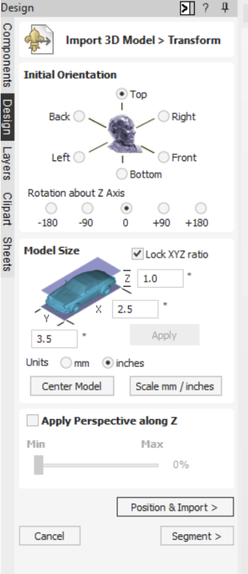
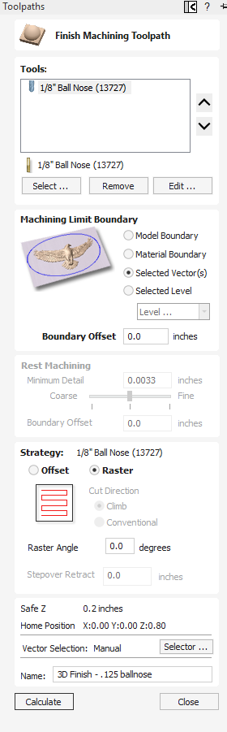
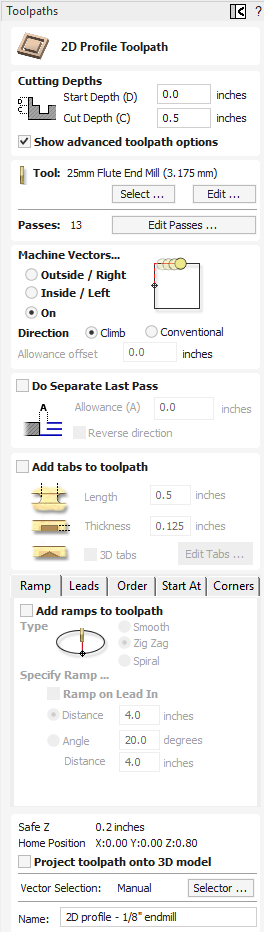
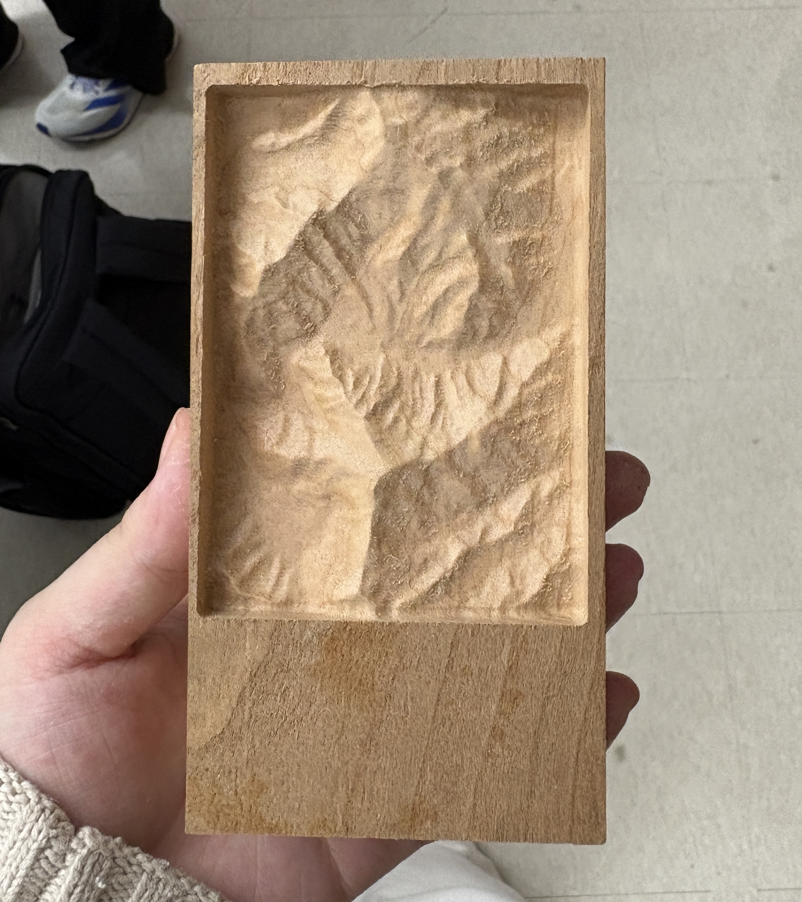

Unlike [milling PCBs](https://angelinayyang.github.io/p/pcb-milling-workflows/), which uses the native MakeraCAM software to define the trace toolpaths, designing toolpaths for milling 3D materials like wood is often done through Vetric Aspire. 

## 3D Machining Terminology

* **Roughing pass**: Typically the first pass, the roughing pass uses an end mill (e.g., flat end mill) that will eject a large number of chips at a high feed rate. In other words, the roughing pass is intended to create the *rough* shape of the design. 

* **Finishing pass**: The second pass, called the finishing pass, won’t require as aggressive of a cut (e.g., use of the ball nose bit) and can provide a smoother finish at a high speed. The finishing pass cuts the material into a *fine* shape and usually takes significantly longer than the roughing pass.

## Exporting an STL via Terrain2STL

> This workflow is an extention of the provided workflow by Mr. Dubick, Mr. Budzichowski, and Dr. Taylor

1. Go to the [Terrain2STL website](https://jthatch.com/Terrain2STL/).

2. Use the map interface to locate a geographical area of your desire

3. Define the model area using the "Box Width," "Box Height," and "Box Scaling Factor" under the "Model Details" tab

4. Adjust model settings

    4a. Vertical scaling amplifies the height of the terrain, making vertical elements of the land more pronounced in the exported .STL file

    4b. Water drop lowers the height of water bodies

    4c. Base height adds an additional and solid base underneath the terrain

5. Once all settings are adjusted as intended, click the "Generate Model" button. This will generate and export your terrain .STL file as a .ZIP file.

## Aspire Workflow

> This workflow is an extention of the provided workflow by Mr. Dubick, Mr. Budzichowski, and Dr. Taylor

1. Open Vetric Aspire 12.5

2. Click "Create New File"

3. In the "Job Setup" dialogue box that pops up, set the "Job Type" to "Single Sided"

4. Set the "Job Size (X, Y)" to match the physical stock. For the topography map, the dimensions for x, y, and z are 2.5, 3.5, and 1.0 inches, respectively

5. set the "Z Zero Position" to the "Material Surface"

6. for the "XY Datum Position," select the bottom left corner, as this allows you to easiler center the component

7. Set the "Model Resolution" to "Standard (fastest)" 

8. Under the "Modeling" tab, click the "Import a Component or 3D model" and select your .STL file

9. Under the "Import 3D Model > Transform" dialogue box, set the "Initial Orientation" to "Top"; leave the "Rotation About Z Axis" at 0

10. Adjust the width, height, and length of the file under "Model Size"; ensure they are in the intended units of measurement

11. Click "Apply" and "Center Model"

12. Click "Position and Import >"

13. Under the "Import 3D Model > Position" dialogue box, use the slider bar to position the purple horizontal cutting plane at the appropriate depth to maximize the vertical relief of your model while maintaining a reasonable base height

14. Under the "Component" side tab, right-click the name of the .STL file under the "Level 1" to access the "Component Properties"

15. Adjust the "Shape Height" value to 1.0 and the "Base Height" value to 0.0, before clicking "Close"

17. To position the 3D model within your material, switch to the "Design" tab and click on the "2D view"

18. Click the "Alignment Tool," located under "Transform Objects"

19. Click the "Center" tool, before clicking "Close"; this will center the imported model accordingly.

20. Staying in the 2D view, go under "Create Vectors" and click "Draw Rectangle"

21. Draw a rectangle around the boundary of the model (2.5" by 3.5")

22. Switch to the "Toolpaths" tab in the top right of Aspire

23. Select the 3D model image in the 2D view

24. Click on the "3D Roughing Toolpath" icon located in the "Toolpaths Operations" menu

24. Define the constraints for the roughing pass (material should be hardwood):

    24a. Select a large 25 mm Flute End Mill (3.175mm) under the Carvera Tools subsection; note that this tool is also referred to as a 1/8" End Mill

    24b. Define the machining limit boundary as the model boundary

    24c. Define the machining allowance as a small value (e.g., .024") to prevent the bit from breaking

    24d. Under "Strategy," choose "Z level' or "3D Raster"; note that Z level is efficient for stairstepping down, while 3D raster is good for flatter models

    24e. As a general rule of thumb, rename your toolpath to maintain organization. Once you'd created a name, click "Calculate"

25. Keeping the boundary vector selected, click on the "3D Finishing Toolpath" icon

26. Define the constraints for the finishing pass (material should be hardwood):

    26a. Select a small 1/8" Ball Nose bit; note that the smaller the bit, the more detail you get at the expense of time

    26b. Define the machining limit boundary as the model boundary

    26c. Under "Strategy," select "Raster" and set the "Raster Angle" to go back and forth along the X-axis

    26d. Similar to the roughing pass, name your toolpath accordingly. Click "Calculate"

27. In the 2D view, click on the *rectangular* model profile

28. Click the "2D Roughing Toolpath" icon

29. Define constraints for the 2D profile cut (material should be hardwood):

    29a. In terms of the "Cutting Depths," make the "Start Depth" 0 and the "Cut Depth" .5

    29b. Select a large 25mm Flute End mill as the tool

    29c. For "Machine Vectors," select "On" the line and the direction of "Climb"

    29d. Same as before, name your toolpath and click "Calculate"

30. To review your toolpaths. click the "Preview all Toolpaths" button; Aspire will run a complete 3D simulation, progressing from the Roughing pass to the Finishing pass to the profile cut

 

31. To save the Aspire file, go to "File" > "Save As" and save your .crv3d project file

32. To export your g-code or your toolpath files, click the "Save Toolpaths" button

    32a. Choose the "Machine" as the "Carvera Desktop CNC Machine"

    32b. Choose the "Post-Processor" as the "Carvera ATC (mm) (*cnc)" and click "Save Toolpath(s)"

## Producing a Topography Map on the Carvera

For my topography map, I selected a small region in the Himalayas and exported the mountain range as an .STL from Terrain2STL. Here is the [.STL file](Yang_A_B_Topo.stl).

Following the workflow for designing CNC toolpaths via Aspire, I successfully designed the roughing pass, finishing pass, and profile cut, saving the g-code:

* Here is my [Aspire file (.cr3vd)](/Yang_A_B_Topo_Aspire_File.crv3d)

* Here is my [G-code file (.cnc)](Yang_A_B_Topo_Gcode.cnc)

The process of loading the file to the Carvera was virtually the same as instructed in the PCB milling workflow; the only major difference was that I disabled the automatic z-axis probing (5x5 touchdown), since we already defined the depth in the Aspire Job Setup.

Here is what my final topography map looked like:

Overall, through this project, I reviewed fundamental terminology, such as rough and finishing passes, as well as refreshed my memory on how to use Aspire to design toolpaths for 3D machining. It's been a while since I've used this software in general, and I've  only used it when designing toolpaths for the larger CNC machines, so the specific tools we used for table-top milling were unfamiliar to me. However, with the provided workflow and a bit of practice, I felt like I got the hang of it again!

The only "problem" I encountered was the assigned milling depth; the value I set in Aspire was too shallow for my liking. In the future, I would adjust this leveling after importing my .STL model into Aspire. Beyond that minor change, this project was pretty successful!