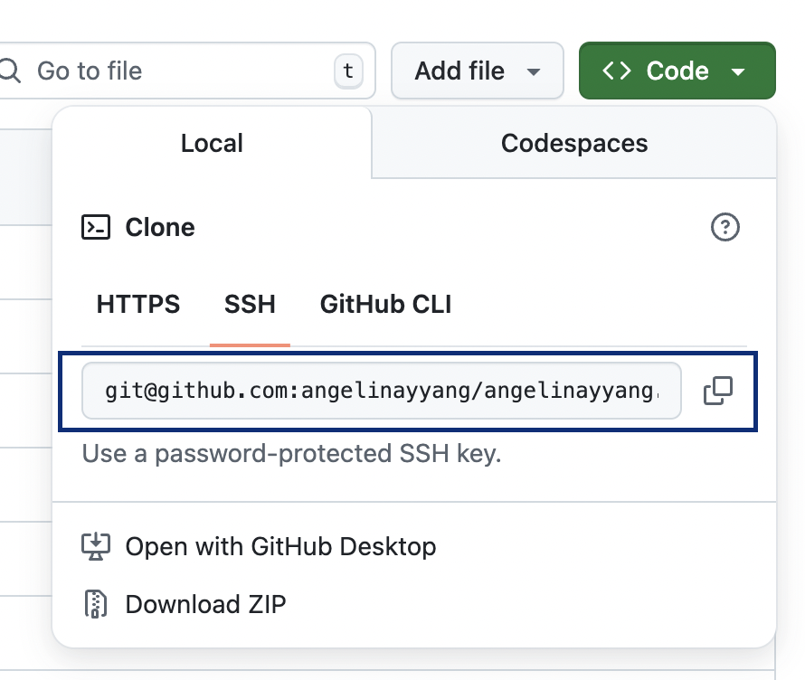
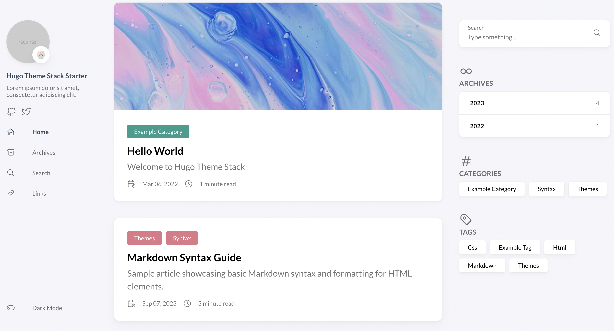
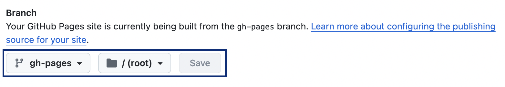

The site that you are currently viewing runs using [MkDocs](https://www.MkDocs.org/), a static site generator tailored towards project documentation. The process to creating a website is fairly easy, even for mac users like myself! ( • ᴖ • ｡)

## Repo Creation and Cloning

[Github](https://github.com/) is a web-based platform built upon Git that utilizes [version control](https://about.gitlab.com/topics/version-control/) to manage source code and projects in a **repository** (often referred to as a 'repo'). 

To create the site, I created a new [Github Pages](https://pages.github.com/) repository and named it 
```
angelinayyang.github.io
```

 or, in general, 
 
 ```
 YOUR_USERNAME.github.io
 ```

 After creating this repo, I **cloned** it to my local folder by using the command

 ```
 git clone REPO-NAME
 ```
I acquired the repo name by copying and pasting the SSH url as seen below:

<center>
 
</center>


## SSH Key Creation

>   <center> <strong><p style="color: red;"> Do not share your SSH key with anyone. Do not post it online. </p> </strong> </center>


Speaking of SSH keys, an SSH key is a cryptographic key pair, consisting of a public and private key, used to authenticate and secure connections to remote servers using the SSH protocol. In other words, it is a type of password unique to each device.

I ran the following command in terminal:

```YAML

ssh-keygen -t ed25519 -C "your_email@example.com"


Generating public/private ed25519 key pair.
Enter file in which to save the key (/home/user/.ssh/id_ed25519): 


Enter passphrase (empty for no passphrase):  
Enter the same passphrase again:
```

To **access** your ssh key:

```
cat ~/.ssh/id_rsa.pub 
```

Your SSH key will appear as 'ssh-rsa' followed by a string of generated characters. 

To directly **copy** your ssh key:

```
cat ~/.ssh/id_ed25519.pub | clip 
```

To add your SSH key into your Github, go to Github > Account Settings > SSH and GPG Keys > New SSH Key and paste in the string of characters.


## Installing MkDocs

In your coding environment, ensure that you have:

1. Installed the latest update of python and [pip](https://pip.pypa.io/en/stable/installation/)

    1a. Update pip by running the following command: 
    ```
    python -m pip install --upgrade pip
    ```

2. Installed the latest version of Git

    1a. For **MacOS** or **Linux** users, you will need to use a package manager such as [Homebrew](https://brew.sh/) to update git . Once installed, you can update Git by running the following command:

    ```
    brew upgrade git
    ```

    1b. For **Windows** users, you will need to use Gitbash (packaged with the Git download for Windows) and run the following command: 
    ```
    git update-git-for-windows

    ```

Once you have met both requirements, you can install MkDocs by running the following command in a new terminal in the cloned site folder:


```
pip install mkdocs
```

MkDocs has good [documentation](https://www.MkDocs.org/getting-started/) on how to get started, but here's a general summary of the most fundamental commands. To create a basic static documentation site, run the following command:

```
mkdocs new my-project
cd my-project
```

This will create the following **hierarchy** or directory structure in your coding environment, where index.md is the home-page and the MkDocs.yml configures the site with information like site_name, repo_url, and site_description:

```
.
├─ docs/
│  └─ index.md
└─ mkdocs.yml
```

To view your site on a local server, run:

```
mkdocs serve
```

You will get something like this in response:

```
INFO    -  Building documentation...
INFO    -  Cleaning site directory
INFO    -  Documentation built in 0.22 seconds
INFO    -  [15:50:43] Watching paths for changes: 'docs', 'mkdocs.yml'
INFO    -  [15:50:43] Serving on http://127.0.0.1:8000/
```

[http://127.0.0.1:8000/](http://127.0.0.1:8000/) is the local server that you can view your site on when you copy and paste the url into your browser.


### Intro to Markdown

Markdown is a pretty dandy tool to streamline documentation because it can simultaneously support an intuitive markup language as well as direct HTML. 

#### Basic Syntax

**Text Alteration**

```
*This is italicized text.*
```
*This is italicized text.*

```
**This is bolded text.**
```
**This is bolded text.**

____

**Headings**

```
# H1 
## H2
### H3
#### H4
##### H5
###### H6

```

<h1> H1 </h1>
<h2> H2 </h2>
<h3> H3 </h3>
<h4> H4 </h4>
<h5> H5 </h5>
<h6> H6 </h6>


____


**Images**

```

```


#### Hyperlinks

```
[Link to an interesting video](https://www.youtube.com/watch?v=dQw4w9WgXcQ&list=RDdQw4w9WgXcQ&start_radio=1)
```

[Link to an interesting video](https://www.youtube.com/watch?v=dQw4w9WgXcQ&list=RDdQw4w9WgXcQ&start_radio=1)

#### Lists

**Unordered List**


- need a blank line above to start new list
- valid bullet symbols `*`, `-` or '+'
- nested
    - 4 spaces or 1 tab
    - to indent


____


**Ordered List**


1. use *numbers* for ordered
    1. you can nest these too

2. **numbers** can be in order

4. but markdown will automatically fix them if not

#### Blockquotes

```
> Insert some profound blockquote.
```

> Insert some profound blockquote.

#### Tables
```
|  Item       | Description             |
| ----------- | ----------------------- |
| Item 1      | Description for item 1  |
| Item 2      | Description for item 2  |
| Item 3      | Description for item 3  |
```


|  Item       | Description             |
| ----------- | ----------------------- |
| Item 1      | Description for item 1  |
| Item 2      | Description for item 2  |
| Item 3      | Description for item 3  |

More about MkDocs syntax can be found [here](https://www.markdownguide.org/basic-syntax/#overview).

## Customizing with Hugo: Stack Theme

MkDocs naturally has themes, such as [Material](https://squidfunk.github.io/MkDocs-material/), which work wonderfully for documentation purposes. However, for greater visual appeal, you can opt for other theme options. [Hugo](https://gohugo.io/), for instance provides a simple and easy-to-follow framework for developing visually stunning sites. This documentation specifically uses the [Stack](https://themes.gohugo.io/themes/hugo-theme-stack/) theme, created by Jimmy Cai. 

To use Hugo, ensure that you have

1. Installed the latest version of Go.

    1a. Download the [Go MSI package](https://go.dev/doc/install)
    
    1b. To see the Go version, run

    ```
     go version
    ```
2. Installed the latest version of Git

To install hugo, run the following command in terminal:
```
brew install hugo
```


### Installing Theme Manually

If you're starting with an existing repo, you can create a new site with the command:

```
hugo new site SITE-NAME
```
This will create the following hierarchy:

```
my-site/
├── archetypes/
│   └── default.md
├── assets/
├── content/
├── data/
├── i18n/
├── layouts/
├── static/
├── themes/
└── hugo.toml
```


Then, you can change the current directory to the root of your project by running 

```
cd SITE-NAME
```

To clone the stack theme as a submodule to your existing repo, run

```
git submodule add https://github.com/CaiJimmy hugo-theme-stack/ themes/hugo-theme-stack
```

### Using the Starter Pack

If you're starting from scratch **without a repo** and would like to use the theme starter, you can also directly create a new codespace from the [hugo-theme-stack-starter repo](https://github.com/CaiJimmy/hugo-theme-stack-starter/tree/master).

The starter pack configuration file lies under the config/_default/ folder. 

Note that the hugo-theme-stack-starter, format-wise, looks a bit different from the manually installed theme. For instance, the starter pack is missing the **layouts folder**, which is crucial for defining the HTML templates that control your website's content. The layout folder consists of files like **list.html** and **single.html**. Without this folder, you don't have as much control or flexibility with the visual format of your website. 

Depending on which option you pick to create your Hugo site, you will either have a **config.yaml** or **config.toml** file, which configures site-wide parameters. For instance:

```
baseurl = "https://angelinayyang.github.io"
languageCode = "en-us"
title = "Angelina's Internet Corner"
```

Other parameters include the **avatar** icon. For my site, I custom designed a pixel art avatar of myself in a free online software, [PixilArt](https://www.pixilart.com/).


Each post in your new site will also have its own metadata and specific parameters, known as [front matter](https://gohugo.io/content-management/front-matter/). For instance, here is the front matter for this particular page:

```yaml
---
title: How I Made This Website
description: Intro to Github Pages, using static site generation with MkDocs, and applying the Hugo Stack theme to develop my personal blog.
image: cover.png
date: 2025-06-15

categories:
    - Web Development
    - Personal Project
    
tags: 
    - website design
    - html
    - markdown
weight: 3 
---
```

Whether you are manually installing the theme or applying the starter pack, to view your site on a local server, run in the terminal of your coding environment

```
hugo serve -D -F
```
**-D** ensures that pages marked as "drafts" will be included in the server, and **-F** loads pages with dates set in the future. Here is what the example site will look like:



## Publishing Your Site

Before publishing changes, make sure that Github Pages is set up properly by going to your repository on Github > Settings > Pages > toggling **gh-pages** as the main branch.




To publish your local changes to your remote repository, run the following commands:

```
git add . 
git commit -m "Insert description here"  
git push 
```

- **Git add .** adds all changes in the current directory and its subdirectories to the Git staging area, in preparation for a commit. 

- **Git commit -m ""** is a local action that records all changes in the repository's history. This is the 'version control' aspect of Git.

- **Git push** then takes all of the changes that have been made locally and push them up to a remote repository

If you make any changes in the remote repository (e.g. via the web IDE), be sure to **pull** all changes first before making additional edits in your local repository. Use the following command:

```
git pull

```

(˵ •̀ ᴗ •́ ˵ ) ✧ With that, congrats on building your first site using MkDocs! 


